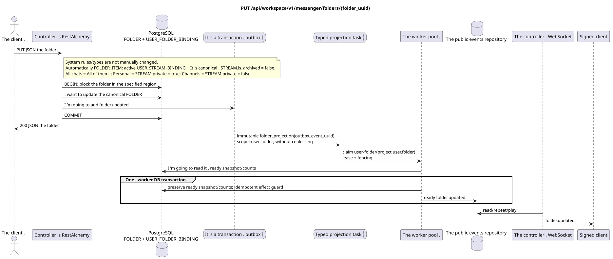

# `PUT /api/workspace/v1/messenger/folders/{folder_uuid}`

[← The main index of the documentation](../../../../index.md) · [Index of sequence diagrams](../../README.md) · [Content and users Workspace](../README.md)

Status: the target specification of the operation, first developed in the documentation.
remains unchanged and is the normative [`workspace_api.md`](../../../../workspace_api.md).
This file describes the transaction and projection target boundaries; it doesn ' t
production code, migration SQL or new endpoint.



[The source that you can edit PlantUML](diagrams/put_folder_update.puml)

## Purpose and public contract

Update the `title` and `color` folders of the current user.

Authentication: Bearer IAM; `project_id` and current `user_uuid` tokens are taken from context IAM.

## Path and query settings

| Location | Name of the person | Type / rule |
| --- | --- | --- |
| The way | `folder_uuid` | UUID |

The collection pagination, where it is provided, preserves the current contract `page_limit` and UUID
`page_marker` and returns `X-Pagination-Limit`, and
`X-Pagination-Marker` Only if there 's a next page ..

## The body of the query

```json
{
  "title": "Archive",
  "background_color_value": 4289352960
}
```

## A Successful Answer

`200`

```json
{
  "uuid": "50ecadd0-9823-4d97-b54c-806cc672c210",
  "title": "Archive",
  "background_color_value": 4289352960,
  "unread_count": 3,
  "system_type": "created",
  "folder_items": [
    {
      "uuid": "9f41b1a7-77f9-4c12-bdc6-d3cebc5dbf50",
      "project_id": "22222222-2222-2222-2222-222222222222",
      "folder_uuid": "50ecadd0-9823-4d97-b54c-806cc672c210",
      "user_uuid": "11111111-1111-1111-1111-111111111111",
      "stream_uuid": "75309057-419c-4b12-a7c1-3932429ec4a6",
      "chat_type": "stream",
      "order_index": 10,
      "pinned_at": null,
      "unread_count": 3,
      "active_unread_count": 3,
      "passive_unread_count": 0,
      "created_at": "2026-06-22T09:30:00Z",
      "updated_at": "2026-06-22T09:30:00Z"
    }
  ],
  "created_at": "2026-06-22T09:30:00Z",
  "updated_at": "2026-06-22T09:31:00Z"
}
```


## Errors and authorization

Incorrect or unauthorized input data is processed by the RESTAlchemy/IAM error boundary; resources in the specified area are not disclosed outside the user/project boundaries.

General form of response for validation error:

```json
{
  "type": "ValidationErrorException",
  "code": 400,
  "message": "Validation error occurred."
}
```

## The target boundary RestAlchemy

```python
from restalchemy.api import controllers as ra_controllers
from restalchemy.api import resources as ra_resources
from restalchemy.dm import models
from restalchemy.dm import properties
from restalchemy.dm import types
from restalchemy.storage.sql import orm


class WorkspaceFolder(models.ModelWithUUID, models.ModelWithProject,
                      models.ModelWithTimestamp, orm.SQLStorableMixin):
    __tablename__ = "messenger_folders"
    title = properties.property(types.String(min_length=1, max_length=64), required=True)
    background_color_value = properties.property(types.AllowNone(types.Integer()))


class WorkspaceUserFolderBinding(models.ModelWithUUID, models.ModelWithProject,
                                 models.ModelWithTimestamp, orm.SQLStorableMixin):
    __tablename__ = "messenger_user_folder_bindings"
    # Public UUID links are scalar UUID properties, never URI relationships.
    user_uuid = properties.property(types.UUID(), required=True, read_only=True)
    folder_uuid = properties.property(types.UUID(), required=True, read_only=True)
    unread_count = properties.property(types.Integer(min_value=0), default=0, read_only=True)
    mention_count = properties.property(types.Integer(min_value=0), default=0, read_only=True)
    folder_items_snapshot = properties.property(types.List(), default=list, read_only=True)
    folder_items_snapshot_version = properties.property(types.Integer(min_value=0), default=0, read_only=True)
    folder_items_snapshot_updated_at = properties.property(types.AllowNone(types.UTCDateTimeZ()), read_only=True)
    BUSINESS_KEY = ("project_id", "user_uuid", "folder_uuid")


class WorkspaceUserFolder(models.ModelWithTimestamp, orm.SQLStorableMixin):
    __tablename__ = "messenger_api_user_folders_v1"
    binding_uuid = properties.property(types.UUID(), id_property=True, read_only=True)
    uuid = properties.property(types.UUID(), read_only=True)
    title = properties.property(types.String(min_length=1, max_length=64))
    background_color_value = properties.property(types.AllowNone(types.Integer()))
    unread_count = properties.property(types.Integer(min_value=0), read_only=True)
    system_type = properties.property(types.AllowNone(types.Enum(["all", "created"])), read_only=True)
    folder_items = properties.property(types.List(), read_only=True)


class FolderController(ra_controllers.BaseResourceControllerPaginated):
    __resource__ = ra_resources.ResourceByRAModel(
        model_class=WorkspaceUserFolder,
        hidden_fields=["binding_uuid", "project_id", "user_uuid"],
        convert_underscore=False,
        process_filters=True,
    )
```

Each public reference to an entity is declared a scalar UUID property RestAlchemy, not `relationship` (which would be serialized as URI). The corresponding physical column `*_uuid`  an indexed external key with an explicitly selected reference action. Therefore, public JSON keeps UUID unchanged.

Public `folder_items` directly displays read-only JSONB `WorkspaceUserFolderBinding.folder_items_snapshot`; it is not changed by a canonical `FOLDER` update request. The resource reads one indexed line without N+1, `json_agg`, `COUNT` and custom SQL; the normalized `FOLDER_ITEM` remain source of truth.

The `title`/`color` variables are used to specify the user canonical `FOLDER`.
The rule/type of the system `USER_FOLDER_BINDING` is fixed and cannot be changed
The automatic `FOLDER_ITEM` remains supported by the worker
The projection of the active `USER_STREAM_BINDING` and canonical
`STREAM` with `is_archived = false`: `All chats` (All chats) includes all such
available streams, `Personal` (Personal)  only streams from
`STREAM.private = true`, `Channels` («Channels)  only with
`STREAM.private = false`. This operation doesn 't change those rules or add
public acts.

## Synchronous path API

1. Find `folder_uuid` through the unique binding of the current user's folder.
2. Check for field changes.
3. Update the canonical `FOLDER`.
4. Add a fixed domain to the outbox `folder.updated`.
5. Record the transaction and return the read representation to the specified region.

## Outbox, Typed tasks, worker and real-time work

No unread counter is counted in sync. The ready value of the binding is added in a saved form.

Fixed event returns immutable `folder_projection` without coalescing,
with exact scope `user-folder:(project_id,user_uuid,folder_uuid)` and unique
`outbox_event_uuid`. The owner of the fenced lease does not reassemble items, but reads the finished
The image/counter and in one worker DB transaction records only ready
`folder.updated` The controller only delivers it after the commit;
retry/backoff, DLQ/reaper - They 're compulsory ..

## Idempotence, keys and races

The user/project area prevents updates between users. Competing updates are serialized on the canonical folder line; the last fixed changeable values are returned.

## The moment of visibility for the client

The response REST reflects a synchronous change in the folder. Other clients will see the corresponding ready event after a limited delay of the projection with consistency in the end.

[← The main index of the documentation](../../../../index.md) · [Index of sequence diagrams](../../README.md) · [Content and users Workspace](../README.md)
