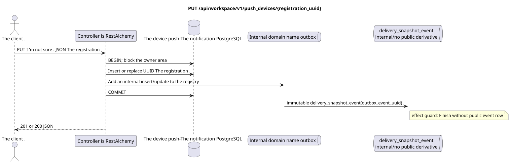

# `PUT /api/workspace/v1/push_devices/{registration_uuid}`


Common target-invariant of reliability: each immutable outbox event outputs exactly one immutable typed task with unique `outbox_event_uuid`; coalescing is absent. Task stores the actual exact scope key, uses lease/fencing, retry/backoff, max attempts/DLQ, reaper and idempotent effect guard. Topic scope is applied only to placement/message-binding work; shared rows do not receive implicit fallback on topic.

[← The main index of the documentation](../../../../index.md) · [Index of sequence diagrams](../../README.md) · [Content and users Workspace](../README.md)

Status: the target specification of the operation, first developed in the documentation.
remains unchanged and is the normative [`workspace_api.md`](../../../../workspace_api.md).
This file describes the transaction and projection target boundaries; it doesn ' t
production code, migration SQL or new endpoint.



[The source that you can edit PlantUML](diagrams/put_push_device.puml)

## Purpose and public contract

Idempotent to register or replace a new installation token/encryption key.

Authentication: Bearer IAM; `project_id` and current `user_uuid` tokens are taken from context IAM.

## Path and query settings

| Location | Name of the person | Type / rule |
| --- | --- | --- |
| The way | `registration_uuid` | stable UUID installation created by the client |

The collection pagination, where it is provided, preserves the current contract `page_limit` and UUID
`page_marker` and returns `X-Pagination-Limit`, and
`X-Pagination-Marker` Only if there 's a next page ..

## The body of the query

```json
{
  "transport": "fcm",
  "platform": "ios",
  "registration_token": "<FCM registration token>",
  "encryption": {
    "kind": "HPKE",
    "algorithm": "HPKE-v1-BASE-X25519-HKDF-SHA256-AES-256-GCM",
    "key_uuid": "248305f4-ecdf-4206-8e93-95f830ea8ad6",
    "public_key": "<unpadded base64url X25519 public key>"
  }
}
```

## A Successful Answer

`201` `200` when first registered, `200` when replaced`

```json
{
  "uuid": "7c1af344-95e1-487e-8b51-d1af0370cdb5",
  "transport": "fcm",
  "platform": "ios",
  "encryption": {
    "kind": "HPKE",
    "algorithm": "HPKE-v1-BASE-X25519-HKDF-SHA256-AES-256-GCM",
    "key_uuid": "248305f4-ecdf-4206-8e93-95f830ea8ad6",
    "public_key": "<unpadded base64url X25519 public key>"
  },
  "user_uuid": "11111111-1111-1111-1111-111111111111",
  "project_id": "22222222-2222-2222-2222-222222222222",
  "registration_token": "<FCM registration token>",
  "created_at": "2026-07-26T05:30:00Z",
  "updated_at": "2026-07-26T05:40:00Z"
}
```


## Errors and authorization

Only `fcm`, platform `android|ios`, fixed algorithm HPKE and canonical 43-character public keys X25519 are accepted in base64url without addition. UUID of another user/project returns as not found.

General form of response for validation error:

```json
{
  "type": "ValidationErrorException",
  "code": 400,
  "message": "Validation error occurred."
}
```

## The target boundary RestAlchemy

```python
from restalchemy.api import controllers as ra_controllers
from restalchemy.api import resources as ra_resources
from restalchemy.dm import models
from restalchemy.dm import properties
from restalchemy.dm import types
from restalchemy.storage.sql import orm


class PushDevice(models.ModelWithUUID, models.ModelWithProject,
                 models.ModelWithTimestamp, orm.SQLStorableMixin):
    __tablename__ = "m_workspace_push_devices"
    user_uuid = properties.property(types.UUID(), required=True, read_only=True)
    transport = properties.property(types.Enum(["fcm"]), required=True)
    platform = properties.property(types.Enum(["android", "ios"]), required=True)
    registration_token = properties.property(types.String(max_length=4096), required=True)
    encryption = properties.property(types.Dict(), required=True)


class PushDeviceController(ra_controllers.BaseResourceController):
    __resource__ = ra_resources.ResourceByRAModel(model_class=PushDevice)
    # Narrow PUT upsert and idempotent DELETE overrides preserve owner scope.
```

Each public reference to an entity is declared a scalar UUID property RestAlchemy, not `relationship` (which would be serialized as URI). The corresponding physical column `*_uuid`  an indexed external key with an explicitly selected reference action. Therefore, public JSON keeps UUID unchanged.

The push notification logs are outside the Messenger entity processing. UUID  resource key settings. `user_uuid` and `project_id`  server scalar UUID-fields supported by indexed columns of the region; encryption uses an existing model `kind` HPKE.

## Synchronous path API

1. Define user and project on IAM and block user area.
2. Check the full replacement body.
3. Insert UUID, if it is missing; otherwise require matching of the owner's area and replace `token`/`platform`/`encryption`.
4. Add internal unchanged domain name registration without public derivative to outbox.
5. Record the transaction and return `201` or `200`.

## Outbox, Typed tasks, worker and real-time work

The Messenger projection and the WebSocket event are not created.

The current contract only governs the registrations. immutable
outbox-The event produces one `delivery_snapshot_event` that is idempotent.
records the absence of a public derivative and completes; Workspace event row
And then ...WebSocketEncryption and push payload delivery are on hold.
outside of this endpoint.

## Idempotence, keys and races

`registration_uuid` — The same body is repeated, the same record is saved, the atomic is replaced, the resource is intercepted by another owner..

## The moment of visibility for the client

The change in registration is visible at the time of return .HTTP- Answer, publicly.WebSocket- No event for him..

[← The main index of the documentation](../../../../index.md) · [Index of sequence diagrams](../../README.md) · [Content and users Workspace](../README.md)
