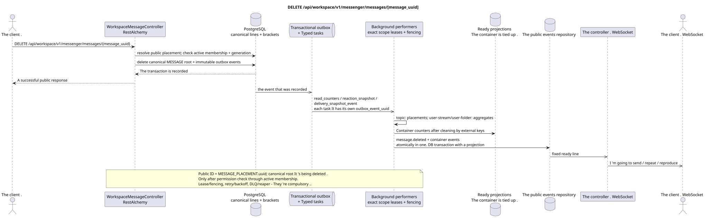

# DELETE /api/workspace/v1/messenger/messages/{message_uuid}

[← The main index of the documentation](../../../../index.md) · [Index of sequence diagrams](../../README.md) · [The section Core Messenger](../README.md)

## Status and boundary of current contract

The method, path, public JSON, and authorization follow the current contract from [`workspace_api.md`](../../../../workspace_api.md); bounded pagination and asynchronous visibility follow separately adopted target compatibility ADR.



The source that you can edit: [`delete_message.puml`](diagrams/delete_message.puml).

## The operation

**Method and way:** `DELETE /api/workspace/v1/messenger/messages/{message_uuid}`

**Purpose:** Remove canonical message and dependent lines irreversibly.

## A public request

Without a body. JSON.

## A successful public response

HTTP `204`; The empty body ..

## Public errors

The bearer-token IAM and the project area are required. An incorrect UUID or request body is given by HTTP `400`; missing or unavailable in this area resource  `404`. Standard documented validation error body:

```json
{
  "type": "ValidationErrorException",
  "code": 400,
  "message": "Validation error occurred."
}
```

## The target boundary RestAlchemy

```python
from restalchemy.api import controllers
from restalchemy.api import resources
from restalchemy.dm import models
from restalchemy.dm import properties
from restalchemy.dm import types
from restalchemy.storage.sql import orm


class WorkspaceUserMessage(models.ModelWithProject, orm.SQLStorableMixin):
    __tablename__ = "messenger_api_user_messages_v1"

    binding_uuid = properties.property(types.UUID(), id_property=True)
    uuid = properties.property(types.UUID(), read_only=True)
    stream_uuid = properties.property(types.UUID(), read_only=True)
    topic_uuid = properties.property(types.UUID(), read_only=True)
    author_uuid = properties.property(types.UUID(), read_only=True)
    user_uuid = properties.property(types.UUID(), read_only=True)


class WorkspaceMessageController(controllers.BaseResourceControllerPaginated):
    __resource__ = resources.ResourceByRAModel(
        WorkspaceUserMessage, convert_underscore=False, process_filters=True,
    )
```

It 's public .`uuid`and the route identifier are equal .`MESSAGE_PLACEMENT.uuid = UUIDv5(namespace=TOPIC.uuid, name=MESSAGE.uuid)`; name — lowercase hyphenated canonical UUID- It 's canonical .`MESSAGE.uuid`The internal;`binding_uuid`The controller allows placement and synchronously checks active membership plus generation to canonical delete.

## Synchronous transaction

1. Allow access and verify author rights.
2. Remove root MESSAGE; clearing dependencies is done with external keys.
3. Add a non-changeable tombstone to a transactional outbox with a public ID.

Affected state: MESSAGE, locations, user bindings/states, reaction facts and transactional outbox.

## Typed tasks and background performers

The tasks are: `read_counters`, `reaction_snapshot` and `delivery_snapshot_event`.

Topic-scoped workers The process of placement is deleted, and the individual fenced owners
`user-stream`/`user-topic`/`user-folder` They're updating the shared counters.
outbox event has a separate immutable task; topic worker does not unsafe
read-modify-write shared rows. Lease/retry/DLQ/reaper And the idempotent effect on
`outbox_event_uuid` - They 're compulsory ..

## Public events and WebSocket

`message.deleted` and affected thread/topic lines delivered by the dispatcher.

## Idempotence, races and time characteristics visible to the client

The clearing by external keys is atomic, the repetition of the tombstone is impotent..

[← The main index of the documentation](../../../../index.md) · [Index of sequence diagrams](../../README.md) · [The section Core Messenger](../README.md)
