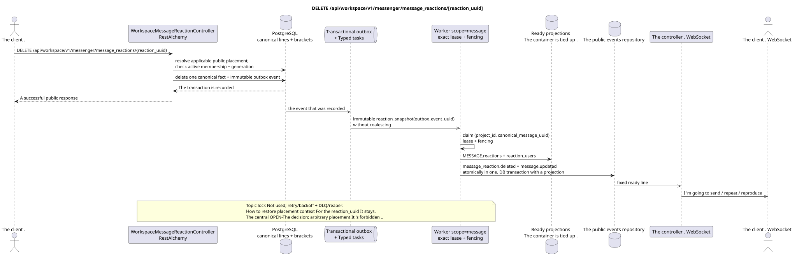

# DELETE /api/workspace/v1/messenger/message_reactions/{reaction_uuid}

[← The main index of the documentation](../../../../index.md) · [Index of sequence diagrams](../../README.md) · [The section Core Messenger](../README.md)

## Status and boundary of current contract

The method, path, public JSON, and authorization follow the current contract from [`workspace_api.md`](../../../../workspace_api.md); bounded pagination and asynchronous visibility follow separately adopted target compatibility ADR.



The source that you can edit: [`delete_message_reaction.puml`](diagrams/delete_message_reaction.puml).

## The operation

**Method and way:** `DELETE /api/workspace/v1/messenger/message_reactions/{reaction_uuid}`

**Purpose:** Remove the original reaction of the current user.

## A public request

Without a body. JSON.

## A successful public response

HTTP `204`; The empty body ..

## Public errors

The bearer-token IAM and the project area are required. An incorrect UUID or request body is given by HTTP `400`; missing or unavailable in this area resource  `404`. Standard documented validation error body:

```json
{
  "type": "ValidationErrorException",
  "code": 400,
  "message": "Validation error occurred."
}
```

## The target boundary RestAlchemy

```python
from restalchemy.api import controllers
from restalchemy.api import resources
from restalchemy.dm import models
from restalchemy.dm import properties
from restalchemy.dm import types
from restalchemy.storage.sql import orm


class WorkspaceMessageReactionView(
    models.ModelWithUUID,
    models.ModelWithProject,
    orm.SQLStorableMixin,
):
    __tablename__ = "messenger_api_message_reactions_v1"

    message_uuid = properties.property(types.UUID(), read_only=True)
    canonical_message_uuid = properties.property(types.UUID(), read_only=True)
    user_uuid = properties.property(types.UUID(), read_only=True)


class WorkspaceMessageReactionController(controllers.BaseResourceControllerPaginated):
    __resource__ = resources.ResourceByRAModel(
        WorkspaceMessageReactionView, convert_underscore=False, process_filters=True,
    )
```

Public `message_uuid`  scalar UUID placement; internal
`canonical_message_uuid` field permissions are hidden.UUIDThe original fact
The physical links remain indexed FK, and the
The original metadata of the provider/delivery is closed.

## Synchronous transaction

1. Re-establish user-owned fact, applicable public placement
   and check active stream membership + matching generation.
2. Remove exactly one fact.
3. Add an immutable event to delete transactional outbox; derived task
   It 's unique . `outbox_event_uuid`.

Affected state: reaction and transactional outbox.

## Typed tasks and background performers

Tasks: separate immutable `reaction_snapshot`; coalescing is not available.

Fenced owner scope `message` It 's rebuilding the images from the remaining facts .; topic
lock Lease expiry, retry/backoff, DLQ and reaper provide
Repair after failure.

## Public events and WebSocket

For the initiator  `message_reaction.deleted`, for the observer  `message.updated`; the dispatcher delivers the fixed lines.

## Idempotence, races and time characteristics visible to the client

Deleting a fact is atomic, requires active membership, and rebuilding it is impotent.
I 'm going to call you .UUID- Aggregated maps may be a little behind ..
The path contains only `reaction_uuid`: way to restore it public
placement context With multiple placement, it's still centralized.
OPEN-The decision, and arbitrary placement is prohibited. access check
The fact and picture are deliberately canonical-message-global and visible to all placements,
This privacy trade-off is accepted as Critic risk #8.

[← The main index of the documentation](../../../../index.md) · [Index of sequence diagrams](../../README.md) · [The section Core Messenger](../README.md)
