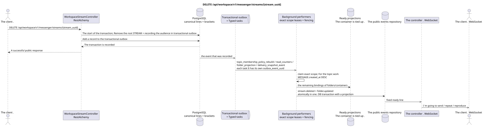

# DELETE /api/workspace/v1/messenger/streams/{stream_uuid}


Common target-invariant of reliability: each immutable outbox event outputs exactly one immutable typed task with unique `outbox_event_uuid`; coalescing is absent. Task stores the actual exact scope key, uses lease/fencing, retry/backoff, max attempts/DLQ, reaper and idempotent effect guard. Topic scope is applied only to placement/message-binding work; shared rows do not receive implicit fallback on topic.

[← The main index of the documentation](../../../../index.md) · [Index of sequence diagrams](../../README.md) · [The section Core Messenger](../README.md)

## Status and boundary of current contract

The method, path, public JSON, and authorization follow the current contract from [`workspace_api.md`](../../../../workspace_api.md); bounded pagination and asynchronous visibility follow separately adopted target compatibility ADR.



The source that you can edit: [`delete_stream.puml`](diagrams/delete_stream.puml).

## The operation

**Method and way:** `DELETE /api/workspace/v1/messenger/streams/{stream_uuid}`

**Purpose:** Delete the canonical stream for all users.

## A public request

Without a body. JSON.

## A successful public response

HTTP `204`; The empty body ..

## Public errors

The bearer-token IAM and the project area are required. An incorrect UUID or request body is given by HTTP `400`; missing or unavailable in this area resource  `404`. Standard documented validation error body:

```json
{
  "type": "ValidationErrorException",
  "code": 400,
  "message": "Validation error occurred."
}
```

Deleting the stream with itself gives `400`.

## The target boundary RestAlchemy

```python
from restalchemy.api import controllers
from restalchemy.api import resources
from restalchemy.dm import models
from restalchemy.dm import properties
from restalchemy.dm import types
from restalchemy.storage.sql import orm


class WorkspaceUserStream(
    models.ModelWithUUID,
    models.ModelWithProject,
    orm.SQLStorableMixin,
):
    __tablename__ = "messenger_api_user_streams_v1"

    owner = properties.property(types.UUID(), read_only=True)
    user_uuid = properties.property(types.UUID(), read_only=True)
    direct_user_uuid = properties.property(
        types.AllowNone(types.UUID()), default=None, read_only=True,
    )
    last_message_uuid = properties.property(types.UUID(), read_only=True)
    default_topic_uuid = properties.property(types.UUID(), read_only=True)


class WorkspaceStreamController(controllers.BaseResourceControllerPaginated):
    __resource__ = resources.ResourceByRAModel(
        WorkspaceUserStream, convert_underscore=False, process_filters=True,
    )
```

Public entity references are represented by scalar properties `types.UUID()`, not relations RestAlchemy, which are serialized in URI.Physical columns `*_uuid` remain indexed external keys with explicitly selected reference integrity actions.The public field `owner` is the property UUID; the physical field `owner_uuid`  is the user's indexed external key. USER_STREAM_BINDING stores ready-made flow-level counters..

## Synchronous transaction

1. Permitting and verifying permissions.
2. Delete STREAM with selected external key clearance.
3. Add separate immutable transactional outbox events for each
   The one that 's being drawn `topic_membership_policy_rebuild`, `read_counters`,
   `folder_projection` and `delivery_snapshot_event` task.

Affected state: root STREAM, topics, locations, container bindings and transactional outbox.

## Typed tasks and background performers

The tasks: `topic_membership_policy_rebuild`, `read_counters`,
`folder_projection` and `delivery_snapshot_event`, each for its own source
outbox event.

Background performers update the status of folders/containers and ready to delete without searching for missing bindings. Different topics can be processed in parallel within a customizable limit; within one busy topic canonical messages are given priority by `MESSAGE.created_at DESC`, with older work also advancing over time.

## Public events and WebSocket

`stream.deleted` And the affected ones. `folder.updated`.

## Idempotence, races and time characteristics visible to the client

The clearing by external keys is atomic; re-processing of the audience's gravestone recording is safe..

[← The main index of the documentation](../../../../index.md) · [Index of sequence diagrams](../../README.md) · [The section Core Messenger](../README.md)
