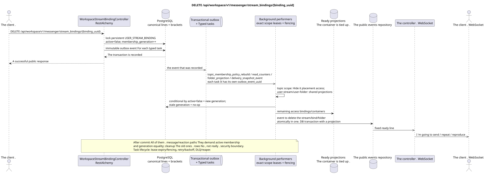

# DELETE /api/workspace/v1/messenger/stream_bindings/{binding_uuid}

[← The main index of the documentation](../../../../index.md) · [Index of sequence diagrams](../../README.md) · [The section Core Messenger](../README.md)

## Status and boundary of current contract

The method, path, public JSON, and authorization follow the current contract from [`workspace_api.md`](../../../../workspace_api.md); bounded pagination and asynchronous visibility follow separately adopted target compatibility ADR.



The source that you can edit: [`delete_stream_binding.puml`](diagrams/delete_stream_binding.puml).

## The operation

**Method and way:** `DELETE /api/workspace/v1/messenger/stream_bindings/{binding_uuid}`

**Purpose:** Remove the access of a regular user to the stream.

## A public request

Without a body. JSON.

## A successful public response

HTTP `204`; The empty body ..

## Public errors

The bearer-token IAM and the project area are required. An incorrect UUID or request body is given by HTTP `400`; missing or unavailable in this area resource  `404`. Standard documented validation error body:

```json
{
  "type": "ValidationErrorException",
  "code": 400,
  "message": "Validation error occurred."
}
```

Removing the direct stream or the stream itself gives `400`.

## The target boundary RestAlchemy

```python
from restalchemy.api import controllers
from restalchemy.api import resources
from restalchemy.dm import models
from restalchemy.dm import properties
from restalchemy.dm import types
from restalchemy.storage.sql import orm


class WorkspaceStreamBindingView(
    models.ModelWithUUID,
    models.ModelWithProject,
    orm.SQLStorableMixin,
):
    __tablename__ = "messenger_api_stream_bindings_v1"

    stream_uuid = properties.property(types.UUID(), read_only=True)
    user_uuid = properties.property(types.UUID(), read_only=True)
    who_uuid = properties.property(types.UUID(), read_only=True)


class WorkspaceStreamBindingController(controllers.BaseResourceControllerPaginated):
    __resource__ = resources.ResourceByRAModel(
        WorkspaceStreamBindingView, convert_underscore=False, process_filters=True,
    )
```

Public references to entities are represented by scalar properties `types.UUID()`, not relations RestAlchemy, which are serialized in URI. Physical columns `*_uuid` remain indexed external keys with explicitly selected reference integrity actions.USER_STREAM_BINDING is unique in `(project_id, stream_uuid, user_uuid)` and can physically store ready counters, but its current public JSON binding does not change.

## Synchronous transaction

1. Restore and authorize persistent `USER_STREAM_BINDING` by locking
   the current line membership lifecycle.
2. Without deleting the string physically, atomically set `active = false` and enlarge
   It 's monotonous . `membership_generation`.
3. Add immutable transactional outbox events with old audience and new audience
   generation; Each event is accompanied by a separate typed task.

Affected state: access bindings to the stream, topic and message, as well as transactional outbox; canonical entities are preserved.

## Typed tasks and background performers

The tasks: immutable `topic_membership_policy_rebuild`,
`read_counters`, `folder_projection` and `delivery_snapshot_event`, each with
own source `outbox_event_uuid` and exact scope key.

After commit, every message GET/list/action/reaction immediately checks
`USER_STREAM_BINDING.active` and generation, so stale message bindings/state
Topic-scoped worker can asynchronously hide/rearrange
placement bindings; user-stream/user-folder scope workers It 's updated . shared
Cleanup of older generations is optional and not
is the security boundary. lease/fencing,
retry/backoff, DLQ/reaper And we 're going to have a potential effect guard on `outbox_event_uuid`.

## Public events and WebSocket

Delete the stream for the deleted user, delete the binding for the remaining user and update the folders.

## Idempotence, races and time characteristics visible to the client

The canonical content is preserved. `204` means that the membership is already
inactive and access is prohibited after commit; projections and events are asynchronous. Stale
fan-out/history task With the previous generation doing no-op and can't resurrect
Re-add uses the new generation and fresh placement-scoped state.

[← The main index of the documentation](../../../../index.md) · [Index of sequence diagrams](../../README.md) · [The section Core Messenger](../README.md)
