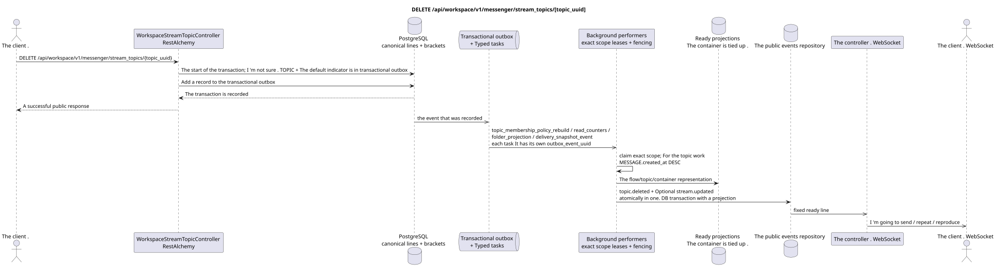

# DELETE /api/workspace/v1/messenger/stream_topics/{topic_uuid}


Common target-invariant of reliability: each immutable outbox event outputs exactly one immutable typed task with unique `outbox_event_uuid`; coalescing is absent. Task stores the actual exact scope key, uses lease/fencing, retry/backoff, max attempts/DLQ, reaper and idempotent effect guard. Topic scope is applied only to placement/message-binding work; shared rows do not receive implicit fallback on topic.

[← The main index of the documentation](../../../../index.md) · [Index of sequence diagrams](../../README.md) · [The section Core Messenger](../README.md)

## Status and boundary of current contract

The method, path, public JSON, and authorization follow the current contract from [`workspace_api.md`](../../../../workspace_api.md); bounded pagination and asynchronous visibility follow separately adopted target compatibility ADR.



The source that you can edit: [`delete_stream_topic.puml`](diagrams/delete_stream_topic.puml).

## The operation

**Method and way:** `DELETE /api/workspace/v1/messenger/stream_topics/{topic_uuid}`

**Purpose:** Remove the canonical topic.

## A public request

Without a body. JSON.

## A successful public response

HTTP `204`; The empty body ..

## Public errors

The bearer-token IAM and the project area are required. An incorrect UUID or request body is given by HTTP `400`; missing or unavailable in this area resource  `404`. Standard documented validation error body:

```json
{
  "type": "ValidationErrorException",
  "code": 400,
  "message": "Validation error occurred."
}
```

## The target boundary RestAlchemy

```python
from restalchemy.api import controllers
from restalchemy.api import resources
from restalchemy.dm import models
from restalchemy.dm import properties
from restalchemy.dm import types
from restalchemy.storage.sql import orm


class WorkspaceUserTopic(
    models.ModelWithUUID,
    models.ModelWithProject,
    orm.SQLStorableMixin,
):
    __tablename__ = "messenger_api_user_topics_v1"

    stream_uuid = properties.property(types.UUID(), read_only=True)
    user_uuid = properties.property(types.UUID(), read_only=True)
    last_message_uuid = properties.property(types.UUID(), read_only=True)
    summary_last_message_uuid = properties.property(types.UUID(), read_only=True)


class WorkspaceStreamTopicController(controllers.BaseResourceControllerPaginated):
    __resource__ = resources.ResourceByRAModel(
        WorkspaceUserTopic, convert_underscore=False, process_filters=True,
    )
```

Public references to entities are represented by scalar properties `types.UUID()`, rather than relations RestAlchemy, which are serialized in URI. Physical columns `*_uuid` remain indexed external keys with clearly selected reference integrity actions. TOPIC is a canonical entity; unique USER_TOPIC_BINDING provides visibility, personal status, and ready-made topic counters.

## Synchronous transaction

1. Permitting and verifying permissions.
2. Remove TOPIC with external keys; if necessary, reset the default stream topic.
3. Add separate immutable transactional outbox events for each
   The one that 's being drawn `topic_membership_policy_rebuild`, `read_counters`,
   `folder_projection` and `delivery_snapshot_event` task.

Tracked status: TOPIC, bindings/topics, default stream topic indicator and transactional outbox; messages with other topics are saved.

## Typed tasks and background performers

The tasks: `topic_membership_policy_rebuild`, `read_counters`,
`folder_projection` and `delivery_snapshot_event`, each for its own source
outbox event.

Topic-scoped worker It handles the placement of the topic you 're deleting .; shared
`user-topic`/`user-stream`/`user-folder` rows They get separate immutable tasks
exact scopes. It's simultaneously typing one fenced owner key, no coalescing..

## Public events and WebSocket

`topic.deleted` and conditional `stream.updated`.

## Idempotence, races and time characteristics visible to the client

Repeat clearing for external keys and transactional outbox is safe. Topic changes instantly, projections and events  asynchronously.

[← The main index of the documentation](../../../../index.md) · [Index of sequence diagrams](../../README.md) · [The section Core Messenger](../README.md)
