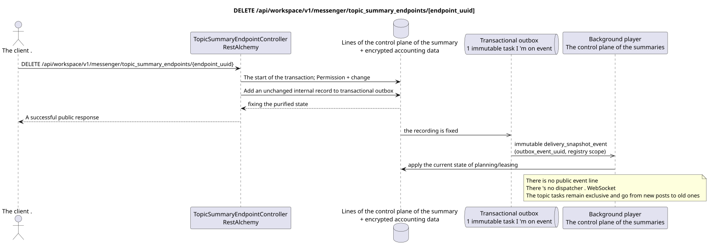

# DELETE /api/workspace/v1/messenger/topic_summary_endpoints/{endpoint_uuid}

[← The main index of the documentation](../../../../index.md) · [Index of sequence diagrams](../../README.md) · [The section Core Messenger](../README.md)

## Status and boundary of current contract

The target specification in the docs-first approach. HTTP-contract remains the current contract from [`workspace_api.md`](../../../../workspace_api.md); The target internal mechanisms are only a proposal.



The source that you can edit: [`delete_topic_summary_endpoint.puml`](diagrams/delete_topic_summary_endpoint.puml).

## The operation

**Method and way:** `DELETE /api/workspace/v1/messenger/topic_summary_endpoints/{endpoint_uuid}`

**Purpose:** Remove global endpoint summaries and encrypted accounting data.

## A public request

Without a body. JSON.

## A successful public response

HTTP `204`; The empty body ..

The status and error timestamp fields may be missing in the response if they allow `null` and have this value. `api_key` and the active request token are never returned.

## Public errors

Requires bearer-token IAM. Incorrect UUID or request body is given HTTP `400`; no management permission  `403`. Standard validation error body:

```json
{
  "type": "ValidationErrorException",
  "code": 400,
  "message": "Validation error occurred."
}
```

For every operation with an endpoint register, `workspace.topic_summary_endpoint.manage` is required; the missing endpoint gives `404`.

## The target boundary RestAlchemy

```python
from restalchemy.api import controllers
from restalchemy.api import resources
from restalchemy.dm import models
from restalchemy.dm import properties
from restalchemy.dm import types
from restalchemy.storage.sql import orm


class WorkspaceTopicSummaryEndpoint(
    models.ModelWithUUID,
    models.ModelWithTimestamp,
    orm.SQLStorableMixin,
):
    __tablename__ = "messenger_topic_summary_endpoints"

    name = properties.property(types.String(max_length=255), required=True)
    base_url = properties.property(types.String(max_length=2048), required=True)
    model = properties.property(types.String(max_length=255), required=True)
    credential_present = properties.property(types.Boolean(), read_only=True)


class TopicSummaryEndpointController(controllers.BaseResourceControllerPaginated):
    __resource__ = resources.ResourceByRAModel(
        WorkspaceTopicSummaryEndpoint,
        convert_underscore=False,
        process_filters=True,
    )
```

This global resource has no public fields of entity relations. Its public field `uuid`  scalar property UUID. Any internal external key or reference to account data is indexed and has an explicit reference integrity action; `api_key` is write-only, stored in encrypted form, and never serialized..

## Synchronous transaction

1. Request permission to control and restore endpoint.
2. Remove the endpoint root; the external key cascade removes encrypted account data.
3. Add a permanent internal deletion record to transactional outbox.

## Typed task and background executable

Separate immutable `delivery_snapshot_event` task from exact scope registry
The endpoints are updated by the register/clears the lease for source outbox event; unique
`outbox_event_uuid`, without coalescing.

The control plane background executor excludes the endpoint from the future selection; active restricted requests are completed according to the selected lease policy.MESSAGENot being fulfilled.

## Public events, repeats and time characteristics

The external keys are atomic; the replay sees a missing resource. Public event Workspace and dispatcher action are not created.

There is no ready public event Workspace for this administrative operation, so the controller WebSocket is not involved in it.

[← The main index of the documentation](../../../../index.md) · [Index of sequence diagrams](../../README.md) · [The section Core Messenger](../README.md)
