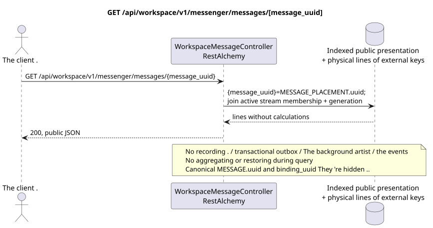

# GET /api/workspace/v1/messenger/messages/{message_uuid}

[← The main index of the documentation](../../../../index.md) · [Index of sequence diagrams](../../README.md) · [The section Core Messenger](../README.md)

## Status and boundary of current contract

The method, path, public JSON, and authorization follow the current contract from [`workspace_api.md`](../../../../workspace_api.md); bounded pagination and asynchronous visibility follow separately adopted target compatibility ADR.



The source that you can edit: [`get_message.puml`](diagrams/get_message.puml).

## The operation

**Method and way:** `GET /api/workspace/v1/messenger/messages/{message_uuid}`

**Purpose:** To get a message visible on a stable public placement UUID.

## A public request

Path: `message_uuid = a93dca35-3061-4748-bda4-7f6f8c660ea5`; without body.

## A successful public response

HTTP `200`:

```json
{
  "uuid": "a93dca35-3061-4748-bda4-7f6f8c660ea5",
  "project_id": "22222222-2222-2222-2222-222222222222",
  "stream_uuid": "75309057-419c-4b12-a7c1-3932429ec4a6",
  "topic_uuid": "4ec0b996-b778-45f8-8ef4-ef863be0c047",
  "author_uuid": "11111111-1111-1111-1111-111111111111",
  "payload": {
    "kind": "markdown",
    "content": "Привет, Workspace"
  },
  "user_uuid": "11111111-1111-1111-1111-111111111111",
  "read": true,
  "pinned": false,
  "starred": false,
  "is_own": true,
  "mentioned": false,
  "reactions": {},
  "reaction_users": {},
  "source_name": "native",
  "source": {
    "kind": "native"
  },
  "provider": null,
  "delivery": null,
  "created_at": "2026-06-22T10:10:00Z",
  "updated_at": "2026-06-22T10:10:00Z"
}
```

## Public errors

The bearer-token IAM and project area are required; the invisible or missing resource or marker gives `404`..

## The target boundary RestAlchemy

```python
from restalchemy.api import controllers
from restalchemy.api import resources
from restalchemy.dm import models
from restalchemy.dm import properties
from restalchemy.dm import types
from restalchemy.storage.sql import orm


class WorkspaceUserMessage(models.ModelWithProject, orm.SQLStorableMixin):
    __tablename__ = "messenger_api_user_messages_v1"

    binding_uuid = properties.property(types.UUID(), id_property=True)
    uuid = properties.property(types.UUID(), read_only=True)
    stream_uuid = properties.property(types.UUID(), read_only=True)
    topic_uuid = properties.property(types.UUID(), read_only=True)
    author_uuid = properties.property(types.UUID(), read_only=True)
    user_uuid = properties.property(types.UUID(), read_only=True)


class WorkspaceMessageController(controllers.BaseResourceControllerPaginated):
    __resource__ = resources.ResourceByRAModel(
        WorkspaceUserMessage, convert_underscore=False, process_filters=True,
    )
```

It 's public .`uuid`and the route identifier are equal .`MESSAGE_PLACEMENT.uuid = UUIDv5(namespace=TOPIC.uuid, name=MESSAGE.uuid)`; name — lowercase hyphenated canonical UUID- It 's canonical .`MESSAGE.uuid`The internal;`binding_uuid`It 's a hidden technicality .ORMThe controller allows placement and synchronizes active checking.`USER_STREAM_BINDING`Plus the match . `membership_generation`.

## Synchronized reading path

1. Allow placement UUID, require active membership and match generation through the indexed chain USER_STREAM_BINDING -> USER_MESSAGE_BINDING -> MESSAGE_PLACEMENT, attach one MESSAGE and placement-scoped USER_MESSAGE_STATE.
2. Returns the result directly from the indexed representation without calculations.
3. Do not add transactional outbox entries, tasks, work with projections, public events or WebSocket.

## Idempotency and consistency visible to the client

This GET has no side effects. It can observe the permissible lag from an earlier record, but does not perform recovery, fan-out distribution, `COUNT`, `GROUP BY`, window or lateral operations, correlated subqueries or search for missing bindings.

[← The main index of the documentation](../../../../index.md) · [Index of sequence diagrams](../../README.md) · [The section Core Messenger](../README.md)
