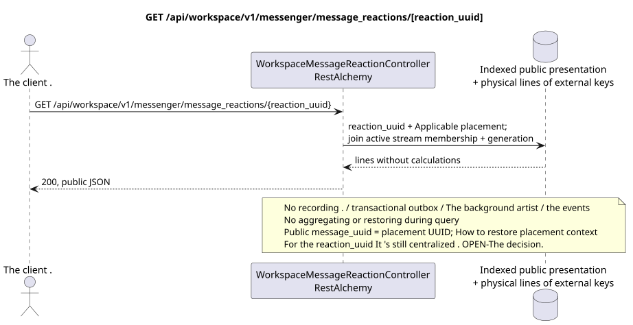

# GET /api/workspace/v1/messenger/message_reactions/{reaction_uuid}

[← The main index of the documentation](../../../../index.md) · [Index of sequence diagrams](../../README.md) · [The section Core Messenger](../README.md)

## Status and boundary of current contract

The method, path, public JSON, and authorization follow the current contract from [`workspace_api.md`](../../../../workspace_api.md); bounded pagination and asynchronous visibility follow separately adopted target compatibility ADR.



The source that you can edit: [`get_message_reaction.puml`](diagrams/get_message_reaction.puml).

## The operation

**Method and way:** `GET /api/workspace/v1/messenger/message_reactions/{reaction_uuid}`

**Purpose:** To obtain one visible reaction fact.

## A public request

Path: `reaction_uuid = bd4b7632-8788-435a-93cc-6873657335c6`; without body.

## A successful public response

HTTP `200`:

```json
{
  "uuid": "bd4b7632-8788-435a-93cc-6873657335c6",
  "project_id": "22222222-2222-2222-2222-222222222222",
  "message_uuid": "a93dca35-3061-4748-bda4-7f6f8c660ea5",
  "user_uuid": "11111111-1111-1111-1111-111111111111",
  "emoji_name": "thumbs_up",
  "provider": null,
  "delivery": null,
  "created_at": "2026-06-22T10:12:00Z",
  "updated_at": "2026-06-22T10:12:00Z"
}
```

## Public errors

The bearer-token IAM and project area are required; the invisible or missing resource or marker gives `404`..

## The target boundary RestAlchemy

```python
from restalchemy.api import controllers
from restalchemy.api import resources
from restalchemy.dm import models
from restalchemy.dm import properties
from restalchemy.dm import types
from restalchemy.storage.sql import orm


class WorkspaceMessageReactionView(
    models.ModelWithUUID,
    models.ModelWithProject,
    orm.SQLStorableMixin,
):
    __tablename__ = "messenger_api_message_reactions_v1"

    message_uuid = properties.property(types.UUID(), read_only=True)
    canonical_message_uuid = properties.property(types.UUID(), read_only=True)
    user_uuid = properties.property(types.UUID(), read_only=True)


class WorkspaceMessageReactionController(controllers.BaseResourceControllerPaginated):
    __resource__ = resources.ResourceByRAModel(
        WorkspaceMessageReactionView, convert_underscore=False, process_filters=True,
    )
```

Public `message_uuid`  scalar UUID placement; internal
`canonical_message_uuid` field permissions are hidden.UUIDThe original fact
The physical links remain indexed FK, and the
The original metadata of the provider/delivery is closed.

## Synchronized reading path

1. Re-establish the fact on UUID and apply public placement, then through it
   stream check active `USER_STREAM_BINDING` and equal membership
   generation; Serial only `provider`/`delivery`.
2. Returns the result directly from the indexed representation without calculations.
3. Do not add transactional outbox entries, tasks, work with projections, public events or WebSocket.

## Idempotency and consistency visible to the client

This GET has no side effects. It can observe the permissible lag from an earlier record, but does not perform recovery, fan-out distribution, `COUNT`, `GROUP BY`, window or lateral operations, correlated subqueries or search for missing bindings.

The public field `message_uuid`  placement UUID.
only `reaction_uuid`, selecting a public placement for canonical-message-global
fact with several visible placements remains an obvious OPEN solution; hidden
binding UUID or arbitrary primary placement cannot be selected.

[← The main index of the documentation](../../../../index.md) · [Index of sequence diagrams](../../README.md) · [The section Core Messenger](../README.md)
