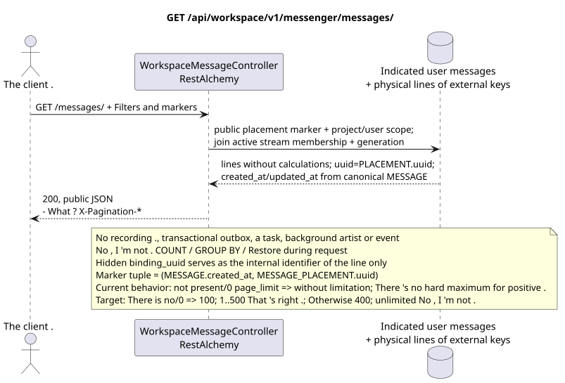

# GET /api/workspace/v1/messenger/messages/

[← The main index of the documentation](../../../../index.md) · [Index of sequence diagrams](../../README.md) · [The section Core Messenger](../README.md)

## Status and boundary of current contract

The method, path, public JSON, authorization and filters follow [`workspace_api.md`](../../../../workspace_api.md); bounded pagination and asynchronous visibility are separately accepted target compatibility change. This file does not change the executable code.



The source that you can edit: [`get_messages_list.puml`](diagrams/get_messages_list.puml).

## The operation

**Method and way:** `GET /api/workspace/v1/messenger/messages/`

**Purpose:** To obtain a list of messages visible to the current user IAM, with a stable composite page layout by key.

## A public request

No body, example of a request.:

```http
GET /api/workspace/v1/messenger/messages/?stream_uuid=75309057-419c-4b12-a7c1-3932429ec4a6&topic_uuid=4ec0b996-b778-45f8-8ef4-ef863be0c047&sort_key=created_at&sort_dir=desc&page_limit=50&page_marker=a93dca35-3061-4748-bda4-7f6f8c660ea5
Authorization: Bearer <access_token>
```

The lines are sorted by `(MESSAGE.created_at, MESSAGE_PLACEMENT.uuid)`. `page_marker`  last public placement UUID. Marker outside the same user, project and filter area is rejected. Pagination headings: `X-Pagination-Limit` and, only if the following page is available, `X-Pagination-Marker`.

Current semantics RestAlchemy: missing or equal to `0` `page_limit` gives unlimited sample; negative or non-integer value gives HTTP `400`; positive value has no maximum. This is the current gap. Target: missing or `0` => `100`; `1..500` is accepted accurately; negative, non-integer or `>500` => HTTP `400` without clamp; unbounded mode is absent. marker.

## A successful public response

HTTP `200`:

```json
[
  {
    "uuid": "a93dca35-3061-4748-bda4-7f6f8c660ea5",
    "project_id": "22222222-2222-2222-2222-222222222222",
    "stream_uuid": "75309057-419c-4b12-a7c1-3932429ec4a6",
    "topic_uuid": "4ec0b996-b778-45f8-8ef4-ef863be0c047",
    "author_uuid": "11111111-1111-1111-1111-111111111111",
    "payload": {
      "kind": "markdown",
      "content": "Привет, Workspace"
    },
    "user_uuid": "11111111-1111-1111-1111-111111111111",
    "read": true,
    "pinned": false,
    "starred": false,
    "is_own": true,
    "mentioned": false,
    "reactions": {},
    "reaction_users": {},
    "source_name": "native",
    "source": {
      "kind": "native"
    },
    "provider": null,
    "delivery": null,
    "created_at": "2026-06-22T10:10:00Z",
    "updated_at": "2026-06-22T10:10:00Z"
  }
]
```

## Public errors

The bearer-token IAM and project area are required. The marker outside the authenticated user, project, view and filter area gives `404`..

## The target boundary RestAlchemy

```python
from restalchemy.api import controllers
from restalchemy.api import resources
from restalchemy.dm import models
from restalchemy.dm import properties
from restalchemy.dm import types
from restalchemy.storage.sql import orm


class WorkspaceUserMessage(models.ModelWithProject, orm.SQLStorableMixin):
    __tablename__ = "messenger_api_user_messages_v1"

    binding_uuid = properties.property(types.UUID(), id_property=True)
    uuid = properties.property(types.UUID(), read_only=True)
    stream_uuid = properties.property(types.UUID(), read_only=True)
    topic_uuid = properties.property(types.UUID(), read_only=True)
    author_uuid = properties.property(types.UUID(), read_only=True)
    user_uuid = properties.property(types.UUID(), read_only=True)


class WorkspaceMessageController(
    controllers.BaseResourceControllerPaginated,
):
    __resource__ = resources.ResourceByRAModel(
        WorkspaceUserMessage,
        convert_underscore=False,
        process_filters=True,
    )
```

Public references to entities are represented by scalar properties .UUIDNot a relationship .RestAlchemyThe series is being serialized inURI- Physical columns .`*_uuid`are indexed external keys with clearly specified reference integrity actions.

Public `uuid` is equal to `MESSAGE_PLACEMENT.uuid = UUIDv5(namespace=TOPIC.uuid, name=MESSAGE.uuid)`; name  lowercase hyphenated canonical UUID. `MESSAGE.uuid` internal, `binding_uuid`  hidden ORM identity. The controller restores the marker by public placement UUID and uses tuple `(MESSAGE.created_at,MESSAGE_PLACEMENT.uuid)`, without hidden binding key.

## Synchronized reading path

1. Apply project area IAM and current user, as well as documented stream filters and topics.
2. Scan indexed view with leading `USER_MESSAGE_BINDING` and mandatory join to active `USER_STREAM_BINDING` of the same generation.
3. Add one `MESSAGE_PLACEMENT`, one canonical `MESSAGE` and one placement-scoped string `USER_MESSAGE_STATE`.
4. Read canonical content/time stamps and ready state; serialize `uuid = MESSAGE_PLACEMENT.uuid`.
5. Return public JSON without calculating reaction aggregates or unread.

## Transactional outbox, background performer, events and consistency

This GET does not add a record to the transactional outbox, does not create a typed task, does not take a topic, does not record a projection or event, and does not call the WebSocket controller. It does not perform `COUNT`, `GROUP BY`, window or lateral-operations, correlated subqueries, fan-out allocation, recovery or missing binding lookup.

The answer reflects the already fixed lines of projections and may show a small amount of eventual consistency from earlier records..

[← The main index of the documentation](../../../../index.md) · [Index of sequence diagrams](../../README.md) · [The section Core Messenger](../README.md)
