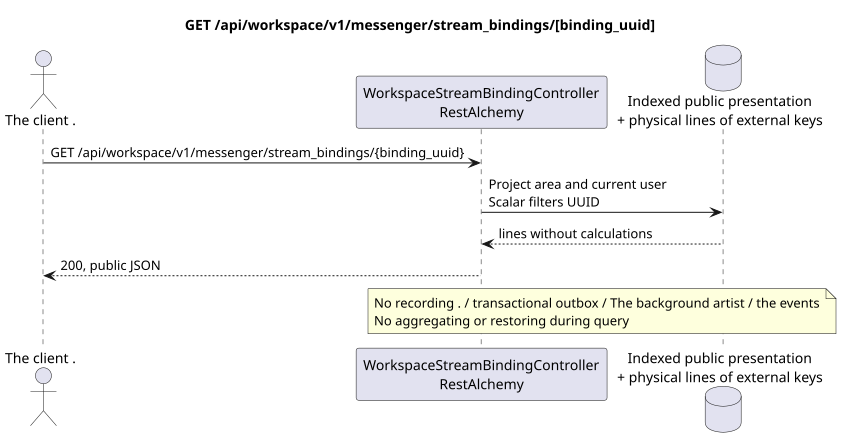

# GET /api/workspace/v1/messenger/stream_bindings/{binding_uuid}

[← The main index of the documentation](../../../../index.md) · [Index of sequence diagrams](../../README.md) · [The section Core Messenger](../README.md)

## Status and boundary of current contract

The method, path, public JSON, and authorization follow the current contract from [`workspace_api.md`](../../../../workspace_api.md); bounded pagination and asynchronous visibility follow separately adopted target compatibility ADR.



The source that you can edit: [`get_stream_binding.puml`](diagrams/get_stream_binding.puml).

## The operation

**Method and way:** `GET /api/workspace/v1/messenger/stream_bindings/{binding_uuid}`

**Purpose:** To obtain one visible stream link.

## A public request

Path: `binding_uuid = 3195a887-da5d-440b-bdf8-0d3d995a9e01`; without body.

## A successful public response

HTTP `200`:

```json
{
  "uuid": "3195a887-da5d-440b-bdf8-0d3d995a9e01",
  "project_id": "22222222-2222-2222-2222-222222222222",
  "stream_uuid": "75309057-419c-4b12-a7c1-3932429ec4a6",
  "user_uuid": "33333333-3333-3333-3333-333333333333",
  "who_uuid": "11111111-1111-1111-1111-111111111111",
  "role": "member",
  "notification_mode": "all_messages",
  "notification_updated_at": "1970-01-01T00:00:00Z",
  "created_at": "2026-06-22T09:05:00Z",
  "updated_at": "2026-06-22T09:05:00Z"
}
```

## Public errors

The bearer-token IAM and project area are required; the invisible or missing resource or marker gives `404`..

## The target boundary RestAlchemy

```python
from restalchemy.api import controllers
from restalchemy.api import resources
from restalchemy.dm import models
from restalchemy.dm import properties
from restalchemy.dm import types
from restalchemy.storage.sql import orm


class WorkspaceStreamBindingView(
    models.ModelWithUUID,
    models.ModelWithProject,
    orm.SQLStorableMixin,
):
    __tablename__ = "messenger_api_stream_bindings_v1"

    stream_uuid = properties.property(types.UUID(), read_only=True)
    user_uuid = properties.property(types.UUID(), read_only=True)
    who_uuid = properties.property(types.UUID(), read_only=True)


class WorkspaceStreamBindingController(controllers.BaseResourceControllerPaginated):
    __resource__ = resources.ResourceByRAModel(
        WorkspaceStreamBindingView, convert_underscore=False, process_filters=True,
    )
```

Public references to entities are represented by scalar properties `types.UUID()`, not relations RestAlchemy, which are serialized in URI. Physical columns `*_uuid` remain indexed external keys with explicitly selected reference integrity actions.USER_STREAM_BINDING is unique in `(project_id, stream_uuid, user_uuid)` and can physically store ready counters, but its current public JSON binding does not change.

## Synchronized reading path

1. Restore binding on UUID, verify membership and observer role, serialize scalar UUID. Physical ready counters do not extend the current public JSON binding.
2. Returns the result directly from the indexed representation without calculations.
3. Do not add transactional outbox entries, tasks, work with projections, public events or WebSocket.

## Idempotency and consistency visible to the client

This GET has no side effects. It can observe the permissible lag from an earlier record, but does not perform recovery, fan-out distribution, `COUNT`, `GROUP BY`, window or lateral operations, correlated subqueries or search for missing bindings.

[← The main index of the documentation](../../../../index.md) · [Index of sequence diagrams](../../README.md) · [The section Core Messenger](../README.md)
