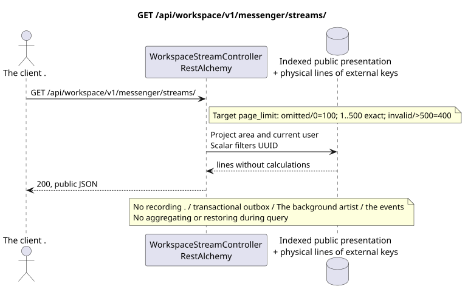

# GET /api/workspace/v1/messenger/streams/

[← The main index of the documentation](../../../../index.md) · [Index of sequence diagrams](../../README.md) · [The section Core Messenger](../README.md)

## Status and boundary of current contract

The method, path, public JSON, and authorization follow the current contract from [`workspace_api.md`](../../../../workspace_api.md); target pagination `100/500` is a separate observable behavior change.



The source that you can edit: [`get_streams_list.puml`](diagrams/get_streams_list.puml).

## The operation

**Method and way:** `GET /api/workspace/v1/messenger/streams/`

**Purpose:** To obtain a list of streams visible through the current user's bindings.

## A public request

Without a body.:

```http
GET /api/workspace/v1/messenger/streams/?private=false&page_limit=50&page_marker=75309057-419c-4b12-a7c1-3932429ec4a6
Authorization: Bearer <access_token>
```

Current semantics RestAlchemy: missing or equal to `0` `page_limit` gives unlimited sample; negative or non-integer value gives HTTP `400`; positive value has no maximum. This is the current gap. Target: missing or `0` => `100`; `1..500` is accepted accurately; negative, non-integer or `>500` => HTTP `400` without clamp; unbounded mode is absent. marker.

## A successful public response

HTTP `200`:

```json
[
  {
    "uuid": "75309057-419c-4b12-a7c1-3932429ec4a6",
    "name": "Инженерия",
    "description": "Инженерное пространство",
    "project_id": "22222222-2222-2222-2222-222222222222",
    "owner": "11111111-1111-1111-1111-111111111111",
    "user_uuid": "11111111-1111-1111-1111-111111111111",
    "role": "owner",
    "notification_mode": "all_messages",
    "unread_count": 2,
    "active_unread_count": 2,
    "passive_unread_count": 0,
    "source_name": "native",
    "source": {
      "kind": "native"
    },
    "invite_only": false,
    "announce": false,
    "private": false,
    "is_archived": false,
    "color": 3368601,
    "last_message_uuid": "a93dca35-3061-4748-bda4-7f6f8c660ea5",
    "default_topic_uuid": "4ec0b996-b778-45f8-8ef4-ef863be0c047",
    "created_at": "2026-06-22T09:00:00Z",
    "updated_at": "2026-06-22T10:10:00Z"
  }
]
```

## Public errors

The bearer-token IAM and project area are required; the invisible or missing resource or marker gives `404`..

## The target boundary RestAlchemy

```python
from restalchemy.api import controllers
from restalchemy.api import resources
from restalchemy.dm import models
from restalchemy.dm import properties
from restalchemy.dm import types
from restalchemy.storage.sql import orm


class WorkspaceUserStream(
    models.ModelWithUUID,
    models.ModelWithProject,
    orm.SQLStorableMixin,
):
    __tablename__ = "messenger_api_user_streams_v1"

    owner = properties.property(types.UUID(), read_only=True)
    user_uuid = properties.property(types.UUID(), read_only=True)
    direct_user_uuid = properties.property(
        types.AllowNone(types.UUID()), default=None, read_only=True,
    )
    last_message_uuid = properties.property(types.UUID(), read_only=True)
    default_topic_uuid = properties.property(types.UUID(), read_only=True)


class WorkspaceStreamController(controllers.BaseResourceControllerPaginated):
    __resource__ = resources.ResourceByRAModel(
        WorkspaceUserStream, convert_underscore=False, process_filters=True,
    )
```

Public entity references are represented by scalar properties `types.UUID()`, not relations RestAlchemy, which are serialized in URI.Physical columns `*_uuid` remain indexed external keys with explicitly selected reference integrity actions.The public field `owner` is the property UUID; the physical field `owner_uuid`  is the user's indexed external key. USER_STREAM_BINDING stores ready-made flow-level counters..

## Synchronized reading path

1. Scan unique lines USER_STREAM_BINDING and attach one canonical STREAM, as well as optional default topics and last message. Ready unread fields are taken from binding; aggregating during query is not performed.
2. Returns the result directly from the indexed representation without calculations.
3. Do not add transactional outbox entries, tasks, work with projections, public events or WebSocket.

## Idempotency and consistency visible to the client

This GET has no side effects. It can observe the permissible lag from an earlier record, but does not perform recovery, fan-out distribution, `COUNT`, `GROUP BY`, window or lateral operations, correlated subqueries or search for missing bindings.

[← The main index of the documentation](../../../../index.md) · [Index of sequence diagrams](../../README.md) · [The section Core Messenger](../README.md)
