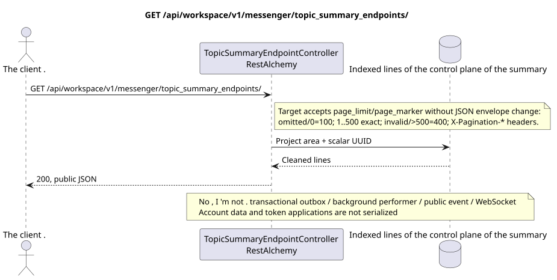

# GET /api/workspace/v1/messenger/topic_summary_endpoints/

[← The main index of the documentation](../../../../index.md) · [Index of sequence diagrams](../../README.md) · [The section Core Messenger](../README.md)

## Status and boundary of current contract

The target specification in the docs-first approach. HTTP-contract remains the current contract from [`workspace_api.md`](../../../../workspace_api.md); The target internal mechanisms are only a proposal.



The source that you can edit: [`get_topic_summary_endpoints_list.puml`](diagrams/get_topic_summary_endpoints_list.puml).

## The operation

**Method and way:** `GET /api/workspace/v1/messenger/topic_summary_endpoints/`

**Purpose:** To obtain a list of global OpenAI-compatible summary endpoints in order of priority and UUID.

## A public request

No body; collection filters and re-definition of order are not accepted.

The current endpoint does not accept `page_limit` and reads the entire register of endpoints
The point  is the current gap.`page_limit`and `page_marker`:
absence/`0` gives `100`, `1..500` is taken exactly, negative,
and `>500` gives HTTP `400` without clamp. JSON remains an array;
Page size is transmitted by standard `X-Pagination-Limit` and
`X-Pagination-Marker`, so no new JSON fields appear.

## A successful public response

HTTP `200`:

```json
[
  {
    "uuid": "e4ad6d80-6bc7-4a91-864c-8e97319a82bd",
    "name": "primary-summary-model",
    "base_url": "https://llm.example.com/v1",
    "model": "summary-model",
    "enabled": true,
    "priority": 10,
    "supports_vision": true,
    "supports_reasoning": true,
    "temperature": 0.2,
    "max_output_tokens": 512,
    "top_p": 1,
    "presence_penalty": 0,
    "frequency_penalty": 0,
    "credential_present": true,
    "failure_count": 0,
    "created_at": "2026-06-22T08:00:00Z",
    "updated_at": "2026-06-22T08:00:00Z"
  }
]
```

The status and error timestamp fields may be missing in the response if they allow `null` and have this value. `api_key` and the active request token are never returned.

## Public errors

Requires bearer-token IAM. Incorrect UUID or request body is given HTTP `400`; no management permission  `403`. Standard validation error body:

```json
{
  "type": "ValidationErrorException",
  "code": 400,
  "message": "Validation error occurred."
}
```

For every operation with an endpoint register, `workspace.topic_summary_endpoint.manage` is required; the missing endpoint gives `404`.

## The target boundary RestAlchemy

```python
from restalchemy.api import controllers
from restalchemy.api import resources
from restalchemy.dm import models
from restalchemy.dm import properties
from restalchemy.dm import types
from restalchemy.storage.sql import orm


class WorkspaceTopicSummaryEndpoint(
    models.ModelWithUUID,
    models.ModelWithTimestamp,
    orm.SQLStorableMixin,
):
    __tablename__ = "messenger_topic_summary_endpoints"

    name = properties.property(types.String(max_length=255), required=True)
    base_url = properties.property(types.String(max_length=2048), required=True)
    model = properties.property(types.String(max_length=255), required=True)
    credential_present = properties.property(types.Boolean(), read_only=True)


class TopicSummaryEndpointController(controllers.BaseResourceControllerPaginated):
    __resource__ = resources.ResourceByRAModel(
        WorkspaceTopicSummaryEndpoint,
        convert_underscore=False,
        process_filters=True,
    )
```

This global resource has no public fields of entity relations. Its public field `uuid`  scalar property UUID. Any internal external key or reference to account data is indexed and has an explicit reference integrity action; `api_key` is write-only, stored in encrypted form, and never serialized..

## Synchronized reading path

1. Require documented permission and project scope.
2. Read indexed physical lines through standard objects RestAlchemy.
3. Clear the account and application fields, then serialize the current public form.
4. Do not create transactional outbox records, tasks, background artist requests, public events or work WebSocket.

This reading has no side effects and does not perform aggregation or recovery during the query.

[← The main index of the documentation](../../../../index.md) · [Index of sequence diagrams](../../README.md) · [The section Core Messenger](../README.md)
