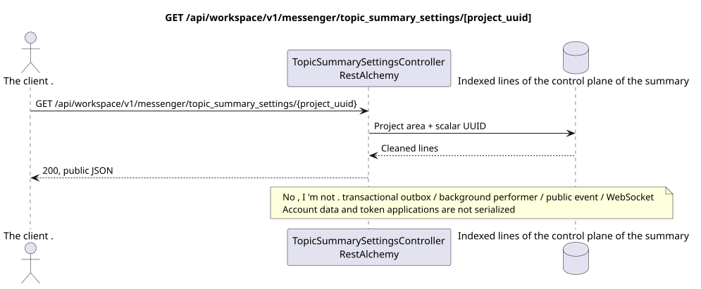

# GET /api/workspace/v1/messenger/topic_summary_settings/{project_uuid}

[← The main index of the documentation](../../../../index.md) · [Index of sequence diagrams](../../README.md) · [The section Core Messenger](../README.md)

## Status and boundary of current contract

The target specification in the docs-first approach. HTTP-contract remains the current contract from [`workspace_api.md`](../../../../workspace_api.md); The target internal mechanisms are only a proposal.



The source that you can edit: [`get_topic_summary_settings.puml`](diagrams/get_topic_summary_settings.puml).

## The operation

**Method and way:** `GET /api/workspace/v1/messenger/topic_summary_settings/{project_uuid}`

**Purpose:** To read global and current project-related inclusion conditions of summaries.

## A public request

Path: `project_uuid = 12345678-1234-4234-8234-123456789abc`; value must match the project IAM; no body.

## A successful public response

HTTP `200`:

```json
{
  "project_id": "12345678-1234-4234-8234-123456789abc",
  "global_enabled": false,
  "project_enabled": false
}
```

The status and error timestamp fields may be missing in the response if they allow `null` and have this value. `api_key` and the active request token are never returned.

## Public errors

Requires bearer-token IAM. Incorrect UUID or request body is given HTTP `400`; no management permission  `403`. Standard validation error body:

```json
{
  "type": "ValidationErrorException",
  "code": 400,
  "message": "Validation error occurred."
}
```

If UUID in the path does not match the project IAM, returns `403`; GET requires project membership, and PUT  management permission.

## The target boundary RestAlchemy

```python
from restalchemy.api import controllers
from restalchemy.api import resources
from restalchemy.dm import models
from restalchemy.dm import properties
from restalchemy.dm import types
from restalchemy.storage.sql import orm


class WorkspaceTopicSummarySettings(
    models.ModelWithProject,
    orm.SQLStorableMixin,
):
    __tablename__ = "messenger_topic_summary_settings"

    project_id = properties.property(types.UUID(), id_property=True, read_only=True)
    global_enabled = properties.property(types.Boolean(), default=False)
    project_enabled = properties.property(types.Boolean(), default=False)


class TopicSummarySettingsController(controllers.BaseResourceController):
    __resource__ = resources.ResourceByRAModel(
        WorkspaceTopicSummarySettings,
        convert_underscore=False,
        process_filters=True,
    )
```

The public field `project_id`  scalar property UUID, not a relation in the form URI. The physical indexed external key to the project Workspace has an explicitly given reference integrity action. UUID from the path must match the context of the project IAM.

## Synchronized reading path

1. Require documented permission and project scope.
2. Read indexed physical lines through standard objects RestAlchemy.
3. Clear the account and application fields, then serialize the current public form.
4. Do not create transactional outbox records, tasks, background artist requests, public events or work WebSocket.

This reading has no side effects and does not perform aggregation or recovery during the query.

[← The main index of the documentation](../../../../index.md) · [Index of sequence diagrams](../../README.md) · [The section Core Messenger](../README.md)
