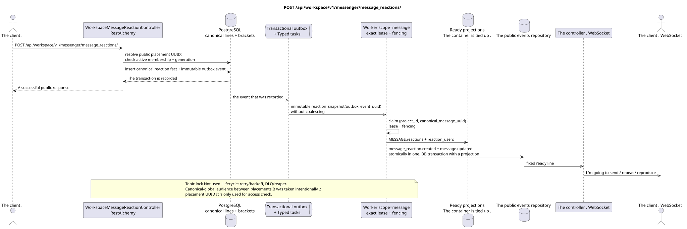

# POST /api/workspace/v1/messenger/message_reactions/

[← The main index of the documentation](../../../../index.md) · [Index of sequence diagrams](../../README.md) · [The section Core Messenger](../README.md)

## Status and boundary of current contract

The method, path, public JSON, and authorization follow the current contract from [`workspace_api.md`](../../../../workspace_api.md); bounded pagination and asynchronous visibility follow separately adopted target compatibility ADR.



The source that you can edit: [`post_message_reactions_create.puml`](diagrams/post_message_reactions_create.puml).

## The operation

**Method and way:** `POST /api/workspace/v1/messenger/message_reactions/`

**Purpose:** To create one initial reaction to a canonical message.

## A public request

```json
{
  "message_uuid": "a93dca35-3061-4748-bda4-7f6f8c660ea5",
  "emoji_name": "thumbs_up"
}
```

## A successful public response

HTTP `201`:

```json
{
  "uuid": "bd4b7632-8788-435a-93cc-6873657335c6",
  "project_id": "22222222-2222-2222-2222-222222222222",
  "message_uuid": "a93dca35-3061-4748-bda4-7f6f8c660ea5",
  "user_uuid": "11111111-1111-1111-1111-111111111111",
  "emoji_name": "thumbs_up",
  "provider": null,
  "delivery": null,
  "created_at": "2026-06-22T10:12:00Z",
  "updated_at": "2026-06-22T10:12:00Z"
}
```

## Public errors

The bearer-token IAM and the project area are required. An incorrect UUID or request body is given by HTTP `400`; missing or unavailable in this area resource  `404`. Standard documented validation error body:

```json
{
  "type": "ValidationErrorException",
  "code": 400,
  "message": "Validation error occurred."
}
```

Repeating the same user, message, and emoji combination is rejected; the current contract does not specify a separate application code for this.

## The target boundary RestAlchemy

```python
from restalchemy.api import controllers
from restalchemy.api import resources
from restalchemy.dm import models
from restalchemy.dm import properties
from restalchemy.dm import types
from restalchemy.storage.sql import orm


class WorkspaceMessageReactionView(
    models.ModelWithUUID,
    models.ModelWithProject,
    orm.SQLStorableMixin,
):
    __tablename__ = "messenger_api_message_reactions_v1"

    message_uuid = properties.property(types.UUID(), read_only=True)
    canonical_message_uuid = properties.property(types.UUID(), read_only=True)
    user_uuid = properties.property(types.UUID(), read_only=True)


class WorkspaceMessageReactionController(controllers.BaseResourceControllerPaginated):
    __resource__ = resources.ResourceByRAModel(
        WorkspaceMessageReactionView, convert_underscore=False, process_filters=True,
    )
```

Public `message_uuid`  scalar UUID placement; internal
`canonical_message_uuid` field permissions are hidden.UUIDThe original fact
The physical links remain indexed FK, and the
The original metadata of the provider/delivery is closed.

## Synchronous transaction

1. Interpret public `message_uuid` as placement UUID, restore
   its canonical message and immediately check active stream membership and
   matching generation.
2. Insert one raw fact for the current user, canonical message and emoji;
   placement is used for authorization, not as hidden public ID.
3. Add a separate immutable event to transactional outbox; derived task
   Unique on `outbox_event_uuid`, no synchronized editing.

The affected state: the fact of reaction, access binding and transactional outbox.

## Typed tasks and background performers

Tasks: separate immutable `reaction_snapshot` and if necessary separate
`delivery_snapshot_event`; coalescing There is no.

One . fenced owner scope `message`
`(project_id, canonical_message_uuid)` He reads the facts and he 's atomic .
replaces `MESSAGE.reactions`/`reaction_users`; topic lock is not used.
Task lifecycle includes lease expiry, retry/backoff, DLQ and reaper.

## Public events and WebSocket

For the initiator  `message_reaction.created`, then for the observer  `message.updated` through the controller.

## Idempotence, races and time characteristics visible to the client

Uniqueness `(project,canonical_message,user,emoji)` prevents duplicates and
Revocate membership bans the request immediately after commit,
The fact is visible to the initiator immediately, the pictures and
Canonical-global snapshots are intentionally visible between
The decision was made to make a new Critic risk #8.

[← The main index of the documentation](../../../../index.md) · [Index of sequence diagrams](../../README.md) · [The section Core Messenger](../README.md)
