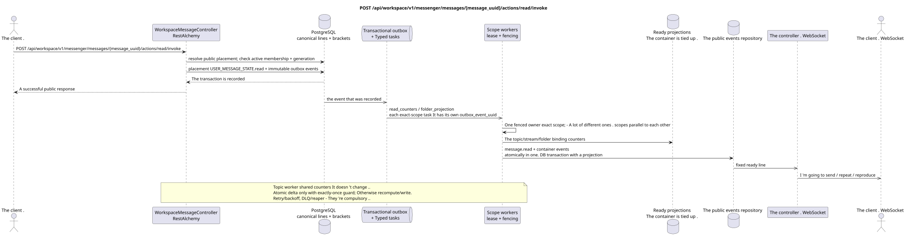

# POST /api/workspace/v1/messenger/messages/{message_uuid}/actions/read/invoke

[← The main index of the documentation](../../../../index.md) · [Index of sequence diagrams](../../README.md) · [The section Core Messenger](../README.md)

## Status and boundary of current contract

The method, path, public JSON, and authorization follow the current contract from [`workspace_api.md`](../../../../workspace_api.md); bounded pagination and asynchronous visibility follow separately adopted target compatibility ADR.



The source that you can edit: [`post_message_read_action.puml`](diagrams/post_message_read_action.puml).

## The operation

**Method and way:** `POST /api/workspace/v1/messenger/messages/{message_uuid}/actions/read/invoke`

**Purpose:** To mark one message as read by the current user.

## A public request

Without a body. JSON.

## A successful public response

HTTP `200`:

```json
{
  "uuid": "a93dca35-3061-4748-bda4-7f6f8c660ea5",
  "project_id": "22222222-2222-2222-2222-222222222222",
  "stream_uuid": "75309057-419c-4b12-a7c1-3932429ec4a6",
  "topic_uuid": "4ec0b996-b778-45f8-8ef4-ef863be0c047",
  "author_uuid": "11111111-1111-1111-1111-111111111111",
  "payload": {
    "kind": "markdown",
    "content": "Привет, Workspace"
  },
  "user_uuid": "33333333-3333-3333-3333-333333333333",
  "read": true,
  "pinned": false,
  "starred": false,
  "is_own": false,
  "mentioned": false,
  "reactions": {},
  "reaction_users": {},
  "source_name": "native",
  "source": {
    "kind": "native"
  },
  "provider": null,
  "delivery": null,
  "created_at": "2026-06-22T10:10:00Z",
  "updated_at": "2026-06-22T10:10:00Z"
}
```

## Public errors

The bearer-token IAM and the project area are required. An incorrect UUID or request body is given by HTTP `400`; missing or unavailable in this area resource  `404`. Standard documented validation error body:

```json
{
  "type": "ValidationErrorException",
  "code": 400,
  "message": "Validation error occurred."
}
```

## The target boundary RestAlchemy

```python
from restalchemy.api import controllers
from restalchemy.api import resources
from restalchemy.dm import models
from restalchemy.dm import properties
from restalchemy.dm import types
from restalchemy.storage.sql import orm


class WorkspaceUserMessage(models.ModelWithProject, orm.SQLStorableMixin):
    __tablename__ = "messenger_api_user_messages_v1"

    binding_uuid = properties.property(types.UUID(), id_property=True)
    uuid = properties.property(types.UUID(), read_only=True)
    stream_uuid = properties.property(types.UUID(), read_only=True)
    topic_uuid = properties.property(types.UUID(), read_only=True)
    author_uuid = properties.property(types.UUID(), read_only=True)
    user_uuid = properties.property(types.UUID(), read_only=True)


class WorkspaceMessageController(controllers.BaseResourceControllerPaginated):
    __resource__ = resources.ResourceByRAModel(
        WorkspaceUserMessage, convert_underscore=False, process_filters=True,
    )
```

Public `uuid` and route ID are equal to `MESSAGE_PLACEMENT.uuid`; canonical `MESSAGE.uuid` and `binding_uuid` are hidden. Placement unambiguously selects `USER_MESSAGE_STATE (project,user,placement)`, and action simultaneously checks active membership and generation.

## Synchronous transaction

1. Allow public placement UUID and current user access.
2. Set a unique value USER_MESSAGE_STATE.read.
3. Only when you change , add a separate immutable outbox event for each
   output task of the actual area.

Affected state: USER_MESSAGE_STATE, access area and transactional outbox; container counters are never stored in message binding.

## Typed tasks and background performers

Tasks: separate immutable `read_counters` for exact `user-stream` and
`user-topic`, and also `folder_projection` for exact `user-folder`; each task
corresponds to its own source outbox event, coalescing is absent.

Fenced owners scopes `user-stream`, `user-topic` and `user-folder` is idempotent.
/snapshot. Topic worker is not writing these shared rows. Atomic delta
Allowed only with exactly-once guard on `outbox_event_uuid`; otherwise scope worker
Task lifecycle includes retry/backoff, DLQ/reaper.

## Public events and WebSocket

`message.read`, Update the topic, stream and folder

## Idempotence, races and time characteristics visible to the client

Setup of idmpotent state; current state changes immediately, and aggregates and events may lag shortly.

[← The main index of the documentation](../../../../index.md) · [Index of sequence diagrams](../../README.md) · [The section Core Messenger](../README.md)
