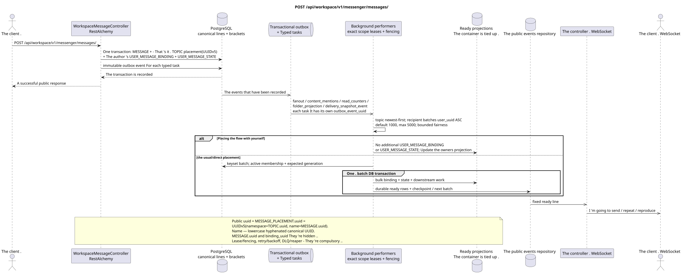

# POST /api/workspace/v1/messenger/messages/

[← The main index of the documentation](../../../../index.md) · [Index of sequence diagrams](../../README.md) · [The section Core Messenger](../README.md)

## Status and boundary of current contract

The method, path, public JSON, and authorization follow the current contract from [`workspace_api.md`](../../../../workspace_api.md); bounded pagination and asynchronous visibility follow separately adopted target compatibility ADR.



The source that you can edit: [`post_messages_create.puml`](diagrams/post_messages_create.puml).

## The operation

**Method and way:** `POST /api/workspace/v1/messenger/messages/`

**Purpose:** To create one canonical markdown message and its initial placement.

## A public request

```json
{
  "stream_uuid": "75309057-419c-4b12-a7c1-3932429ec4a6",
  "topic_uuid": "4ec0b996-b778-45f8-8ef4-ef863be0c047",
  "payload": {
    "kind": "markdown",
    "content": "Привет, Workspace"
  }
}
```

## A successful public response

HTTP `201`:

```json
{
  "uuid": "a93dca35-3061-4748-bda4-7f6f8c660ea5",
  "project_id": "22222222-2222-2222-2222-222222222222",
  "stream_uuid": "75309057-419c-4b12-a7c1-3932429ec4a6",
  "topic_uuid": "4ec0b996-b778-45f8-8ef4-ef863be0c047",
  "author_uuid": "11111111-1111-1111-1111-111111111111",
  "payload": {
    "kind": "markdown",
    "content": "Привет, Workspace"
  },
  "user_uuid": "11111111-1111-1111-1111-111111111111",
  "read": true,
  "pinned": false,
  "starred": false,
  "is_own": true,
  "mentioned": false,
  "reactions": {},
  "reaction_users": {},
  "source_name": "native",
  "source": {
    "kind": "native"
  },
  "provider": null,
  "delivery": null,
  "created_at": "2026-06-22T10:10:00Z",
  "updated_at": "2026-06-22T10:10:00Z"
}
```

## Public errors

The bearer-token IAM and the project area are required. An incorrect UUID or request body is given by HTTP `400`; missing or unavailable in this area resource  `404`. Standard documented validation error body:

```json
{
  "type": "ValidationErrorException",
  "code": 400,
  "message": "Validation error occurred."
}
```

The default topic or topic absence is `400001007` (`StreamDefaultTopicNotConfiguredError`); markdown after removing edge spaces should contain from 1 to 40,000 characters.

## The target boundary RestAlchemy

```python
from restalchemy.api import controllers
from restalchemy.api import resources
from restalchemy.dm import models
from restalchemy.dm import properties
from restalchemy.dm import types
from restalchemy.storage.sql import orm


class WorkspaceUserMessage(models.ModelWithProject, orm.SQLStorableMixin):
    __tablename__ = "messenger_api_user_messages_v1"

    binding_uuid = properties.property(types.UUID(), id_property=True)
    uuid = properties.property(types.UUID(), read_only=True)
    stream_uuid = properties.property(types.UUID(), read_only=True)
    topic_uuid = properties.property(types.UUID(), read_only=True)
    author_uuid = properties.property(types.UUID(), read_only=True)
    user_uuid = properties.property(types.UUID(), read_only=True)


class WorkspaceMessageController(controllers.BaseResourceControllerPaginated):
    __resource__ = resources.ResourceByRAModel(
        WorkspaceUserMessage, convert_underscore=False, process_filters=True,
    )
```

Public `uuid` and route ID are equal to `MESSAGE_PLACEMENT.uuid`, computed as `UUIDv5(namespace=TOPIC.uuid, name=MESSAGE.uuid)`; name  lowercase hyphenated canonical UUID. `MESSAGE.uuid` internal, `binding_uuid` hidden. `topic_uuid` physically binding; public null/omission is first allowed in canonical default topic.

## Synchronous transaction

1. Check current access to the stream and topic.
2. Insert one `MESSAGE`.
3. Calculate the determinate placement UUID and insert one `MESSAGE_PLACEMENT`; retry the same pair topic/message returns the same UUID.
4. Insert the author `USER_MESSAGE_BINDING` and
   `USER_MESSAGE_STATE (read=true)`.
5. Add a separate unchangeable outbox event for each transaction
   The one that 's being drawn initial typed task.

The synchronous transaction is limited to the set `MESSAGE` +
`MESSAGE_PLACEMENT` + `USER_MESSAGE_BINDING` + the author
`USER_MESSAGE_STATE` + transactional outbox.

## Typed tasks and background performers

The tasks are `fanout`, `content_mentions`, `read_counters`, `folder_projection` and,
where applicable, provider `delivery_snapshot_event`; each has
- My own . source outbox event.

The slot exclusively occupies `(project_id, topic_uuid)`, handles messages on
`MESSAGE.created_at DESC`, a recipients  immutable keyset batches by
`user_uuid ASC`: default `1000`, hard maximum `5000`, without `OFFSET` and unbounded
transaction. Every batch is rechecked . active membership/generation,
Atomically writes binding/state, downstream work and ready events, then checkpoint;
retry Stale task does no-op; self-chat does not add
The second set ..

## Public events and WebSocket

Worker It 's atomically fixing the projection and ready `message.created`/
`topic.updated`/`stream.updated` rows. Dispatcher It 's coming . durable events.

## Idempotence, races and time characteristics visible to the client

The canonical content is stored in one copy; business key and UUIDv5
The author sees the message immediately. (`201` =
primary commit), receivers/projections may lag behind; about a second — SLO intent,
Bounded fairness doesn't allow a large audience to displace the old work..

[← The main index of the documentation](../../../../index.md) · [Index of sequence diagrams](../../README.md) · [The section Core Messenger](../README.md)
