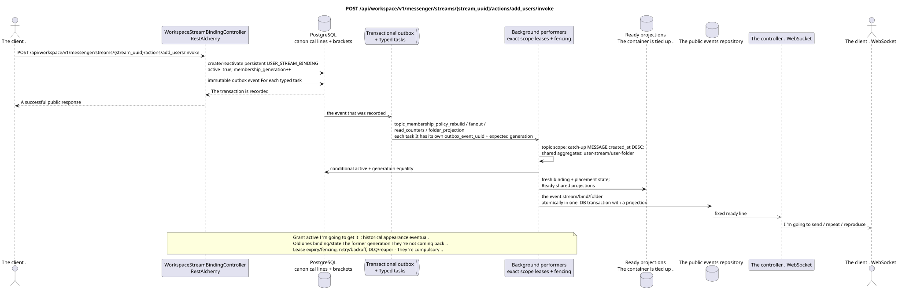

# POST /api/workspace/v1/messenger/streams/{stream_uuid}/actions/add_users/invoke

[← The main index of the documentation](../../../../index.md) · [Index of sequence diagrams](../../README.md) · [The section Core Messenger](../README.md)

## Status and boundary of current contract

The method, path, public JSON, and authorization follow the current contract from [`workspace_api.md`](../../../../workspace_api.md); bounded pagination and asynchronous visibility follow separately adopted target compatibility ADR.



The source that you can edit: [`post_stream_add_users_action.puml`](diagrams/post_stream_add_users_action.puml).

## The operation

**Method and way:** `POST /api/workspace/v1/messenger/streams/{stream_uuid}/actions/add_users/invoke`

**Purpose:** Add users to a regular stream by grouping them by role.

## A public request

```json
{
  "member": [
    "33333333-3333-3333-3333-333333333333",
    "44444444-4444-4444-4444-444444444444"
  ],
  "owner": [
    "55555555-5555-5555-5555-555555555555"
  ]
}
```

## A successful public response

HTTP `200`:

```json
[
  {
    "uuid": "3195a887-da5d-440b-bdf8-0d3d995a9e01",
    "project_id": "22222222-2222-2222-2222-222222222222",
    "stream_uuid": "75309057-419c-4b12-a7c1-3932429ec4a6",
    "user_uuid": "33333333-3333-3333-3333-333333333333",
    "who_uuid": "11111111-1111-1111-1111-111111111111",
    "role": "member",
    "notification_mode": "all_messages",
    "notification_updated_at": "1970-01-01T00:00:00Z",
    "created_at": "2026-06-22T09:05:00Z",
    "updated_at": "2026-06-22T09:05:00Z"
  },
  {
    "uuid": "4295a887-da5d-440b-bdf8-0d3d995a9e02",
    "project_id": "22222222-2222-2222-2222-222222222222",
    "stream_uuid": "75309057-419c-4b12-a7c1-3932429ec4a6",
    "user_uuid": "44444444-4444-4444-4444-444444444444",
    "who_uuid": "11111111-1111-1111-1111-111111111111",
    "role": "member",
    "notification_mode": "all_messages",
    "notification_updated_at": "1970-01-01T00:00:00Z",
    "created_at": "2026-06-22T09:05:00Z",
    "updated_at": "2026-06-22T09:05:00Z"
  }
]
```

## Public errors

The bearer-token IAM and the project area are required. An incorrect UUID or request body is given by HTTP `400`; missing or unavailable in this area resource  `404`. Standard documented validation error body:

```json
{
  "type": "ValidationErrorException",
  "code": 400,
  "message": "Validation error occurred."
}
```

Unsupported role gives `400001004`; users not in list form  `400001005`; changing the membership of the direct stream or the stream itself — `400`.

## The target boundary RestAlchemy

```python
from restalchemy.api import controllers
from restalchemy.api import resources
from restalchemy.dm import models
from restalchemy.dm import properties
from restalchemy.dm import types
from restalchemy.storage.sql import orm


class WorkspaceStreamBindingView(
    models.ModelWithUUID,
    models.ModelWithProject,
    orm.SQLStorableMixin,
):
    __tablename__ = "messenger_api_stream_bindings_v1"

    stream_uuid = properties.property(types.UUID(), read_only=True)
    user_uuid = properties.property(types.UUID(), read_only=True)
    who_uuid = properties.property(types.UUID(), read_only=True)


class WorkspaceStreamBindingController(controllers.BaseResourceControllerPaginated):
    __resource__ = resources.ResourceByRAModel(
        WorkspaceStreamBindingView, convert_underscore=False, process_filters=True,
    )
```

Public references to entities are represented by scalar properties `types.UUID()`, not relations RestAlchemy, which are serialized in URI. Physical columns `*_uuid` remain indexed external keys with explicitly selected reference integrity actions.USER_STREAM_BINDING is unique in `(project_id, stream_uuid, user_uuid)` and can physically store ready counters, but its current public JSON binding does not change.

## Synchronous transaction

1. Check roles for the regular stream.
2. Create persistent `USER_STREAM_BINDING` for each user
   `active = true` and initial `membership_generation` or reactivate
   tombstone, by pre-increasing generation; `who_uuid` is equal to current
   The old generation is not reused..
3. Add an immutable transactional outbox event for each output typed
   task; One event doesn 't overlap with another ..

The affected state: packet USER_STREAM_BINDING and transactional outbox.

## Typed tasks and background performers

The tasks: immutable `topic_membership_policy_rebuild`, `fanout`,
`read_counters` and `folder_projection`; each task has its own source
`outbox_event_uuid`, exact scope key And the expected `membership_generation` there,
where the result depends on membership.

The answer means that membership is active immediately, but historical visibility
The topic-scoped worker creates fresh
`USER_MESSAGE_BINDING` + placement-scoped `USER_MESSAGE_STATE` Only if you
membership remains active and generation matches; stale task does no-op.
Shared aggregates Updated by individual owners `user-stream`/`user-folder`.
All tasks use lease/fencing, retry/backoff, DLQ/reaper and idempotent
effect guard. Old bindings/state of the previous generation are not automatically
They 're becoming visible ..

## Public events and WebSocket

For new user  `stream.created`, for existing  `stream_bindings.created`, and also for folder updates.

## Idempotence, races and time characteristics visible to the client

Unique user and stream key and monotone generation control
The response from active membership comes back immediately, historically.
The visibility of messages/topics is achieved asynchronously after the projection commit and only
Then it gives birth. ready WebSocket events.

[← The main index of the documentation](../../../../index.md) · [Index of sequence diagrams](../../README.md) · [The section Core Messenger](../README.md)
