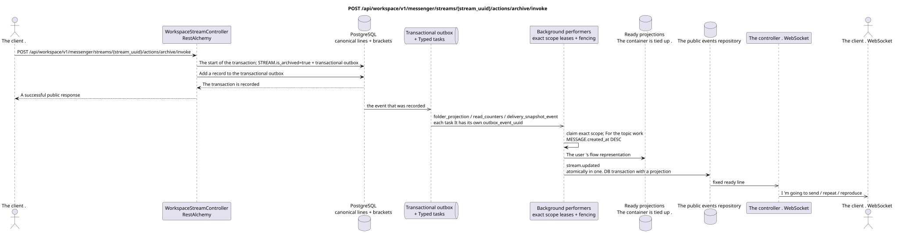

# POST /api/workspace/v1/messenger/streams/{stream_uuid}/actions/archive/invoke


Common target-invariant of reliability: each immutable outbox event outputs exactly one immutable typed task with unique `outbox_event_uuid`; coalescing is absent. Task stores the actual exact scope key, uses lease/fencing, retry/backoff, max attempts/DLQ, reaper and idempotent effect guard. Topic scope is applied only to placement/message-binding work; shared rows do not receive implicit fallback on topic.

[← The main index of the documentation](../../../../index.md) · [Index of sequence diagrams](../../README.md) · [The section Core Messenger](../README.md)

## Status and boundary of current contract

The method, path, public JSON, and authorization follow the current contract from [`workspace_api.md`](../../../../workspace_api.md); bounded pagination and asynchronous visibility follow separately adopted target compatibility ADR.



The source that you can edit: [`post_stream_archive_action.puml`](diagrams/post_stream_archive_action.puml).

## The operation

**Method and way:** `POST /api/workspace/v1/messenger/streams/{stream_uuid}/actions/archive/invoke`

**Purpose:** To establish a canonical meaning `is_archived=true`.

## A public request

Without a body. JSON.

## A successful public response

HTTP `200`:

```json
{
  "uuid": "75309057-419c-4b12-a7c1-3932429ec4a6",
  "name": "Инженерия",
  "description": "Инженерное пространство",
  "project_id": "22222222-2222-2222-2222-222222222222",
  "owner": "11111111-1111-1111-1111-111111111111",
  "user_uuid": "11111111-1111-1111-1111-111111111111",
  "role": "owner",
  "notification_mode": "all_messages",
  "unread_count": 2,
  "active_unread_count": 2,
  "passive_unread_count": 0,
  "source_name": "native",
  "source": {
    "kind": "native"
  },
  "invite_only": false,
  "announce": false,
  "private": false,
  "is_archived": true,
  "color": 3368601,
  "last_message_uuid": "a93dca35-3061-4748-bda4-7f6f8c660ea5",
  "default_topic_uuid": "4ec0b996-b778-45f8-8ef4-ef863be0c047",
  "created_at": "2026-06-22T09:00:00Z",
  "updated_at": "2026-06-22T10:15:00Z"
}
```

## Public errors

The bearer-token IAM and the project area are required. An incorrect UUID or request body is given by HTTP `400`; missing or unavailable in this area resource  `404`. Standard documented validation error body:

```json
{
  "type": "ValidationErrorException",
  "code": 400,
  "message": "Validation error occurred."
}
```

## The target boundary RestAlchemy

```python
from restalchemy.api import controllers
from restalchemy.api import resources
from restalchemy.dm import models
from restalchemy.dm import properties
from restalchemy.dm import types
from restalchemy.storage.sql import orm


class WorkspaceUserStream(
    models.ModelWithUUID,
    models.ModelWithProject,
    orm.SQLStorableMixin,
):
    __tablename__ = "messenger_api_user_streams_v1"

    owner = properties.property(types.UUID(), read_only=True)
    user_uuid = properties.property(types.UUID(), read_only=True)
    direct_user_uuid = properties.property(
        types.AllowNone(types.UUID()), default=None, read_only=True,
    )
    last_message_uuid = properties.property(types.UUID(), read_only=True)
    default_topic_uuid = properties.property(types.UUID(), read_only=True)


class WorkspaceStreamController(controllers.BaseResourceControllerPaginated):
    __resource__ = resources.ResourceByRAModel(
        WorkspaceUserStream, convert_underscore=False, process_filters=True,
    )
```

Public entity references are represented by scalar properties `types.UUID()`, not relations RestAlchemy, which are serialized in URI.Physical columns `*_uuid` remain indexed external keys with explicitly selected reference integrity actions.The public field `owner` is the property UUID; the physical field `owner_uuid`  is the user's indexed external key. USER_STREAM_BINDING stores ready-made flow-level counters..

## Synchronous transaction

1. Permitting and verifying permissions.
2. Set it up STREAM.is_archived=true.
3. Only when you change , add a separate immutable outbox event for each
   The output of the `folder_projection`, `read_counters` and
   `delivery_snapshot_event` task.

The affected state is STREAM and transactional outbox.

## Typed tasks and background performers

Tasks: separate `folder_projection`, `read_counters` and
`delivery_snapshot_event`, Each for its own . source outbox event.

User/provider projections are given by immutable tasks
`user-stream`/`user-folder`/provider scopes. Topic worker shared rows He doesn 't write .;
One fenced owner owns exact key.

## Public events and WebSocket

`stream.updated` for users.

## Idempotence, races and time characteristics visible to the client

Repeating the state setting is safe; the caller sees the result immediately, events  asynchronously.

[← The main index of the documentation](../../../../index.md) · [Index of sequence diagrams](../../README.md) · [The section Core Messenger](../README.md)
