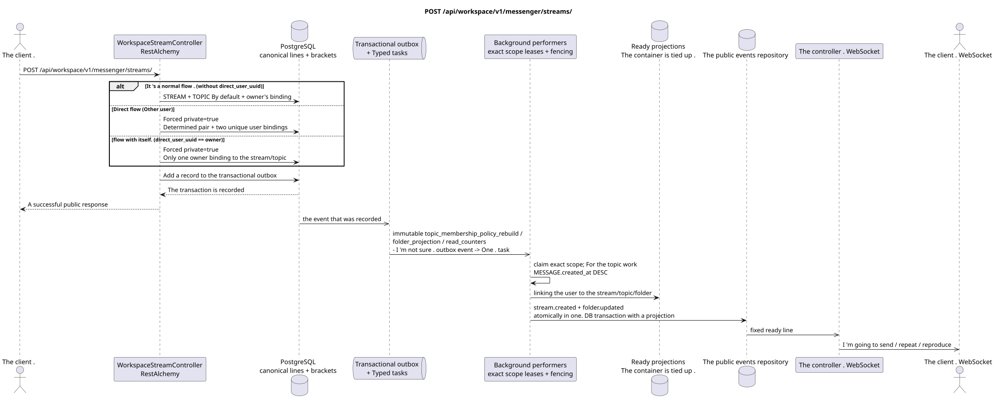

# POST /api/workspace/v1/messenger/streams/


Common target-invariant of reliability: each immutable outbox event outputs exactly one immutable typed task with unique `outbox_event_uuid`; coalescing is absent. Task stores the actual exact scope key, uses lease/fencing, retry/backoff, max attempts/DLQ, reaper and idempotent effect guard. Topic scope is applied only to placement/message-binding work; shared rows do not receive implicit fallback on topic.

[← The main index of the documentation](../../../../index.md) · [Index of sequence diagrams](../../README.md) · [The section Core Messenger](../README.md)

## Status and boundary of current contract

The method, path, public JSON, and authorization follow the current contract from [`workspace_api.md`](../../../../workspace_api.md); bounded pagination and asynchronous visibility follow separately adopted target compatibility ADR.



The source that you can edit: [`post_streams_create.puml`](diagrams/post_streams_create.puml).

## The operation

**Method and way:** `POST /api/workspace/v1/messenger/streams/`

**Purpose:** Create a canonical stream, owner binding and topic by default; the direct stream identifier is processed idmpotently.

## A public request

Regular stream:

```json
{
  "name": "Инженерия",
  "description": "Инженерное пространство",
  "source_name": "native",
  "source": {
    "kind": "native"
  },
  "invite_only": false,
  "announce": false
}
```

Direct flow:

```json
{
  "name": "Прямой поток",
  "description": "Приватное пространство",
  "source_name": "native",
  "source": {
    "kind": "native"
  },
  "direct_user_uuid": "33333333-3333-3333-3333-333333333333"
}
```

The flow with itself:

```json
{
  "name": "Личные заметки",
  "description": "",
  "source_name": "native",
  "source": {
    "kind": "native"
  },
  "direct_user_uuid": "11111111-1111-1111-1111-111111111111"
}
```

## A successful public response

New resource: HTTP `201`; existing determined pair of direct flow: HTTP `200`.:

```json
{
  "uuid": "64184b31-e43c-5b0d-95f8-b7b50bdc03c9",
  "name": "Личные заметки",
  "description": "",
  "project_id": "22222222-2222-2222-2222-222222222222",
  "owner": "11111111-1111-1111-1111-111111111111",
  "user_uuid": "11111111-1111-1111-1111-111111111111",
  "role": "owner",
  "notification_mode": "all_messages",
  "unread_count": 0,
  "active_unread_count": 0,
  "passive_unread_count": 0,
  "source_name": "native",
  "source": {
    "kind": "native"
  },
  "invite_only": false,
  "announce": false,
  "direct_user_uuid": "11111111-1111-1111-1111-111111111111",
  "private": true,
  "is_archived": false,
  "color": 3368601,
  "default_topic_uuid": "4ec0b996-b778-45f8-8ef4-ef863be0c047",
  "created_at": "2026-06-22T09:00:00Z",
  "updated_at": "2026-06-22T09:00:00Z"
}
```

## Public errors

The bearer-token IAM and the project area are required. An incorrect UUID or request body is given by HTTP `400`; missing or unavailable in this area resource  `404`. Standard documented validation error body:

```json
{
  "type": "ValidationErrorException",
  "code": 400,
  "message": "Validation error occurred."
}
```

The identity conflict or source of the direct stream and the change of the direct stream membership gives `400`; removing the flow with itself also gives `400`.

## The target boundary RestAlchemy

```python
from restalchemy.api import controllers
from restalchemy.api import resources
from restalchemy.dm import models
from restalchemy.dm import properties
from restalchemy.dm import types
from restalchemy.storage.sql import orm


class WorkspaceUserStream(
    models.ModelWithUUID,
    models.ModelWithProject,
    orm.SQLStorableMixin,
):
    __tablename__ = "messenger_api_user_streams_v1"

    owner = properties.property(types.UUID(), read_only=True)
    user_uuid = properties.property(types.UUID(), read_only=True)
    direct_user_uuid = properties.property(
        types.AllowNone(types.UUID()), default=None, read_only=True,
    )
    last_message_uuid = properties.property(types.UUID(), read_only=True)
    default_topic_uuid = properties.property(types.UUID(), read_only=True)


class WorkspaceStreamController(controllers.BaseResourceControllerPaginated):
    __resource__ = resources.ResourceByRAModel(
        WorkspaceUserStream, convert_underscore=False, process_filters=True,
    )
```

Public entity references are represented by scalar properties `types.UUID()`, not relations RestAlchemy, which are serialized in URI.Physical columns `*_uuid` remain indexed external keys with explicitly selected reference integrity actions.The public field `owner` is the property UUID; the physical field `owner_uuid`  is the user's indexed external key. USER_STREAM_BINDING stores ready-made flow-level counters..

## Synchronous transaction

1. Output a determined pair of direct current; any value `direct_user_uuid` is forced to set `private=true`.
2. Insert STREAM and TOPIC by default.
3. Insert unique owner associations to the stream and topic; insert only one user for the stream itself.
4. Add a record to transactional outbox.

The affected state is STREAM, TOPIC, USER_STREAM_BINDING, USER_TOPIC_BINDING and transactional outbox.

## Typed tasks and background performers

Tasks: `topic_membership_policy_rebuild` and accurate `folder_projection`/`read_counters` for affected containers.

The background performers create the remaining ready projections of containers and events; the stream has no second participant with itself. Subsequent distribution of fan-out messages does not create additional binding of the user's message. Different topics can be processed in parallel within a customizable limit; within one busy topic canonical messages are given priority on `MESSAGE.created_at DESC`, with older work also advancing over time.

## Public events and WebSocket

Participant sends `stream.created` and updates folders through the controller.

## Idempotence, races and time characteristics visible to the client

The key pair and unique binding make competitive repetition potentially powerful..

[← The main index of the documentation](../../../../index.md) · [Index of sequence diagrams](../../README.md) · [The section Core Messenger](../README.md)
