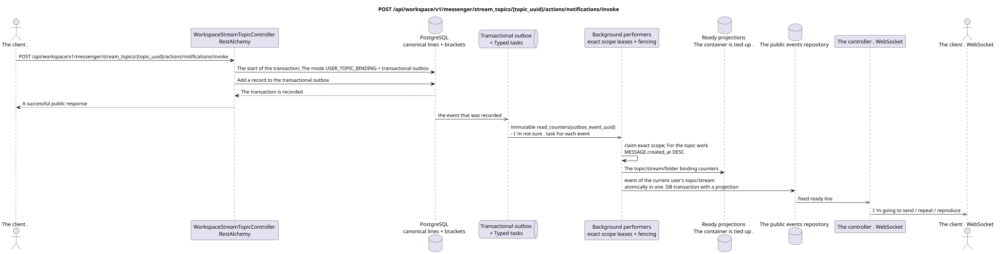

# POST /api/workspace/v1/messenger/stream_topics/{topic_uuid}/actions/notifications/invoke


Common target-invariant of reliability: each immutable outbox event outputs exactly one immutable typed task with unique `outbox_event_uuid`; coalescing is absent. Task stores the actual exact scope key, uses lease/fencing, retry/backoff, max attempts/DLQ, reaper and idempotent effect guard. Topic scope is applied only to placement/message-binding work; shared rows do not receive implicit fallback on topic.

[← The main index of the documentation](../../../../index.md) · [Index of sequence diagrams](../../README.md) · [The section Core Messenger](../README.md)

## Status and boundary of current contract

The method, path, public JSON, and authorization follow the current contract from [`workspace_api.md`](../../../../workspace_api.md); bounded pagination and asynchronous visibility follow separately adopted target compatibility ADR.



The source that you can edit: [`post_topic_notifications_action.puml`](diagrams/post_topic_notifications_action.puml).

## The operation

**Method and way:** `POST /api/workspace/v1/messenger/stream_topics/{topic_uuid}/actions/notifications/invoke`

**Purpose:** Set the notification mode of the topic for the current user.

## A public request

```json
{
  "notification_mode": "follow"
}
```

## A successful public response

HTTP `200`:

```json
{
  "uuid": "4ec0b996-b778-45f8-8ef4-ef863be0c047",
  "project_id": "22222222-2222-2222-2222-222222222222",
  "name": "Релизы",
  "stream_uuid": "75309057-419c-4b12-a7c1-3932429ec4a6",
  "user_uuid": "11111111-1111-1111-1111-111111111111",
  "color": 4491468,
  "last_message_uuid": "a93dca35-3061-4748-bda4-7f6f8c660ea5",
  "unread_count": 2,
  "active_unread_count": 2,
  "passive_unread_count": 0,
  "is_default": false,
  "is_done": false,
  "notification_mode": "follow",
  "summary": null,
  "summary_last_message_uuid": null,
  "summary_has_new_messages": null,
  "summary_enabled": true,
  "summary_system_prompt": null,
  "summary_reasoning_effort": null,
  "source_name": "native",
  "source": {
    "kind": "native"
  },
  "provider": null,
  "delivery": null,
  "created_at": "2026-06-22T09:10:00Z",
  "updated_at": "2026-06-22T10:20:00Z"
}
```

## Public errors

The bearer-token IAM and the project area are required. An incorrect UUID or request body is given by HTTP `400`; missing or unavailable in this area resource  `404`. Standard documented validation error body:

```json
{
  "type": "ValidationErrorException",
  "code": 400,
  "message": "Validation error occurred."
}
```

Allowed `mute`, `default`, `follow`; `unmute` only allowed for the silenced stream, otherwise returns `400001006`.

## The target boundary RestAlchemy

```python
from restalchemy.api import controllers
from restalchemy.api import resources
from restalchemy.dm import models
from restalchemy.dm import properties
from restalchemy.dm import types
from restalchemy.storage.sql import orm


class WorkspaceUserTopic(
    models.ModelWithUUID,
    models.ModelWithProject,
    orm.SQLStorableMixin,
):
    __tablename__ = "messenger_api_user_topics_v1"

    stream_uuid = properties.property(types.UUID(), read_only=True)
    user_uuid = properties.property(types.UUID(), read_only=True)
    last_message_uuid = properties.property(types.UUID(), read_only=True)
    summary_last_message_uuid = properties.property(types.UUID(), read_only=True)


class WorkspaceStreamTopicController(controllers.BaseResourceControllerPaginated):
    __resource__ = resources.ResourceByRAModel(
        WorkspaceUserTopic, convert_underscore=False, process_filters=True,
    )
```

Public references to entities are represented by scalar properties `types.UUID()`, rather than relations RestAlchemy, which are serialized in URI. Physical columns `*_uuid` remain indexed external keys with clearly selected reference integrity actions. TOPIC is a canonical entity; unique USER_TOPIC_BINDING provides visibility, personal status, and ready-made topic counters.

## Synchronous transaction

1. Allow USER_TOPIC_BINDING.
2. Set the mode.
3. Add separate immutable outbox events for `read_counters` and when
   You want a public event, `delivery_snapshot_event`; every event
   It 's gonna take exactly one . task.

Affected state: applicable to TOPIC, USER_TOPIC_BINDING, USER_MESSAGE_STATE and transactional outbox; counters are only in container bindings.

## Typed tasks and background performers

Tasks: `read_counters` and optional `delivery_snapshot_event`.

- Separate fenced owners `user-topic`/`user-stream`/`user-folder` scopes
Topic worker shared rows does not write; each
outbox event The following is a separate immutable task.

## Public events and WebSocket

Update the current user's topic and stream..

## Idempotence, races and time characteristics visible to the client

Repetition for unique binding and current source is safe. The caller sees the state at once, derived projections and events  asynchronously.

[← The main index of the documentation](../../../../index.md) · [Index of sequence diagrams](../../README.md) · [The section Core Messenger](../README.md)
