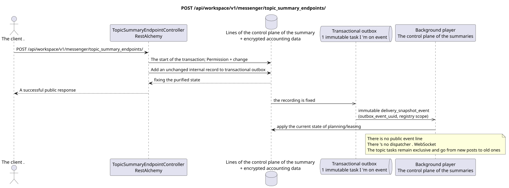

# POST /api/workspace/v1/messenger/topic_summary_endpoints/

[← The main index of the documentation](../../../../index.md) · [Index of sequence diagrams](../../README.md) · [The section Core Messenger](../README.md)

## Status and boundary of current contract

The target specification in the docs-first approach. HTTP-contract remains the current contract from [`workspace_api.md`](../../../../workspace_api.md); The target internal mechanisms are only a proposal.



The source that you can edit: [`post_topic_summary_endpoints_create.puml`](diagrams/post_topic_summary_endpoints_create.puml).

## The operation

**Method and way:** `POST /api/workspace/v1/messenger/topic_summary_endpoints/`

**Purpose:** To create a global endpoint of summaries with records only available for recording.

## A public request

```json
{
  "uuid": "e4ad6d80-6bc7-4a91-864c-8e97319a82bd",
  "name": "primary-summary-model",
  "base_url": "https://llm.example.com/v1",
  "model": "summary-model",
  "api_key": "<учётные данные только для записи>",
  "enabled": true,
  "priority": 10,
  "supports_vision": true,
  "supports_reasoning": true,
  "temperature": 0.2,
  "max_output_tokens": 512,
  "top_p": 1,
  "presence_penalty": 0,
  "frequency_penalty": 0
}
```

## A successful public response

HTTP `201`:

```json
{
  "uuid": "e4ad6d80-6bc7-4a91-864c-8e97319a82bd",
  "name": "primary-summary-model",
  "base_url": "https://llm.example.com/v1",
  "model": "summary-model",
  "enabled": true,
  "priority": 10,
  "supports_vision": true,
  "supports_reasoning": true,
  "temperature": 0.2,
  "max_output_tokens": 512,
  "top_p": 1,
  "presence_penalty": 0,
  "frequency_penalty": 0,
  "credential_present": true,
  "failure_count": 0,
  "created_at": "2026-06-22T08:00:00Z",
  "updated_at": "2026-06-22T08:00:00Z"
}
```

The status and error timestamp fields may be missing in the response if they allow `null` and have this value. `api_key` and the active request token are never returned.

## Public errors

Requires bearer-token IAM. Incorrect UUID or request body is given HTTP `400`; no management permission  `403`. Standard validation error body:

```json
{
  "type": "ValidationErrorException",
  "code": 400,
  "message": "Validation error occurred."
}
```

For every operation with an endpoint register, `workspace.topic_summary_endpoint.manage` is required; the missing endpoint gives `404`.

## The target boundary RestAlchemy

```python
from restalchemy.api import controllers
from restalchemy.api import resources
from restalchemy.dm import models
from restalchemy.dm import properties
from restalchemy.dm import types
from restalchemy.storage.sql import orm


class WorkspaceTopicSummaryEndpoint(
    models.ModelWithUUID,
    models.ModelWithTimestamp,
    orm.SQLStorableMixin,
):
    __tablename__ = "messenger_topic_summary_endpoints"

    name = properties.property(types.String(max_length=255), required=True)
    base_url = properties.property(types.String(max_length=2048), required=True)
    model = properties.property(types.String(max_length=255), required=True)
    credential_present = properties.property(types.Boolean(), read_only=True)


class TopicSummaryEndpointController(controllers.BaseResourceControllerPaginated):
    __resource__ = resources.ResourceByRAModel(
        WorkspaceTopicSummaryEndpoint,
        convert_underscore=False,
        process_filters=True,
    )
```

This global resource has no public fields of entity relations. Its public field `uuid`  scalar property UUID. Any internal external key or reference to account data is indexed and has an explicit reference integrity action; `api_key` is write-only, stored in encrypted form, and never serialized..

## Synchronous transaction

1. Requested `workspace.topic_summary_endpoint.manage`.
2. Check the UUID, OpenAI-compatible base URL and generation ranges.
3. Encrypt and save account data, then insert the endpoint.
4. Add an unchanged internal record to transactional outbox.

## Typed task and background executable

Separate immutable `delivery_snapshot_event` task from exact scope registry
endpoints for source outbox event; unique `outbox_event_uuid`, without
coalescing.

The control plane task updates the order of suitable endpoints and their leases. It does not itself handle MESSAGE; subsequent work with the summary topic remains exclusive to the topic and comes from new messages to old ones..

## Public events, repeats and time characteristics

The client immediately gets the cleared endpoint; no public event Workspace or record WebSocket is created. Repetition conflicts UUID follow the current creation semantics; account data never gets into logs, events or responses.

There is no ready public event Workspace for this administrative operation, so the controller WebSocket is not involved in it.

[← The main index of the documentation](../../../../index.md) · [Index of sequence diagrams](../../README.md) · [The section Core Messenger](../README.md)
