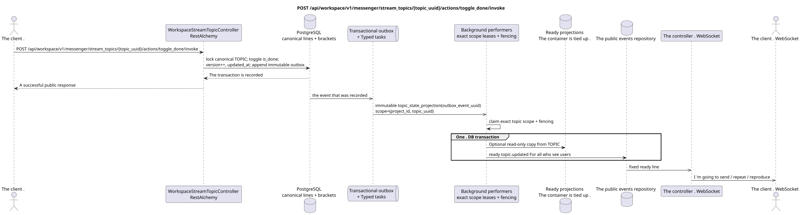

# POST /api/workspace/v1/messenger/stream_topics/{topic_uuid}/actions/toggle_done/invoke

[← The main index of the documentation](../../../../index.md) · [Index of sequence diagrams](../../README.md) · [The section Core Messenger](../README.md)

## Status and boundary of current contract

The method, path, public JSON, and authorization follow the current contract from [`workspace_api.md`](../../../../workspace_api.md); bounded pagination and asynchronous visibility follow separately adopted target compatibility ADR.



The source that you can edit: [`post_topic_toggle_done_action.puml`](diagrams/post_topic_toggle_done_action.puml).

## The operation

**Method and way:** `POST /api/workspace/v1/messenger/stream_topics/{topic_uuid}/actions/toggle_done/invoke`

**Purpose:** Switch to the common end sign.

## A public request

Without a body. JSON.

## A successful public response

HTTP `200`:

```json
{
  "uuid": "4ec0b996-b778-45f8-8ef4-ef863be0c047",
  "project_id": "22222222-2222-2222-2222-222222222222",
  "name": "Релизы",
  "stream_uuid": "75309057-419c-4b12-a7c1-3932429ec4a6",
  "user_uuid": "11111111-1111-1111-1111-111111111111",
  "color": 4491468,
  "last_message_uuid": "a93dca35-3061-4748-bda4-7f6f8c660ea5",
  "unread_count": 2,
  "active_unread_count": 2,
  "passive_unread_count": 0,
  "is_default": false,
  "is_done": true,
  "notification_mode": "default",
  "summary": null,
  "summary_last_message_uuid": null,
  "summary_has_new_messages": null,
  "summary_enabled": true,
  "summary_system_prompt": null,
  "summary_reasoning_effort": null,
  "source_name": "native",
  "source": {
    "kind": "native"
  },
  "provider": null,
  "delivery": null,
  "created_at": "2026-06-22T09:10:00Z",
  "updated_at": "2026-06-22T10:20:00Z"
}
```

## Public errors

The bearer-token IAM and the project area are required. An incorrect UUID or request body is given by HTTP `400`; missing or unavailable in this area resource  `404`. Standard documented validation error body:

```json
{
  "type": "ValidationErrorException",
  "code": 400,
  "message": "Validation error occurred."
}
```

## The target boundary RestAlchemy

```python
from restalchemy.api import controllers
from restalchemy.api import resources
from restalchemy.dm import models
from restalchemy.dm import properties
from restalchemy.dm import types
from restalchemy.storage.sql import orm


class WorkspaceUserTopic(
    models.ModelWithUUID,
    models.ModelWithProject,
    orm.SQLStorableMixin,
):
    __tablename__ = "messenger_api_user_topics_v1"

    stream_uuid = properties.property(types.UUID(), read_only=True)
    user_uuid = properties.property(types.UUID(), read_only=True)
    last_message_uuid = properties.property(types.UUID(), read_only=True)
    summary_last_message_uuid = properties.property(types.UUID(), read_only=True)


class WorkspaceStreamTopicController(controllers.BaseResourceControllerPaginated):
    __resource__ = resources.ResourceByRAModel(
        WorkspaceUserTopic, convert_underscore=False, process_filters=True,
    )
```

Public references to entities are represented by scalar properties `types.UUID()`, rather than relations RestAlchemy, which are serialized in URI. Physical columns `*_uuid` remain indexed external keys with clearly selected reference integrity actions. TOPIC is a canonical entity; unique USER_TOPIC_BINDING provides visibility, personal status, and ready-made topic counters.

## Synchronous transaction

1. Allow project-scoped topic and active stream membership; re-check
   authorization inside the transaction.
2. Block the canonical `TOPIC` row, atomically switch `TOPIC.is_done`,
   `TOPIC.version` to enlarge and update `updated_at`.
3. Add an immutable `topic_state_projection` outbox event to the same
   transaction and return view, where `is_done` reads from canonical `TOPIC`.

Authoritative state to be requested: only canonical `TOPIC` and transactional
outbox. `USER_TOPIC_BINDING` stores access/notification/counts and is not
writable source `is_done`; `USER_MESSAGE_STATE` This command doesn't change..

## Typed tasks and background performers

The task is one immutable .`topic_state_projection`For the source event, scope
`topic (project_id,topic_uuid)`. Fenced owner It creates ready-made `topic.updated`
rows; if after measurement, read-only copy `is_done` appears in view/binding, it
It just rebuilds it from canonical `TOPIC`. ready event rows
The data is recorded by one DB transaction./backoff, DLQ/reaperand idempotent effect
`outbox_event_uuid` is required.

## Public events and WebSocket

`topic.updated` The controller delivers the fixed ready lines.

## Idempotence, races and time characteristics visible to the client

Row lock/version It will start the toggle and will exclude the lost update. transaction
If the error is not fixed, the server returns the error; if ambiguous
transport retry The client reads the canonical state first and doesn 't repeat it . toggle
The caller sees the canonical state at once, the ready events  asynchronously.

[← The main index of the documentation](../../../../index.md) · [Index of sequence diagrams](../../README.md) · [The section Core Messenger](../README.md)
