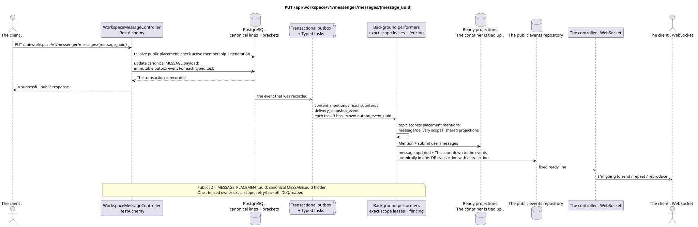

# PUT /api/workspace/v1/messenger/messages/{message_uuid}

[← The main index of the documentation](../../../../index.md) · [Index of sequence diagrams](../../README.md) · [The section Core Messenger](../README.md)

## Status and boundary of current contract

The method, path, public JSON, and authorization follow the current contract from [`workspace_api.md`](../../../../workspace_api.md); bounded pagination and asynchronous visibility follow separately adopted target compatibility ADR.



The source that you can edit: [`put_message.puml`](diagrams/put_message.puml).

## The operation

**Method and way:** `PUT /api/workspace/v1/messenger/messages/{message_uuid}`

**Purpose:** Replace the payload of the canonical message after author checks and access.

## A public request

```json
{
  "payload": {
    "kind": "markdown",
    "content": "Отредактированный текст"
  }
}
```

## A successful public response

HTTP `200`:

```json
{
  "uuid": "a93dca35-3061-4748-bda4-7f6f8c660ea5",
  "project_id": "22222222-2222-2222-2222-222222222222",
  "stream_uuid": "75309057-419c-4b12-a7c1-3932429ec4a6",
  "topic_uuid": "4ec0b996-b778-45f8-8ef4-ef863be0c047",
  "author_uuid": "11111111-1111-1111-1111-111111111111",
  "payload": {
    "kind": "markdown",
    "content": "Отредактированный текст"
  },
  "user_uuid": "11111111-1111-1111-1111-111111111111",
  "read": true,
  "pinned": false,
  "starred": false,
  "is_own": true,
  "mentioned": false,
  "reactions": {},
  "reaction_users": {},
  "source_name": "native",
  "source": {
    "kind": "native"
  },
  "provider": null,
  "delivery": null,
  "created_at": "2026-06-22T10:10:00Z",
  "updated_at": "2026-06-22T10:11:00Z"
}
```

## Public errors

The bearer-token IAM and the project area are required. An incorrect UUID or request body is given by HTTP `400`; missing or unavailable in this area resource  `404`. Standard documented validation error body:

```json
{
  "type": "ValidationErrorException",
  "code": 400,
  "message": "Validation error occurred."
}
```

## The target boundary RestAlchemy

```python
from restalchemy.api import controllers
from restalchemy.api import resources
from restalchemy.dm import models
from restalchemy.dm import properties
from restalchemy.dm import types
from restalchemy.storage.sql import orm


class WorkspaceUserMessage(models.ModelWithProject, orm.SQLStorableMixin):
    __tablename__ = "messenger_api_user_messages_v1"

    binding_uuid = properties.property(types.UUID(), id_property=True)
    uuid = properties.property(types.UUID(), read_only=True)
    stream_uuid = properties.property(types.UUID(), read_only=True)
    topic_uuid = properties.property(types.UUID(), read_only=True)
    author_uuid = properties.property(types.UUID(), read_only=True)
    user_uuid = properties.property(types.UUID(), read_only=True)


class WorkspaceMessageController(controllers.BaseResourceControllerPaginated):
    __resource__ = resources.ResourceByRAModel(
        WorkspaceUserMessage, convert_underscore=False, process_filters=True,
    )
```

Public `uuid` and route identifier equal `MESSAGE_PLACEMENT.uuid = UUIDv5(namespace=TOPIC.uuid, name=MESSAGE.uuid)`; name  lowercase hyphenated canonical UUID. canonical `MESSAGE.uuid` internal; `binding_uuid` remains a hidden technical ORM key. controller allows placement and simultaneously checks active membership plus match generation.

## Synchronous transaction

1. Allow public placement UUID, active membership and generation through applicable binding.
2. Check the author.
3. I 'm going to update MESSAGE.payload.
4. Add separate immutable outbox events to output
   `content_mentions`, `read_counters` and `delivery_snapshot_event` tasks.

Tracked status: MESSAGE and transactional outbox; placements remain links.

## Typed tasks and background performers

The tasks are: `content_mentions`, conditional `read_counters`, `delivery_snapshot_event`.

Topic-scoped workers Read the current canonical content and update
placement-scoped mentions by `MESSAGE.created_at DESC`; canonical/delivery and
container shared rows They get separate exact scopes. outbox event
corresponds to one immutable task; one fenced owner writes the exact key, and topic
worker It doesn't. unsafe read-modify-write shared rows.

## Public events and WebSocket

`message.updated` and changed container rows through the dispatcher.

## Idempotence, races and time characteristics visible to the client

Each outbox event has a separate immutable task; the handler is immutable on `outbox_event_uuid`. The caller sees the contents at once, projections and events  asynchronously.

[← The main index of the documentation](../../../../index.md) · [Index of sequence diagrams](../../README.md) · [The section Core Messenger](../README.md)
