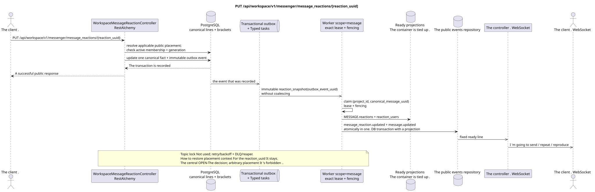

# PUT /api/workspace/v1/messenger/message_reactions/{reaction_uuid}

[← The main index of the documentation](../../../../index.md) · [Index of sequence diagrams](../../README.md) · [The section Core Messenger](../README.md)

## Status and boundary of current contract

The method, path, public JSON, and authorization follow the current contract from [`workspace_api.md`](../../../../workspace_api.md); bounded pagination and asynchronous visibility follow separately adopted target compatibility ADR.



The source that you can edit: [`put_message_reaction.puml`](diagrams/put_message_reaction.puml).

## The operation

**Method and way:** `PUT /api/workspace/v1/messenger/message_reactions/{reaction_uuid}`

**Purpose:** To update the original reaction of the current user.

## A public request

```json
{
  "emoji_name": "heart"
}
```

## A successful public response

HTTP `200`:

```json
{
  "uuid": "bd4b7632-8788-435a-93cc-6873657335c6",
  "project_id": "22222222-2222-2222-2222-222222222222",
  "message_uuid": "a93dca35-3061-4748-bda4-7f6f8c660ea5",
  "user_uuid": "11111111-1111-1111-1111-111111111111",
  "emoji_name": "heart",
  "provider": null,
  "delivery": null,
  "created_at": "2026-06-22T10:12:00Z",
  "updated_at": "2026-06-22T10:13:00Z"
}
```

## Public errors

The bearer-token IAM and the project area are required. An incorrect UUID or request body is given by HTTP `400`; missing or unavailable in this area resource  `404`. Standard documented validation error body:

```json
{
  "type": "ValidationErrorException",
  "code": 400,
  "message": "Validation error occurred."
}
```

## The target boundary RestAlchemy

```python
from restalchemy.api import controllers
from restalchemy.api import resources
from restalchemy.dm import models
from restalchemy.dm import properties
from restalchemy.dm import types
from restalchemy.storage.sql import orm


class WorkspaceMessageReactionView(
    models.ModelWithUUID,
    models.ModelWithProject,
    orm.SQLStorableMixin,
):
    __tablename__ = "messenger_api_message_reactions_v1"

    message_uuid = properties.property(types.UUID(), read_only=True)
    canonical_message_uuid = properties.property(types.UUID(), read_only=True)
    user_uuid = properties.property(types.UUID(), read_only=True)


class WorkspaceMessageReactionController(controllers.BaseResourceControllerPaginated):
    __resource__ = resources.ResourceByRAModel(
        WorkspaceMessageReactionView, convert_underscore=False, process_filters=True,
    )
```

Public `message_uuid`  scalar UUID placement; internal
`canonical_message_uuid` field permissions are hidden.UUIDThe original fact
The physical links remain indexed FK, and the
The original metadata of the provider/delivery is closed.

## Synchronous transaction

1. Re-establish user-owned fact, applicable public placement
   and check active stream membership + matching generation.
2. Updating one value emoji.
3. Add a separate immutable event to transactional outbox; derived task
   It 's unique . `outbox_event_uuid`.

Affected state: fact of reaction and transactional outbox; no total record JSON of query.

## Typed tasks and background performers

Tasks: separate immutable `reaction_snapshot` for source event; coalescing
There is no.

Fenced owner scope `message` It rebuilds images from actual events.; topic
lock Lease expiry, retry/backoff, DLQ and reaper provide
Repair after failure.

## Public events and WebSocket

`message_reaction.updated` with the previous fields, then `message.updated` for the observer.

## Idempotence, races and time characteristics visible to the client

Unique fact key allows race; membership recheck creates instantaneous
deny boundary. The owner gets the facts in the answer, pictures and events immediately —
The path contains only `reaction_uuid`, so the way to store and
Returns its public placement context at multiple visible placements
remains a centralized OPEN-solution; hidden binding or arbitrary
primary placement You can't choose. global reaction
semantics.

[← The main index of the documentation](../../../../index.md) · [Index of sequence diagrams](../../README.md) · [The section Core Messenger](../README.md)
