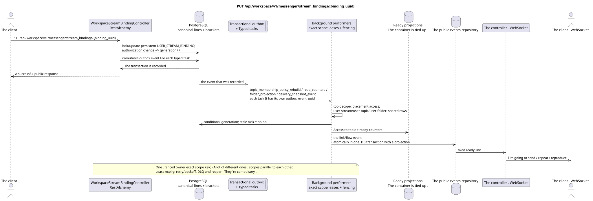

# PUT /api/workspace/v1/messenger/stream_bindings/{binding_uuid}

[← The main index of the documentation](../../../../index.md) · [Index of sequence diagrams](../../README.md) · [The section Core Messenger](../README.md)

## Status and boundary of current contract

The method, path, public JSON, and authorization follow the current contract from [`workspace_api.md`](../../../../workspace_api.md); bounded pagination and asynchronous visibility follow separately adopted target compatibility ADR.



The source that you can edit: [`put_stream_binding.puml`](diagrams/put_stream_binding.puml).

## The operation

**Method and way:** `PUT /api/workspace/v1/messenger/stream_bindings/{binding_uuid}`

**Purpose:** To update the role or status of the notification of the normal binding.

## A public request

```json
{
  "role": "moderator",
  "notification_mode": "mentions_only",
  "notification_updated_at": "2026-06-22T10:17:00Z"
}
```

## A successful public response

HTTP `200`:

```json
{
  "uuid": "3195a887-da5d-440b-bdf8-0d3d995a9e01",
  "project_id": "22222222-2222-2222-2222-222222222222",
  "stream_uuid": "75309057-419c-4b12-a7c1-3932429ec4a6",
  "user_uuid": "33333333-3333-3333-3333-333333333333",
  "who_uuid": "11111111-1111-1111-1111-111111111111",
  "role": "moderator",
  "notification_mode": "mentions_only",
  "notification_updated_at": "2026-06-22T10:17:00Z",
  "created_at": "2026-06-22T09:05:00Z",
  "updated_at": "2026-06-22T10:17:00Z"
}
```

## Public errors

The bearer-token IAM and the project area are required. An incorrect UUID or request body is given by HTTP `400`; missing or unavailable in this area resource  `404`. Standard documented validation error body:

```json
{
  "type": "ValidationErrorException",
  "code": 400,
  "message": "Validation error occurred."
}
```

Updating the direct stream or the stream to itself gives `400`.

## The target boundary RestAlchemy

```python
from restalchemy.api import controllers
from restalchemy.api import resources
from restalchemy.dm import models
from restalchemy.dm import properties
from restalchemy.dm import types
from restalchemy.storage.sql import orm


class WorkspaceStreamBindingView(
    models.ModelWithUUID,
    models.ModelWithProject,
    orm.SQLStorableMixin,
):
    __tablename__ = "messenger_api_stream_bindings_v1"

    stream_uuid = properties.property(types.UUID(), read_only=True)
    user_uuid = properties.property(types.UUID(), read_only=True)
    who_uuid = properties.property(types.UUID(), read_only=True)


class WorkspaceStreamBindingController(controllers.BaseResourceControllerPaginated):
    __resource__ = resources.ResourceByRAModel(
        WorkspaceStreamBindingView, convert_underscore=False, process_filters=True,
    )
```

Public references to entities are represented by scalar properties `types.UUID()`, not relations RestAlchemy, which are serialized in URI. Physical columns `*_uuid` remain indexed external keys with explicitly selected reference integrity actions.USER_STREAM_BINDING is unique in `(project_id, stream_uuid, user_uuid)` and can physically store ready counters, but its current public JSON binding does not change.

## Synchronous transaction

1. Restore and authorize the binding.
2. Update one persistent USER_STREAM_BINDING. If the change affects
   authorization/membership, increase `membership_generation`; only one
   If you change the notification setting , generation will not reuse as surrogate
   version.
3. Add a separate immutable transactional outbox event for each typed
   task The actual area.

The affected state is USER_STREAM_BINDING and transactional outbox.

## Typed tasks and background performers

The tasks: immutable `topic_membership_policy_rebuild`,
`read_counters`, `folder_projection` and `delivery_snapshot_event`, each with
own source `outbox_event_uuid`, exact scope key and depending on
membership — With the expected generation.

Topic-scoped worker Applies access only to placements/bindings topics;
user-stream/user-topic/user-folder scope workers Updating shared aggregates.
At the same time , one fenced owner writes the exact key; stale generation does no-op.
Task lifecycle includes retry/backoff, DLQ and reaper.

## Public events and WebSocket

Events of affected links and streams.

## Idempotence, races and time characteristics visible to the client

Unique membership key, row lock and generation prevent race.
visible at once, projections and events  asynchronously; ready event appears only
atomically in one DB transaction with the corresponding projection.

[← The main index of the documentation](../../../../index.md) · [Index of sequence diagrams](../../README.md) · [The section Core Messenger](../README.md)
