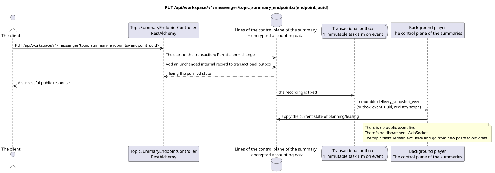

# PUT /api/workspace/v1/messenger/topic_summary_endpoints/{endpoint_uuid}

[← The main index of the documentation](../../../../index.md) · [Index of sequence diagrams](../../README.md) · [The section Core Messenger](../README.md)

## Status and boundary of current contract

The target specification in the docs-first approach. HTTP-contract remains the current contract from [`workspace_api.md`](../../../../workspace_api.md); The target internal mechanisms are only a proposal.



The source that you can edit: [`put_topic_summary_endpoint.puml`](diagrams/put_topic_summary_endpoint.puml).

## The operation

**Method and way:** `PUT /api/workspace/v1/messenger/topic_summary_endpoints/{endpoint_uuid}`

**** To update, turn on or off, change priority or replace account data.

## A public request

```json
{
  "enabled": false,
  "priority": 10,
  "supports_vision": false,
  "api_key": "<новые учётные данные только для записи>"
}
```

## A successful public response

HTTP `200`:

```json
{
  "uuid": "e4ad6d80-6bc7-4a91-864c-8e97319a82bd",
  "name": "primary-summary-model",
  "base_url": "https://llm.example.com/v1",
  "model": "summary-model",
  "enabled": false,
  "priority": 10,
  "supports_vision": false,
  "supports_reasoning": true,
  "temperature": 0.2,
  "max_output_tokens": 512,
  "top_p": 1,
  "presence_penalty": 0,
  "frequency_penalty": 0,
  "credential_present": true,
  "failure_count": 0,
  "created_at": "2026-06-22T08:00:00Z",
  "updated_at": "2026-06-22T08:05:00Z"
}
```

The status and error timestamp fields may be missing in the response if they allow `null` and have this value. `api_key` and the active request token are never returned.

## Public errors

Requires bearer-token IAM. Incorrect UUID or request body is given HTTP `400`; no management permission  `403`. Standard validation error body:

```json
{
  "type": "ValidationErrorException",
  "code": 400,
  "message": "Validation error occurred."
}
```

For every operation with an endpoint register, `workspace.topic_summary_endpoint.manage` is required; the missing endpoint gives `404`.

## The target boundary RestAlchemy

```python
from restalchemy.api import controllers
from restalchemy.api import resources
from restalchemy.dm import models
from restalchemy.dm import properties
from restalchemy.dm import types
from restalchemy.storage.sql import orm


class WorkspaceTopicSummaryEndpoint(
    models.ModelWithUUID,
    models.ModelWithTimestamp,
    orm.SQLStorableMixin,
):
    __tablename__ = "messenger_topic_summary_endpoints"

    name = properties.property(types.String(max_length=255), required=True)
    base_url = properties.property(types.String(max_length=2048), required=True)
    model = properties.property(types.String(max_length=255), required=True)
    credential_present = properties.property(types.Boolean(), read_only=True)


class TopicSummaryEndpointController(controllers.BaseResourceControllerPaginated):
    __resource__ = resources.ResourceByRAModel(
        WorkspaceTopicSummaryEndpoint,
        convert_underscore=False,
        process_filters=True,
    )
```

This global resource has no public fields of entity relations. Its public field `uuid`  scalar property UUID. Any internal external key or reference to account data is indexed and has an explicit reference integrity action; `api_key` is write-only, stored in encrypted form, and never serialized..

## Synchronous transaction

1. Request permission to control and restore the endpoint UUID.
2. Check for at least one variable field or range.
3. Encrypt new account data and update the endpoint if available.
4. Add an unchanged internal record to transactional outbox.

## Typed task and background executable

Separate immutable `delivery_snapshot_event` task from exact scope registry
The end points update the register and safely re-evaluate the lease for source
outbox event; unique `outbox_event_uuid`, without coalescing.

The background executive of the global control plane reads the current state of the endpoint. Existing topical requests remain limited; subsequent summary tasks select the included endpoints first by priority, then by UUID.

## Public events, repeats and time characteristics

The update does not use ETag or revise and does not create a public event Workspace..

There is no ready public event Workspace for this administrative operation, so the controller WebSocket is not involved in it.

[← The main index of the documentation](../../../../index.md) · [Index of sequence diagrams](../../README.md) · [The section Core Messenger](../README.md)
