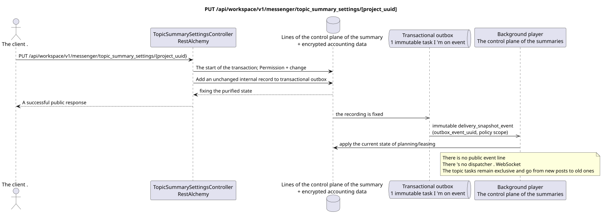

# PUT /api/workspace/v1/messenger/topic_summary_settings/{project_uuid}

[← The main index of the documentation](../../../../index.md) · [Index of sequence diagrams](../../README.md) · [The section Core Messenger](../README.md)

## Status and boundary of current contract

The target specification in the docs-first approach. HTTP-contract remains the current contract from [`workspace_api.md`](../../../../workspace_api.md); The target internal mechanisms are only a proposal.



The source that you can edit: [`put_topic_summary_settings.puml`](diagrams/put_topic_summary_settings.puml).

## The operation

**Method and way:** `PUT /api/workspace/v1/messenger/topic_summary_settings/{project_uuid}`

**Purpose:** To set both conditions for the inclusion of a summary of a topic.

## A public request

```json
{
  "global_enabled": true,
  "project_enabled": true
}
```

## A successful public response

HTTP `200`:

```json
{
  "project_id": "12345678-1234-4234-8234-123456789abc",
  "global_enabled": true,
  "project_enabled": true
}
```

The status and error timestamp fields may be missing in the response if they allow `null` and have this value. `api_key` and the active request token are never returned.

## Public errors

Requires bearer-token IAM. Incorrect UUID or request body is given HTTP `400`; no management permission  `403`. Standard validation error body:

```json
{
  "type": "ValidationErrorException",
  "code": 400,
  "message": "Validation error occurred."
}
```

If UUID in the path does not match the project IAM, returns `403`; GET requires project membership, and PUT  management permission.

## The target boundary RestAlchemy

```python
from restalchemy.api import controllers
from restalchemy.api import resources
from restalchemy.dm import models
from restalchemy.dm import properties
from restalchemy.dm import types
from restalchemy.storage.sql import orm


class WorkspaceTopicSummarySettings(
    models.ModelWithProject,
    orm.SQLStorableMixin,
):
    __tablename__ = "messenger_topic_summary_settings"

    project_id = properties.property(types.UUID(), id_property=True, read_only=True)
    global_enabled = properties.property(types.Boolean(), default=False)
    project_enabled = properties.property(types.Boolean(), default=False)


class TopicSummarySettingsController(controllers.BaseResourceController):
    __resource__ = resources.ResourceByRAModel(
        WorkspaceTopicSummarySettings,
        convert_underscore=False,
        process_filters=True,
    )
```

The public field `project_id`  scalar property UUID, not a relation in the form URI. The physical indexed external key to the project Workspace has an explicitly given reference integrity action. UUID from the path must match the context of the project IAM.

## Synchronous transaction

1. Require project matching from path to project IAM and permission `workspace.topic_summary_settings.manage`.
2. Set both logical inclusion conditions in the same line.
3. Add an unchanged internal record to transactional outbox.

## Typed task and background executable

Separate immutable `delivery_snapshot_event` task with exact scope policy
source outbox event summary schedules the affected project; unique
`outbox_event_uuid`, without coalescing.

The background player turns on or off scheduling for the last values of the conditions. The actual summary generation remains exclusive to `(project_id, topic_uuid)`, limited and processes canonical messages from new to old.

## Public events, repeats and time characteristics

The response with the enabling conditions is returned immediately; scheduling and cancellation are performed asynchronously and idempotently.WorkspaceAnd ship it by .WebSocketNot defined.

There is no ready public event Workspace for this administrative operation, so the controller WebSocket is not involved in it.

[← The main index of the documentation](../../../../index.md) · [Index of sequence diagrams](../../README.md) · [The section Core Messenger](../README.md)
