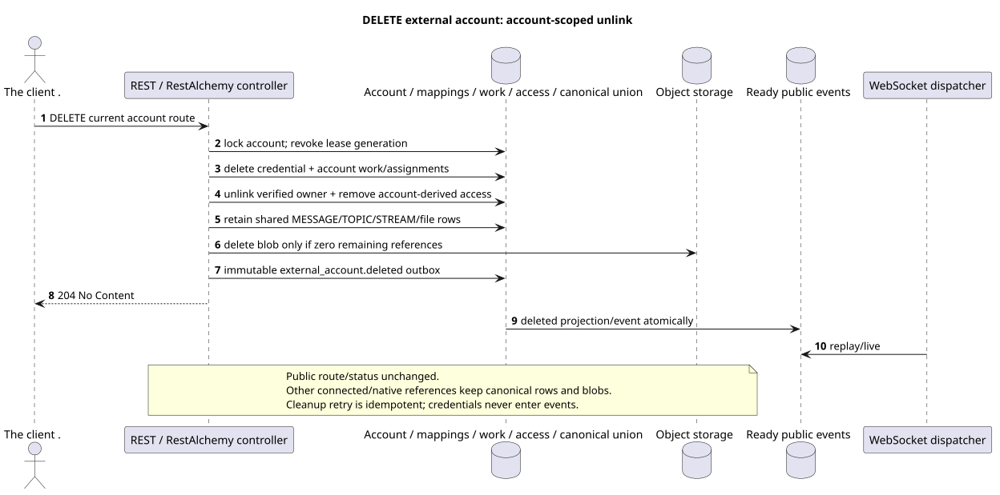

# Delete the external account

[← The main index of the documentation](../../../../index.md) ·
[Index of sequence diagrams](../../README.md) ·
[The external integration section/runtime](../README.md)

`DELETE /api/workspace/v1/messenger/external_accounts/{account_uuid}`

Delete account credential and account-scoped connection/access, save shared
canonical provider data, Available to others connected accounts.



[The source that you can edit PlantUML](diagrams/delete_external_account.puml)

## The request

No additional query parameters other than the path variables mentioned above.

The body is missing. JSON.

## A Successful Answer

`204 No Content`; The body of the answer JSON is missing.

## The errors

| HTTP | Behaviour in public |
| --- | --- |
| `403` | No `workspace.external_account.delete` permission or resource is outside authorized area. |
| `404` | Resource not available or not visible in specified area. |
| `400` | For unacceptable path values, query parameters or body, a standard validation error is used RESTAlchemy. |

Example of validation error body:

```json
{
  "type": "ValidationErrorException",
  "code": 400,
  "message": "Validation error occurred."
}
```

## The border RestAlchemy

Target resource/controller ad (supply documentation, not production code)):

```python
class ExternalAccount(models.ModelWithUUID, models.ModelWithTimestamp, orm.SQLStorableMixin):
    __tablename__ = "m_external_accounts_v2"

    owner_user_uuid = properties.property(types.UUID(), required=True)
    settings = properties.property(EXTERNAL_ACCOUNT_SETTINGS_TYPE, required=True)
    status = properties.property(types.Enum(ACCOUNT_STATUSES), read_only=True)
    capabilities = properties.property(types.Dict(), read_only=True)
    revision = properties.property(types.Integer(min_value=1), read_only=True)


class ExternalAccountController(controllers.BaseResourceControllerPaginated):
    __resource__ = resources.ResourceByRAModel(
        ExternalAccount, hidden_fields=["owner_user_uuid"]
    )
```

`owner_user_uuid` hidden; public `settings.default_project_id` is a scalar UUID property. In the target repository, the indexed `owner_user_uuid` refers to the user Workspace with `ON DELETE CASCADE`, and the extracted indexed `default_project_uuid`  to the project registry with `ON DELETE RESTRICT`; when serialized, the latter is still embedded in `settings`. Public RestAlchemy ads do not use `relationships.relationship` for JSON in the form UUID because the relation (relationship) is serialized as URI. At the boundary of the physical scheme, each canonical non-polymorphic connection `*_uuid` is an indexed external key with a clearly selected reference action..

## Synchronous transaction

1. Authenticate the query, define the domain, check the resolution/body and find the canonical string for the indexed key.
2. Block account, withdraw lease generation, delete credential,
   account assignments/mappings/queued work and account-derived bindings/access;
   untie verified identity from owner and write immutable outbox deletion.
3. Do not delete shared canonical messages/topics/streams/files, while they exist
   other provider/native access/reference; physical blob to be removed only after
   The evidence is zero-reference check.
4. Return only after the transaction is fixed; provider/network cleanup not
   It 's inside her ..

## Background processing, events and consistency

Typed `delivery_snapshot_event` serves exact external-account
scope and ready `external_account.deleted`; the cleanup provider lifecycle remains
It's a steady background work, not a computation. request path.

The background handler in one DB transaction records the materialized state and the ready envelope of the full image `external_account.deleted`; both commit or rollback effects together. After commit a separate handler WebSocket sends, repeats and plays it; API/worker does not own client connections.

Consistency visible to the client: HTTP 204 means that account is removed from
public image and his access no longer authorizes reading. Shared canonical
history Remains for other accounts; credential never gets in event.
It is accepted target semantics with unchanged public route/status and differs
from the old destructive product text.:
[`zulip_bridge/account_lifecycle_and_identity.md`](../../../../zulip_bridge/account_lifecycle_and_identity.md#delete-accepted-target-semantics).

## Idempotency and parallelism

UUID The account is created by the client at the time of creation; business uniqueness allows for one account `(owner_user_uuid, provider_kind)`..

Repeaters use stable business keys and the current state of the outbox. Each immutable outbox event creates a separate task with a unique `outbox_event_uuid`; the re-delivery of this task must be idempotent, coalescing is absent. Monopoly processing of the topic Messenger from new entries to old ones is only applied when the affected canonical placement actually refers to `(project_id, topic_uuid)`; admin/read provider operations do not create an artificial topic and are not included in this queue.

## The sources

- [`workspace_api.md`](../../../../workspace_api.md) — authoritative public routes, general JSON, page, events and contract WebSocket.
- [`zulip_bridge_v1_product_and_api.md`](../../../../zulip_bridge_v1_product_and_api.md) — sanitized lifecycle of external resources, permissions and provider semantics.

[← The main index of the documentation](../../../../index.md) ·
[Index of sequence diagrams](../../README.md) ·
[The external integration section/runtime](../README.md)
