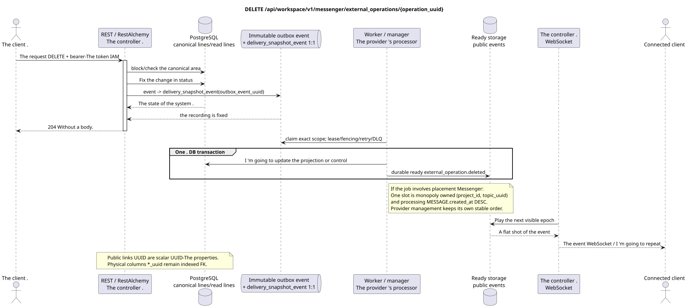

# Cancel the external operation

[← The main index of the documentation](../../../../index.md) ·
[Index of sequence diagrams](../../README.md) ·
[The external integration section/runtime](../README.md)

`DELETE /api/workspace/v1/messenger/external_operations/{operation_uuid}`

Cancel a pending or error- completed task that allows this.



[The source that you can edit PlantUML](diagrams/delete_external_operation.puml)

## The request

No additional query parameters other than the path variables mentioned above.

The body is missing. JSON.

## A Successful Answer

`204 No Content`; The body of the answer JSON is missing.

## The errors

| HTTP | Behaviour in public |
| --- | --- |
| `404` | Resource not available or not visible in specified area. |
| `400` | Can 't undo the operation. |
| `400` | For unacceptable path values, query parameters or body, a standard validation error is used RESTAlchemy. |

Example of validation error body:

```json
{
  "type": "ValidationErrorException",
  "code": 400,
  "message": "Validation error occurred."
}
```

## The border RestAlchemy

Target resource/controller ad (supply documentation, not production code)):

```python
class ExternalOperation(models.ModelWithUUID, models.ModelWithTimestamp, orm.SQLStorableMixin):
    __tablename__ = "m_external_operations_v2"

    external_account_uuid = properties.property(types.UUID(), required=True)
    target_uuid = properties.property(types.AllowNone(types.UUID()), default=None)
    action = properties.property(types.String(), required=True)
    status = properties.property(types.Enum(OPERATION_STATUSES), read_only=True)
    details = properties.property(types.Dict(), read_only=True)
    revision = properties.property(types.Integer(min_value=1), read_only=True)


class ExternalOperationController(controllers.BaseResourceControllerPaginated):
    __resource__ = resources.ResourceByRAModel(ExternalOperation)
    # Owner scope; retry, discard and preflight are narrow action overrides.
```

`external_account_uuid` And admitting .`null` `target_uuid`are scalar .UUID- properties, indexed physical.`external_account_uuid`It 's a link to the account from`ON DELETE CASCADE`Because ...`target_uuid`It's a polymorphic for a stream/topic/message, in its current form it can't be a single external key properly.SQL; the target sentence should choose the canonical register of goals or typed columns of FK, keeping the same publicJSON `target_uuid`- Public announcements .RestAlchemyThey don 't use it .`relationships.relationship`For theJSONIn the form .UUIDBecause relationship is serialized asURIAt the boundary of the physical scheme , every canonical non-polymorphic connection`*_uuid`is an indexed external key with a clearly selected reference action. Sanitizers hide the owner, credentials, raw provider ID, closed certificate, internal address and raw protocol fields.

## Synchronous transaction

1. Authenticate the query, define the domain, check the resolution/body and find the canonical string for the indexed key.
2. Block the operation in the owner area; check `can_discard`; move the provider to terminal; update the delivery target projection; write the unchanged delete outbox; delete the public line of the operation; record the transaction.
3. Return a response only after the transaction is fixed; network delivery is never performed inside the transaction.

## Background processing, events and consistency

Typed projection tasks: create a separate immutable
`delivery_snapshot_event` task for source outbox event and actual scope
For a purpose without coalescing placement topic
task/claim It 's not being created ..

The background handler in one DB transaction records the materialized state and the ready envelope of the full image `external_operation.deleted`; both commit or rollback effects together. After commit a separate handler WebSocket sends, repeats and plays it; API/worker does not own client connections.

Consistency visible to the client: HTTP 204 records cancellation. Cancellation at the provider and target delivery/event projection may be delayed; repeats are impotent relative to stable identity of the operation.

## Idempotency and parallelism

UUID The number of attempts and terminal crossings are recorded under the line block..

Repeaters use stable business keys and the current state of the outbox. Each immutable outbox event creates a separate task with a unique `outbox_event_uuid`; the re-delivery of this task must be idempotent, coalescing is absent. Monopoly processing of the topic Messenger from new entries to old ones is only applied when the affected canonical placement actually refers to `(project_id, topic_uuid)`; admin/read provider operations do not create an artificial topic and are not included in this queue.

## The sources

- [`workspace_api.md`](../../../../workspace_api.md) — authoritative public routes, general JSON, page, events and contract WebSocket.
- [`zulip_bridge_v1_product_and_api.md`](../../../../zulip_bridge_v1_product_and_api.md) — sanitized lifecycle of external resources, permissions and provider semantics.

[← The main index of the documentation](../../../../index.md) ·
[Index of sequence diagrams](../../README.md) ·
[The external integration section/runtime](../README.md)
