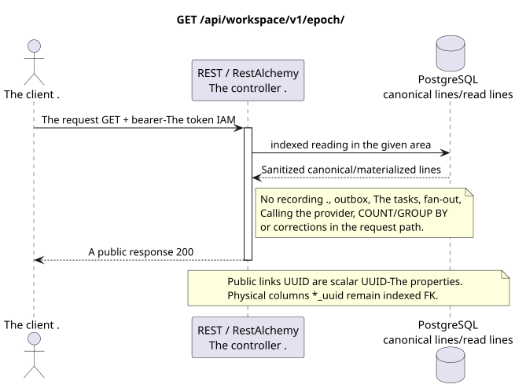

# Getting the current epoch of events

[← The main index of the documentation](../../../../index.md) ·
[Index of sequence diagrams](../../README.md) ·
[The external integration section/runtime](../README.md)

`GET /api/workspace/v1/epoch/`

Return the last visible cursor and the bottom saved border for the authenticated user.



[The source that you can edit PlantUML](diagrams/get_epoch.puml)

## The request

No additional query parameters other than the path variables mentioned above.

The body is missing. JSON.

## A Successful Answer

HTTP `200`:

```json
{
  "epoch_version": 124,
  "epoch_generation": "781203",
  "current_epoch_version": 124,
  "minimum_epoch_version": 37
}
```

## The errors

| HTTP | Behaviour in public |
| --- | --- |
| `400` | For unacceptable path values, query parameters or body, a standard validation error is used RESTAlchemy. |

Example of validation error body:

```json
{
  "type": "ValidationErrorException",
  "code": 400,
  "message": "Validation error occurred."
}
```

## The border RestAlchemy

Target resource/controller ad (supply documentation, not production code)):

```python
class WorkspaceEpoch(models.Model, orm.SQLStorableMixin):
    # Read-only, calculation-free view rooted in one physical event-cursor row.
    __tablename__ = "m_workspace_epoch_view"

    project_id = properties.property(types.UUID(), required=True)
    user_uuid = properties.property(types.UUID(), required=True)
    epoch_generation = properties.property(types.String(min_length=1), read_only=True)
    epoch_version = properties.property(types.Integer(min_value=0), read_only=True)
    current_epoch_version = properties.property(types.Integer(min_value=0), read_only=True)
    minimum_epoch_version = properties.property(types.Integer(min_value=1), read_only=True)

    @classmethod
    def get_id_property(cls) -> dict[str, typing.Any]:
        return {
            "project_id": cls.properties.properties["project_id"],
            "user_uuid": cls.properties.properties["user_uuid"],
        }


class WorkspaceEpochController(controllers.BaseResourceController):
    __resource__ = resources.ResourceByRAModel(
        WorkspaceEpoch,
        hidden_fields=["project_id", "user_uuid"],
    )

    def filter(self, filters, order_by=None):
        del filters, order_by
        return WorkspaceEpoch.objects.get_one(
            filters={
                "project_id": dm_filters.EQ(self.get_context().project_id),
                "user_uuid": dm_filters.EQ(self.get_context().user_uuid),
            }
        )
```

The view displays one indexed physical event cursor line in one line of public response and sets the alias `epoch_version <- current_epoch_version`; it does not perform event record aggregation. The hidden composite identity `(project_id, user_uuid)` is the technical identity of the line RestAlchemy, not the public JSON. Both physical columns UUID  indexed external keys with `ON DELETE CASCADE`. Public ads RestAlchemy do not use `relationships.relationship` for JSON in the form UUID, because the relation (relationship) is serialized as URI.

## Synchronous transaction

1. Authenticate the query and define the project/user domain IAM.
2. Check the path, request settings and required permissions.
3. Execute one indexed read with the canonical line or pre-materialized read surface area saved.
4. Serial only sanitized public fields.

A read transaction does not write an outbox domain entry, a typed projection task, a desired state command, or a ready public event. During the request it does not execute `COUNT`, `GROUP BY`, correlated subquery, fan-out binding, provider call, or cache fix.

## Background processing, events and consistency

Typed projection tasks: none.

No public event Workspace is created for this operation, so the separate controller WebSocket has nothing to deliver.

Consistency visible to the client: no additional delay; response is an authoritative recorded image.

## Idempotency and parallelism

`epoch_version` monotonous inside `epoch_generation`; `(epoch_generation, epoch_version)` is the identity of the playback/cursor.

Repeaters use stable business keys and the current state of the outbox. Each immutable outbox event creates a separate task with a unique `outbox_event_uuid`; the re-delivery of this task must be idempotent, coalescing is absent. Monopoly processing of the topic Messenger from new entries to old ones is only applied when the affected canonical placement actually refers to `(project_id, topic_uuid)`; admin/read provider operations do not create an artificial topic and are not included in this queue.

## The sources

- [`workspace_api.md`](../../../../workspace_api.md) — authoritative public routes, general JSON, page, events and contract WebSocket.
- [`zulip_bridge_v1_product_and_api.md`](../../../../zulip_bridge_v1_product_and_api.md) — sanitized lifecycle of external resources, permissions and provider semantics.

[← The main index of the documentation](../../../../index.md) ·
[Index of sequence diagrams](../../README.md) ·
[The external integration section/runtime](../README.md)
