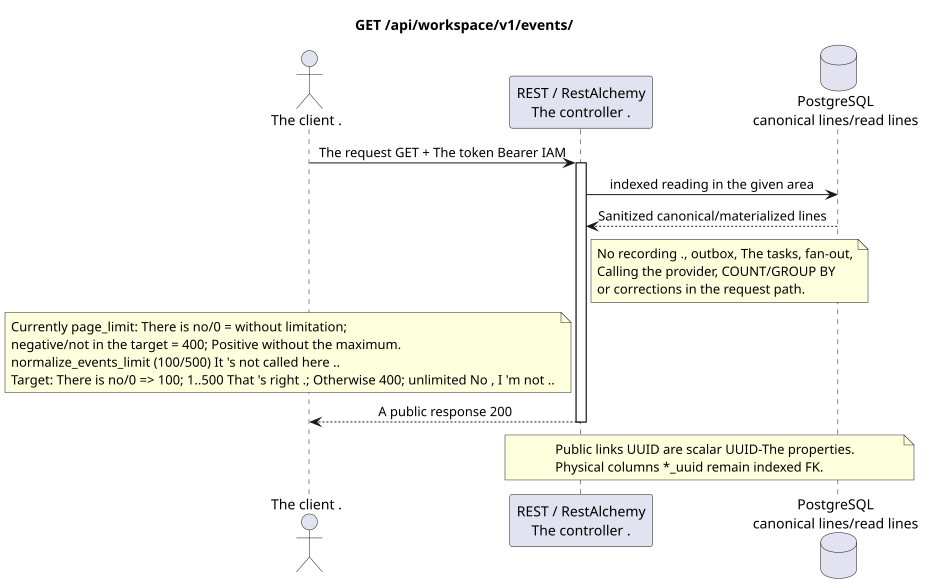

# List of Sustainable Events Workspace

[← The main index of the documentation](../../../../index.md) ·
[Index of sequence diagrams](../../README.md) ·
[External integration and execution time section](../README.md)

`GET /api/workspace/v1/events/`

Return the event suffix that is visible to the current user in ascending order of epoch.



[The source that you can edit PlantUML](diagrams/get_events.puml)

## The request

The request parameters are contracted:

- `epoch_version>` (is coded in URL as `epoch_version%3E`) with an integer cursor
- `epoch_generation` paired with each non-zero cursor
- The whole number `page_limit`; `page_marker`  the whole number of the epoch
- Other documented typed filters of events and AIP-160 `q`

Behavior `page_limit` in the current implementation: no parameter or `0` means
Unlimited sample; negative or non-integer value gives HTTP `400`;
Any positive value is used without a maximum and without a limit
There's a sub-function in the code base.
`normalize_events_limit` with a default value of `100` and a maximum value of `500`, but
The controller of this HTTP operation doesn't call it, so these numbers are not
Target policy: absence/`0` => `100`; `1..500` is accepted exactly; negative, non-integer and `>500` => HTTP `400` without clamp. Unbounded mode is absent; full export client goes to absence of the following marker.

The body is missing. JSON.

## A Successful Answer

HTTP `200`:

```json
[
  {
    "schema_version": 1,
    "uuid": "5bb95582-b4f3-4de1-bf84-f0244910fc82",
    "epoch_version": 124,
    "project_id": "00000000-0000-4000-8000-000000000001",
    "user_uuid": "3f433fee-b27f-4c67-98bd-31fe4df42cc8",
    "object_type": "external_account",
    "action": "updated",
    "created_at": "2026-07-17T12:12:00Z",
    "updated_at": "2026-07-17T12:12:00Z",
    "payload": {
      "kind": "external_account.updated",
      "uuid": "0d4ae1d0-30ad-4d15-bf26-5789e8406201",
      "snapshot": {
        "uuid": "0d4ae1d0-30ad-4d15-bf26-5789e8406201",
        "settings": {
          "kind": "zulip",
          "server_url": "https://zulip.example.invalid",
          "email": "owner@example.invalid",
          "selection_mode": "explicit",
          "history_depth": "30_days",
          "default_project_id": "00000000-0000-4000-8000-000000000001"
        },
        "credential_present": true,
        "status": "live",
        "live_ready": true,
        "safe_error": null,
        "capabilities": {},
        "desired_generation": 7,
        "applied_generation": 7,
        "last_progress_at": "2026-07-17T12:00:00Z",
        "created_at": "2026-07-17T11:00:00Z",
        "updated_at": "2026-07-17T12:00:00Z",
        "revision": 7
      }
    }
  }
]
```

## The errors

| HTTP | Behaviour in public |
| --- | --- |
| `410` | `EventsCursorExpiredError` with `Cache-Control: no-store` when missing/changed generation, future cursor or deleted suffix. |
| `400` | For unacceptable path values, query parameters or body, a standard validation error is used RESTAlchemy. |

Example of validation error body:

```json
{
  "type": "ValidationErrorException",
  "code": 400,
  "message": "Validation error occurred."
}
```

The body of the response when the cursor expires:

```json
{
  "type": "EventsCursorExpiredError",
  "code": 410,
  "error": "epoch_pruned",
  "message": "The event cursor is outside the retained suffix.",
  "reason": "epoch_pruned",
  "epoch_generation": "781203",
  "current_epoch_version": 124,
  "minimum_epoch_version": 37
}
```

## The border RestAlchemy

Target resource/controller ad (supply documentation, not production code)):

```python
class WorkspaceEvent(models.ModelWithUUID, models.ModelWithTimestamp, orm.SQLStorableMixin):
    __tablename__ = "m_workspace_events"

    epoch_version = properties.property(types.Integer(min_value=1), required=True)
    project_id = properties.property(types.UUID(), required=True)
    user_uuid = properties.property(types.AllowNone(types.UUID()), default=None)
    object_type = properties.property(types.String(), required=True)
    action = properties.property(types.String(), required=True)
    payload = properties.property(types.Dict(), required=True)


class WorkspaceEventController(controllers.BaseResourceControllerPaginated):
    __resource__ = resources.ResourceByRAModel(WorkspaceEvent)
    # Scope by project/user or stored compact audience before indexed keyset read.
```

`uuid`, `project_id`, `user_uuid` And then ...UUIDThe value of the useful load inside the image is scalar .UUID- Indexed .`project_id`The events and the permitting .`null` `user_uuid`They 're referring to their canonical lines of the field from`ON DELETE CASCADE`; UUID, copied into the unalteredJSONThe data is the data of the event, not the columns of the relationship, so it is not serialized asURIand are not considered valid external keys.RestAlchemyThey don 't use it .`relationships.relationship`For theJSONIn the form .UUIDBecause the relationship is serialized asURIAt the boundary of the physical scheme , every canonical non-polymorphic connection`*_uuid`is an indexed external key with a clearly selected reference action. Sanitizers hide the owner, credentials, raw provider ID, closed certificate, internal address and raw protocol fields.

## Synchronous transaction

1. Authenticate the query and define the project/user domain IAM.
2. Check the path, request settings and required permissions.
3. Execute one indexed read with the canonical line or pre-materialized read surface area saved.
4. Serial only sanitized public fields.

A read transaction does not write an outbox domain entry, a typed projection task, a desired state command, or a ready public event. During the request it does not execute `COUNT`, `GROUP BY`, correlated subquery, fan-out binding, provider call, or cache fix.

## Background processing, events and consistency

Typed projection tasks: none.

No public event Workspace is created for this operation, so the separate controller WebSocket has nothing to deliver.

Consistency visible to the client: no additional delay; response is an authoritative recorded image.

## Idempotency and parallelism

`epoch_version` monotonous inside `epoch_generation`; `(epoch_generation, epoch_version)` is the identity of the playback/cursor.

Repeaters use stable business keys and the current state of the outbox. Each immutable outbox event creates a separate task with a unique `outbox_event_uuid`; the re-delivery of this task must be idempotent, coalescing is absent. Monopoly processing of the topic Messenger from new entries to old ones is only applied when the affected canonical placement actually refers to `(project_id, topic_uuid)`; admin/read provider operations do not create an artificial topic and are not included in this queue.

## The sources

- [`workspace_api.md`](../../../../workspace_api.md) — authoritative public routes, general JSON, page, events and contract WebSocket.
- [`zulip_bridge_v1_product_and_api.md`](../../../../zulip_bridge_v1_product_and_api.md) — sanitized lifecycle of external resources, permissions and provider semantics.

[← The main index of the documentation](../../../../index.md) ·
[Index of sequence diagrams](../../README.md) ·
[External integration and execution time section](../README.md)
