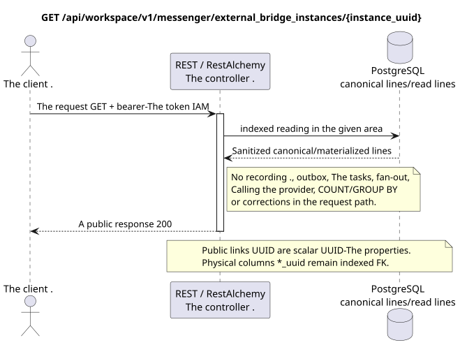

# Get a copy of the external bridge

[← The main index of the documentation](../../../../index.md) ·
[Index of sequence diagrams](../../README.md) ·
[The external integration section/runtime](../README.md)

`GET /api/workspace/v1/messenger/external_bridge_instances/{instance_uuid}`

Return one sanitized photo of identity, capabilities, health and bridge certificate.



[The source that you can edit PlantUML](diagrams/get_external_bridge_instance.puml)

## The request

No additional query parameters other than the path variables mentioned above.

The body is missing. JSON.

## A Successful Answer

HTTP `200`:

```json
{
  "uuid": "6dd6741b-0d90-490a-8e51-749a411be1ad",
  "provider": "zulip",
  "identity_generation": 3,
  "status": "active",
  "capabilities": {},
  "last_heartbeat_at": "2026-07-17T12:11:00Z",
  "certificate_not_after": "2026-10-17T12:00:00Z",
  "safe_error": null,
  "revision": 8,
  "created_at": "2026-07-01T09:00:00Z",
  "updated_at": "2026-07-17T12:11:00Z"
}
```

## The errors

| HTTP | Behaviour in public |
| --- | --- |
| `403` | No `workspace.external_bridge_instance.read` permission or resource is outside authorized area. |
| `404` | Resource not available or not visible in specified area. |
| `400` | For unacceptable path values, query parameters or body, a standard validation error is used RESTAlchemy. |

Example of validation error body:

```json
{
  "type": "ValidationErrorException",
  "code": 400,
  "message": "Validation error occurred."
}
```

## The border RestAlchemy

Target resource/controller ad (supply documentation, not production code)):

```python
class ExternalBridgeInstance(models.ModelWithUUID, models.ModelWithTimestamp, orm.SQLStorableMixin):
    __tablename__ = "m_external_bridge_instances_v2"

    provider = properties.property(types.Enum(PROVIDER_KINDS), required=True)
    identity_generation = properties.property(types.Integer(min_value=1), required=True)
    status = properties.property(types.Enum(BRIDGE_STATUSES), read_only=True)
    capabilities = properties.property(types.Dict(), read_only=True)
    revision = properties.property(types.Integer(min_value=1), read_only=True)


class ExternalBridgeInstanceController(controllers.BaseResourceControllerPaginated):
    __resource__ = resources.ResourceByRAModel(ExternalBridgeInstance)
    # Dedicated IAM permission checks wrap standard indexed reads/actions.
```

UUID The resource is its scalar primary key; the provider type is  a path/domain string key. There is no inter-essential link in this public formUUID- That requires an extra external key .RestAlchemyThey don 't use it .`relationships.relationship`For theJSONIn the form .UUIDBecause relationship is serialized asURIAt the boundary of the physical scheme , every canonical non-polymorphic connection`*_uuid`is an indexed external key with a clearly selected reference action. Sanitizers hide the owner, credentials, raw provider ID, private certificate, internal address and raw protocol fields.

## Synchronous transaction

1. Authenticate the query and define the project/user domain IAM.
2. Check the path, request settings and required permissions.
3. Execute one indexed read with the canonical line or pre-materialized read surface area saved.
4. Serial only sanitized public fields.

A read transaction does not write an outbox domain entry, a typed projection task, a desired state command, or a ready public event. During the request it does not execute `COUNT`, `GROUP BY`, correlated subquery, fan-out binding, provider call, or cache fix.

## Background processing, events and consistency

Typed projection tasks: none.

No public event Workspace is created for this operation, so the separate controller WebSocket has nothing to deliver.

Consistency visible to the client: no additional delay; response is an authoritative recorded image.

## Idempotency and parallelism

UUID The active certification centre determines the bridge with the identity generation..

Repeaters use stable business keys and the current state of the outbox. Each immutable outbox event creates a separate task with a unique `outbox_event_uuid`; the re-delivery of this task must be idempotent, coalescing is absent. Monopoly processing of the topic Messenger from new entries to old ones is only applied when the affected canonical placement actually refers to `(project_id, topic_uuid)`; admin/read provider operations do not create an artificial topic and are not included in this queue.

## The sources

- [`workspace_api.md`](../../../../workspace_api.md) — authoritative public routes, general JSON, page, events and contract WebSocket.
- [`zulip_bridge_v1_product_and_api.md`](../../../../zulip_bridge_v1_product_and_api.md) — sanitized lifecycle of external resources, permissions and provider semantics.

[← The main index of the documentation](../../../../index.md) ·
[Index of sequence diagrams](../../README.md) ·
[The external integration section/runtime](../README.md)
