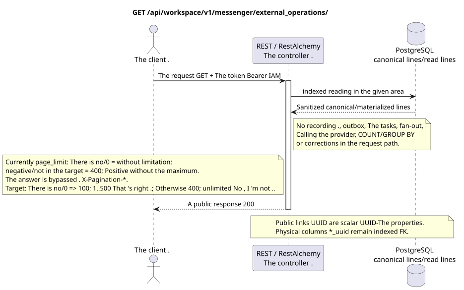

# List of external operations

[← The main index of the documentation](../../../../index.md) ·
[Index of sequence diagrams](../../README.md) ·
[External integration and execution time section](../README.md)

`GET /api/workspace/v1/messenger/external_operations/`

List the owner's stable work associated with the provider.



[The source that you can edit PlantUML](diagrams/get_external_operations.puml)

## The request

The request parameters are contracted:

- - Not required . `external_account_uuid`
- - Not required . `status`
- `page_limit`
- `page_marker` (UUID The last operation)

Behavior `page_limit` in the current implementation: no parameter or `0` means
Unlimited sample; negative or non-integer value gives HTTP `400`;
Any positive value is used without a maximum and without a limit
Redesignating the answer to `ExternalResourceController` bypasses
The standard headings .`X-Pagination-*`Target policy: no`0` => `100`; `1..500`is accepted exactly; negative, incomplete and`>500` => HTTP `400`Unbounded mode is missing; the full export client goes until the next one is missing marker.

The body is missing. JSON.

## A Successful Answer

HTTP `200`:

```json
[
  {
    "uuid": "42bd324f-45f0-4755-9a59-7b7316b2923c",
    "external_account_uuid": "0d4ae1d0-30ad-4d15-bf26-5789e8406201",
    "action": "message.create",
    "target_type": "message",
    "target_uuid": "a93dca35-3061-4748-bda4-7f6f8c660ea5",
    "details": {
      "kind": "zulip"
    },
    "attempt_history": [],
    "status": "queued",
    "attempt": 0,
    "safe_error": null,
    "can_retry": false,
    "can_discard": true,
    "duplicate_risk": false,
    "retry_requires_confirmation": false,
    "original_url": null,
    "reconciliation_state": "not_required",
    "reconciliation_reason": null,
    "reconciliation_evidence": {},
    "revision": 1,
    "created_at": "2026-07-17T12:10:00Z",
    "updated_at": "2026-07-17T12:10:00Z"
  }
]
```

## The errors

| HTTP | Behaviour in public |
| --- | --- |
| `400` | For unacceptable path values, query parameters or body, a standard validation error is used RESTAlchemy. |

Example of validation error body:

```json
{
  "type": "ValidationErrorException",
  "code": 400,
  "message": "Validation error occurred."
}
```

## The border RestAlchemy

Target resource/controller ad (supply documentation, not production code)):

```python
class ExternalOperation(models.ModelWithUUID, models.ModelWithTimestamp, orm.SQLStorableMixin):
    __tablename__ = "m_external_operations_v2"

    external_account_uuid = properties.property(types.UUID(), required=True)
    target_uuid = properties.property(types.AllowNone(types.UUID()), default=None)
    action = properties.property(types.String(), required=True)
    status = properties.property(types.Enum(OPERATION_STATUSES), read_only=True)
    details = properties.property(types.Dict(), read_only=True)
    revision = properties.property(types.Integer(min_value=1), read_only=True)


class ExternalOperationController(controllers.BaseResourceControllerPaginated):
    __resource__ = resources.ResourceByRAModel(ExternalOperation)
    # Owner scope; retry, discard and preflight are narrow action overrides.
```

`external_account_uuid` And admitting .`null` `target_uuid`are scalar .UUID- properties, indexed physical.`external_account_uuid`It 's a link to the account from`ON DELETE CASCADE`Because ...`target_uuid`It's a polymorphic for a stream/topic/message, in its current form it can't be a single external key properly.SQL; the target sentence should choose the canonical register of goals or typed columns of FK, keeping the same publicJSON `target_uuid`- Public announcements .RestAlchemyThey don 't use it .`relationships.relationship`For theJSONIn the form .UUIDBecause the relationship is serialized asURIAt the boundary of the physical scheme , every canonical non-polymorphic connection`*_uuid`is an indexed external key with a clearly selected reference action. Sanitizers hide the owner, credentials, raw provider ID, closed certificate, internal address and raw protocol fields.

## Synchronous transaction

1. Authenticate the query and define the project/user domain IAM.
2. Check the path, request settings and required permissions.
3. Execute one indexed read with the canonical line or pre-materialized read surface area saved.
4. Serial only sanitized public fields.

A read transaction does not write an outbox domain entry, a typed projection task, a desired state command, or a ready public event. During the request it does not execute `COUNT`, `GROUP BY`, correlated subquery, fan-out binding, provider call, or cache fix.

## Background processing, events and consistency

Typed projection tasks: none.

No public event Workspace is created for this operation, so the separate controller WebSocket has nothing to deliver.

Consistency visible to the client: no additional delay; response is an authoritative recorded image.

## Idempotency and parallelism

UUID The number of attempts and terminal crossings are recorded under the line block..

Repeaters use stable business keys and the current state of the original. Each immutable outbox event creates a separate task with a unique `outbox_event_uuid`; the re-delivery of this task must be idempotent, coalescing is absent. Monopoly processing of the topic Messenger from new entries to old ones is only applied when the affected canonical placement actually refers to `(project_id, topic_uuid)`; admin/read provider operations do not create an artificial topic and are not included in this queue.

## The sources

- [`workspace_api.md`](../../../../workspace_api.md) — authoritative public routes, general JSON, page, events and contract WebSocket.
- [`zulip_bridge_v1_product_and_api.md`](../../../../zulip_bridge_v1_product_and_api.md) — sanitized lifecycle of external resources, permissions and provider semantics.

[← The main index of the documentation](../../../../index.md) ·
[Index of sequence diagrams](../../README.md) ·
[External integration and execution time section](../README.md)
