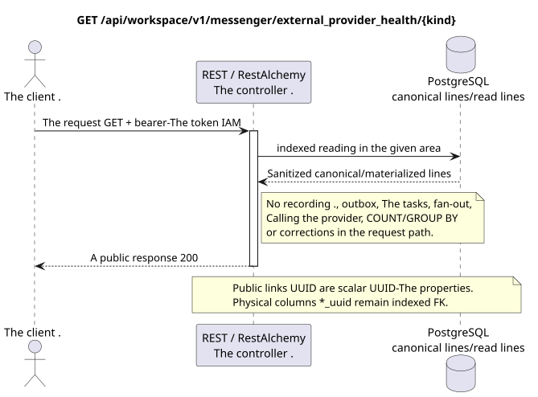

# Getting the health status of the external provider

[← The main index of the documentation](../../../../index.md) ·
[Index of sequence diagrams](../../README.md) ·
[The external integration section/runtime](../README.md)

`GET /api/workspace/v1/messenger/external_provider_health/{kind}`

Read the sanitized aggregated health status of the bridge, accounts, chats and operations for one provider type.



[The source that you can edit PlantUML](diagrams/get_external_provider_health.puml)

## The request

No additional query parameters other than the path variables mentioned above.

The body is missing. JSON.

## A Successful Answer

HTTP `200`:

```json
{
  "provider": "zulip",
  "status": "healthy",
  "account_counts": {
    "live": 2
  },
  "chat_counts": {
    "live": 12
  },
  "bridge_counts": {
    "active": 1
  },
  "operation_counts": {
    "queued": 1,
    "failed": 0
  },
  "metrics": {
    "queue_depth": 1,
    "selected_chats": 12,
    "synchronized_messages": 4800,
    "synchronized_users": 93
  },
  "updated_at": "2026-07-17T12:12:30Z"
}
```

## The errors

| HTTP | Behaviour in public |
| --- | --- |
| `403` | No `workspace.external_provider_health.read` permission or resource is outside authorized area. |
| `400` | For unacceptable path values, query parameters or body, a standard validation error is used RESTAlchemy. |

Example of validation error body:

```json
{
  "type": "ValidationErrorException",
  "code": 400,
  "message": "Validation error occurred."
}
```

## The border RestAlchemy

Target resource/controller ad (supply documentation, not production code)):

```python
class ExternalProviderHealth(models.Model, orm.SQLStorableMixin):
    # Worker-maintained physical projection; public controller is read-only.
    __tablename__ = "m_external_provider_health_state_v1"

    provider = properties.property(types.Enum(PROVIDER_KINDS), required=True)
    status = properties.property(types.String(), read_only=True)
    account_counts = properties.property(types.Dict(), read_only=True)
    chat_counts = properties.property(types.Dict(), read_only=True)
    bridge_counts = properties.property(types.Dict(), read_only=True)
    operation_counts = properties.property(types.Dict(), read_only=True)
    metrics = properties.property(types.Dict(), read_only=True)
    updated_at = properties.property(types.UTCDateTimeZ(), read_only=True)

    @classmethod
    def get_id_property(cls) -> dict[str, typing.Any]:
        return {"provider": cls.properties.properties["provider"]}


class ExternalProviderHealthController(controllers.BaseResourceController):
    __resource__ = resources.ResourceByRAModel(ExternalProviderHealth)
    # GET by provider kind reads one pre-materialized row; writes are worker-only.
```

The physical projection contains one line per provider view, and`provider`The background worker is a powerful replacement for the original state of the line. The public controller never aggregates accounts, chats, bridges, operations, messages or users during a query. The counter/metric maps do not contain resource relationships or external links.UUID- Public announcements .RestAlchemyThey don 't use it .`relationships.relationship`For theJSONIn the form .UUIDBecause relationship is serialized asURI. Sanitizers hide the owner, credentials, raw provider ID, closed certificate, internal address and raw protocol fields.

## Synchronous transaction

1. Authenticate the query and define the project/user domain IAM.
2. Check the path, request settings and required permissions.
3. Execute one indexed read with the canonical line or pre-materialized read surface area saved.
4. Serial only sanitized public fields.

A read transaction does not write an outbox domain entry, a typed projection task, a desired state command, or a ready public event. During the request it does not execute `COUNT`, `GROUP BY`, correlated subquery, fan-out binding, provider call, or cache fix.

## Background processing, events and consistency

Typed projection tasks: none.

No public event Workspace is created for this operation, so the separate controller WebSocket has nothing to deliver.

Consistency visible to the client: the response reads the last pre-materialized health projection and deliberately eventually consists of heartbeat and queues.

## Idempotency and parallelism

For each type of provider, there is one materialized projection..

Repeaters use stable business keys and the current state of the original. Each immutable outbox event creates a separate task with a unique `outbox_event_uuid`; the re-delivery of this task must be idempotent, coalescing is absent. Monopoly processing of the topic Messenger from new entries to old ones is only applied when the affected canonical placement actually refers to `(project_id, topic_uuid)`; admin/read provider operations do not create an artificial topic and are not included in this queue.

## The sources

- [`workspace_api.md`](../../../../workspace_api.md) — authoritative public routes, general JSON, page, events and contract WebSocket.
- [`zulip_bridge_v1_product_and_api.md`](../../../../zulip_bridge_v1_product_and_api.md) — sanitized lifecycle of external resources, permissions and provider semantics.

[← The main index of the documentation](../../../../index.md) ·
[Index of sequence diagrams](../../README.md) ·
[The external integration section/runtime](../README.md)
