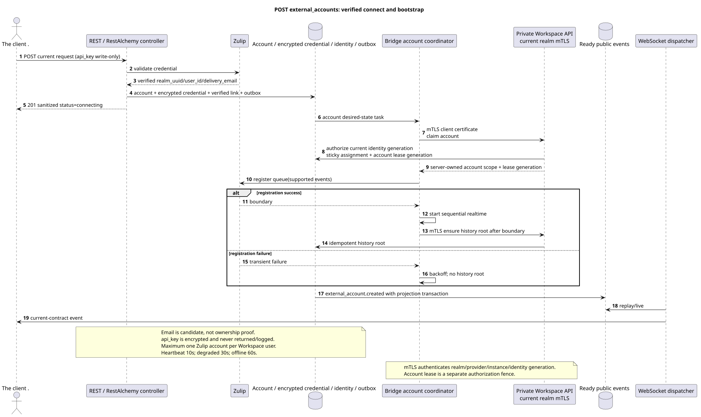

# Create an external account

[← The main index of the documentation](../../../../index.md) ·
[Index of sequence diagrams](../../README.md) ·
[The external integration section/runtime](../README.md)

`POST /api/workspace/v1/messenger/external_accounts/`

Create and verify one provider-neutral account with a created client UUID and only record-accessible accounts.



[The source that you can edit PlantUML](diagrams/post_external_accounts.puml)

## The request

No additional query parameters other than the path variables mentioned above.

```json
{
  "uuid": "0d4ae1d0-30ad-4d15-bf26-5789e8406201",
  "settings": {
    "kind": "zulip",
    "server_url": "https://zulip.example.invalid",
    "email": "owner@example.invalid",
    "api_key": "write-only",
    "selection_mode": "explicit",
    "history_depth": "30_days",
    "default_project_id": "00000000-0000-4000-8000-000000000001"
  }
}
```

## A Successful Answer

HTTP `201`:

```json
{
  "uuid": "0d4ae1d0-30ad-4d15-bf26-5789e8406201",
  "settings": {
    "kind": "zulip",
    "server_url": "https://zulip.example.invalid",
    "email": "owner@example.invalid",
    "selection_mode": "explicit",
    "history_depth": "30_days",
    "default_project_id": "00000000-0000-4000-8000-000000000001"
  },
  "credential_present": true,
  "status": "connecting",
  "live_ready": false,
  "safe_error": null,
  "capabilities": {},
  "desired_generation": 1,
  "applied_generation": 0,
  "last_progress_at": null,
  "created_at": "2026-07-17T11:00:00Z",
  "updated_at": "2026-07-17T11:00:00Z",
  "revision": 1
}
```

The responses of the resources with the revision contain strict `ETag: "<revision>"`.

## The errors

| HTTP | Behaviour in public |
| --- | --- |
| `403` | No `workspace.external_account.create` permission or resource is outside authorized area. |
| `409` | `ExternalAccountConflictError`: The owner already has an account for this type of provider. |
| `400` | For unacceptable path values, query parameters or body, a standard validation error is used RESTAlchemy. |

Example of validation error body:

```json
{
  "type": "ValidationErrorException",
  "code": 400,
  "message": "Validation error occurred."
}
```

## The border RestAlchemy

Target resource/controller ad (supply documentation, not production code)):

```python
class ExternalAccount(models.ModelWithUUID, models.ModelWithTimestamp, orm.SQLStorableMixin):
    __tablename__ = "m_external_accounts_v2"

    owner_user_uuid = properties.property(types.UUID(), required=True)
    settings = properties.property(EXTERNAL_ACCOUNT_SETTINGS_TYPE, required=True)
    status = properties.property(types.Enum(ACCOUNT_STATUSES), read_only=True)
    capabilities = properties.property(types.Dict(), read_only=True)
    revision = properties.property(types.Integer(min_value=1), read_only=True)


class ExternalAccountController(controllers.BaseResourceControllerPaginated):
    __resource__ = resources.ResourceByRAModel(
        ExternalAccount, hidden_fields=["owner_user_uuid"]
    )
```

`owner_user_uuid` hidden; public `settings.default_project_id` is a scalar UUID property. In the target repository, the indexed `owner_user_uuid` refers to the user Workspace with `ON DELETE CASCADE`, and the extracted indexed `default_project_uuid`  to the project registry with `ON DELETE RESTRICT`; when serialized, the latter is still embedded in `settings`. Public RestAlchemy ads do not use `relationships.relationship` for JSON in the form UUID because the relation (relationship) is serialized as URI. At the boundary of the physical scheme, each canonical non-polymorphic connection `*_uuid` is an indexed external key with a clearly selected reference action..

## Synchronous transaction

1. Authenticate the query, define the domain, check the resolution/body and find the canonical string for the indexed key.
2. Before recording, validate Zulip credential and get verified realm UUID,
   provider user ID and `delivery_email`; normalized email remains candidate, not
   The evidence ownership.
3. Insert in one transaction account, encrypted credential envelope, atomic
   verified identity link, desired-state record and immutable outbox.
4. Return the response after commit; the next bootstrap queue is running outside of this queue
   transactions by a single algorithm connect/reconnect.

## Background processing, events and consistency

Typed `delivery_snapshot_event` serves exact external-account
scope; topic task The desired state is not available without placement.
It 's a stand-alone , stable line . control plane.

The background handler in one DB transaction records the materialized state and the ready envelope of the full image `external_account.created`; both commit or rollback effects together. After commit a separate handler WebSocket sends, repeats and plays it; API/worker does not own client connections.

Consistency visible to the client: account line immediately fixed with status `connecting`; bridge check, detection, applied generation, live-work readiness and capabilities converge asynchronously.

After commit Workspace sticky scheduler assigns healthy compatible Bridge with
Minimum normalized load; instance receives whole-account lease, registers
new Zulip queue only for supported events, runs sequential realtime and
Then it creates the history root task. registration boundary.
All Bridge→Workspace calls use the current private
`workspace-external-bridge-api` I 'm with realm-bound mTLS certificate; certificate
identity and current instance generation are checked before the separate account
assignment/lease authorization. Enrollment secret or Zulip `api_key` not
used as a constant S2S credential.
See also:: [`zulip_bridge/account_lifecycle_and_identity.md`](../../../../zulip_bridge/account_lifecycle_and_identity.md).

## Idempotency and parallelism

UUID The account is created by the client at the time of creation; business uniqueness allows for one account `(owner_user_uuid, provider_kind)`..

Repeaters use stable business keys and the current state of the original. Each immutable outbox event creates a separate task with a unique `outbox_event_uuid`; the re-delivery of this task must be idempotent, coalescing is absent. Monopoly processing of the topic Messenger from new entries to old ones is only applied when the affected canonical placement actually refers to `(project_id, topic_uuid)`; admin/read provider operations do not create an artificial topic and are not included in this queue.

## The sources

- [`workspace_api.md`](../../../../workspace_api.md) — authoritative public routes, general JSON, page, events and contract WebSocket.
- [`zulip_bridge_v1_product_and_api.md`](../../../../zulip_bridge_v1_product_and_api.md) — sanitized lifecycle of external resources, permissions and provider semantics.

[← The main index of the documentation](../../../../index.md) ·
[Index of sequence diagrams](../../README.md) ·
[The external integration section/runtime](../README.md)
