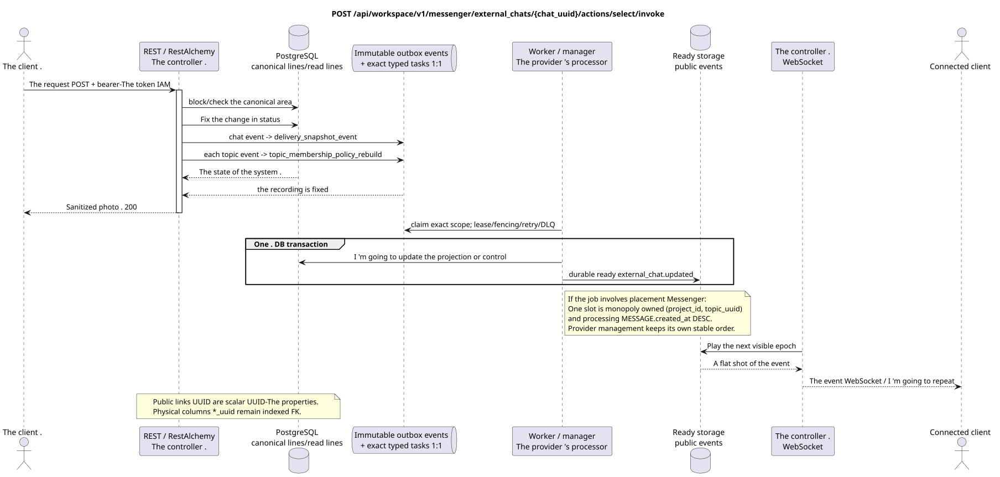

# Choose an external chat

[← The main index of the documentation](../../../../index.md) ·
[Index of sequence diagrams](../../README.md) ·
[The external integration section/runtime](../README.md)

`POST /api/workspace/v1/messenger/external_chats/{chat_uuid}/actions/select/invoke`

Select a chat and assign it to a project.



[The source that you can edit PlantUML](diagrams/post_external_chat_select.puml)

## The request

No additional query parameters other than the path variables mentioned above.

```json
{
  "project_id": "00000000-0000-4000-8000-000000000001"
}
```

## A Successful Answer

HTTP `200`:

```json
{
  "uuid": "26f4907e-d181-4b7b-bdac-cc9685d37c40",
  "external_account_uuid": "0d4ae1d0-30ad-4d15-bf26-5789e8406201",
  "source": {
    "kind": "zulip",
    "chat_type": "channel",
    "original_url": "https://zulip.example.invalid/#narrow/channel/42"
  },
  "display_name": "Engineering",
  "selected": true,
  "project_id": "00000000-0000-4000-8000-000000000001",
  "history_depth": "30_days",
  "projection_stream_uuid": "8ce8c018-4c4f-4f48-9bb7-9d95ce6d5d91",
  "status": "syncing",
  "capabilities": {},
  "safe_error": null,
  "transition_pending": false,
  "revision": 4,
  "created_at": "2026-07-17T11:05:00Z",
  "updated_at": "2026-07-17T12:05:00Z"
}
```

The responses of the resources with the revision contain strict `ETag: "<revision>"`.

## The errors

| HTTP | Behaviour in public |
| --- | --- |
| `404` | Resource not available or not visible in specified area. |
| `400` | For unacceptable path values, query parameters or body, a standard validation error is used RESTAlchemy. |

Example of validation error body:

```json
{
  "type": "ValidationErrorException",
  "code": 400,
  "message": "Validation error occurred."
}
```

## The border RestAlchemy

Target resource/controller ad (supply documentation, not production code)):

```python
class ExternalChat(models.ModelWithUUID, models.ModelWithTimestamp, orm.SQLStorableMixin):
    __tablename__ = "m_external_chats_v2"

    external_account_uuid = properties.property(types.UUID(), required=True)
    source = properties.property(EXTERNAL_CHAT_SOURCE_TYPE, required=True)
    project_id = properties.property(types.AllowNone(types.UUID()), default=None)
    projection_stream_uuid = properties.property(types.AllowNone(types.UUID()), read_only=True)
    selected = properties.property(types.Boolean(), default=False)
    revision = properties.property(types.Integer(min_value=1), read_only=True)


class ExternalChatController(controllers.BaseResourceControllerPaginated):
    __resource__ = resources.ResourceByRAModel(ExternalChat)
    # Owner/account scope and narrow select/deselect/move actions only.
```

`external_account_uuid`, `project_id` and `projection_stream_uuid` are scalar UUID-properties. For corresponding indexed physical columns `external_account_uuid -> external_account ON DELETE CASCADE`, `project_id -> project registry ON DELETE RESTRICT` and allowing `null` `projection_stream_uuid -> STREAM ON DELETE SET NULL` are used. Public announcements RestAlchemy do not use `relationships.relationship` for JSON in the form UUID because the relation (relationship) is serialized as URI. At the boundary of the physical scheme each canonical non-polymorphic connection `*_uuid` is an indexed external key with an explicitly selected reference action. Sanitizers hide the owner, credentials, raw provider ID, closed certificate, internal address and raw protocol fields.

## Synchronous transaction

1. Authenticate the query, define the domain, check the resolution/body and find the canonical string for the indexed key.
2. Block the owner/account/chat destination; check the target project and policy limits; save the selected destination along with the stable desired state and unchanged outbox; record the transaction.
3. Return a response only after the transaction is fixed; network delivery is never performed inside the transaction.

## Background processing, events and consistency

Typed tasks: `delivery_snapshot_event` for external-chat state/event
and a separate `topic_membership_policy_rebuild` for each topic touched;
No scanning of missing bindings in request path.

The background handler in one DB transaction records the materialized state and the ready envelope of the full image `external_chat.updated`; both commit or rollback effects together. After commit a separate handler WebSocket sends, repeats and plays it; API/worker does not own client connections.

Consistency visible to the client: the returned chat may have a status
`syncing`/`transition_pending`. The canonical projections of the stream/topic/message and
The user bindings are only visible after the
The materialist worker.

## Idempotency and parallelism

UUID The UUID fields of the project/stream are indexed external keys, not public URI relationships (relationship).

Repeaters use stable business keys and the current state of the outbox. Each immutable outbox event creates a separate task with a unique `outbox_event_uuid`; the re-delivery of this task must be idempotent, coalescing is absent. Monopoly processing of the topic Messenger from new entries to old ones is only applied when the affected canonical placement actually refers to `(project_id, topic_uuid)`; admin/read provider operations do not create an artificial topic and are not included in this queue.

## The sources

- [`workspace_api.md`](../../../../workspace_api.md) — authoritative public routes, general JSON, page, events and contract WebSocket.
- [`zulip_bridge_v1_product_and_api.md`](../../../../zulip_bridge_v1_product_and_api.md) — sanitized lifecycle of external resources, permissions and provider semantics.

[← The main index of the documentation](../../../../index.md) ·
[Index of sequence diagrams](../../README.md) ·
[The external integration section/runtime](../README.md)
