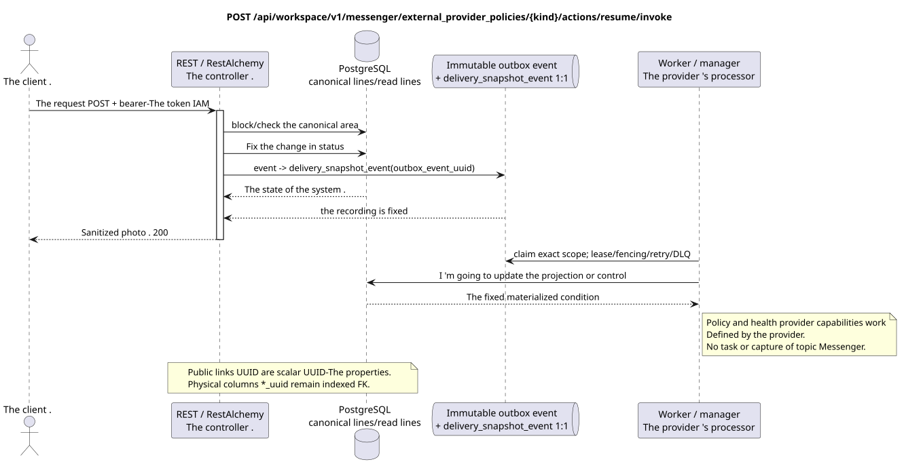

# Renew the policy of the external provider

[← The main index of the documentation](../../../../index.md) ·
[Index of sequence diagrams](../../README.md) ·
[The external integration section/runtime](../README.md)

`POST /api/workspace/v1/messenger/external_provider_policies/{kind}/actions/resume/invoke`

Restore provider view for all domains after policy check.



[The source that you can edit PlantUML](diagrams/post_external_provider_policy_resume.puml)

> Note about the contract: the OpenAPI now generated mistakenly denotes the response to this action as `ExternalOperation_Get`. The behavior of the runtime controller and the associated public contract return an updated resource of this endpoint family. This documentation maintains the public runtime boundary; the fix of the OpenAPI generated is beyond the scope of this task only by documentation (docs-only).

## The request

No additional query parameters other than the path variables mentioned above.

The body is missing. JSON.

## A Successful Answer

HTTP `200`:

```json
{
  "uuid": "bbf5398b-7d85-5770-aaf6-827605ca1200",
  "provider": "zulip",
  "enabled": true,
  "emergency_suspended": false,
  "limits": {
    "max_accounts": 100,
    "max_selected_chats_per_account": 1000,
    "max_file_bytes": 5368709120
  },
  "custom_ca_bundle": {
    "uuid": "40a917df-3c67-43a7-b5a3-d0ea38e24666",
    "generation": 4,
    "sha256": "0123456789abcdef0123456789abcdef0123456789abcdef0123456789abcdef",
    "certificate_count": 1
  },
  "revision": 5,
  "created_at": "2026-07-01T09:00:00Z",
  "updated_at": "2026-07-17T12:12:00Z"
}
```

The responses of the resources with the revision contain strict `ETag: "<revision>"`.

## The errors

| HTTP | Behaviour in public |
| --- | --- |
| `403` | No `workspace.external_provider_policy.resume` permission or resource is outside authorized area. |
| `400` | For unacceptable path values, query parameters or body, a standard validation error is used RESTAlchemy. |

Example of validation error body:

```json
{
  "type": "ValidationErrorException",
  "code": 400,
  "message": "Validation error occurred."
}
```

## The border RestAlchemy

Target resource/controller ad (supply documentation, not production code)):

```python
class ExternalProviderPolicy(models.ModelWithUUID, models.ModelWithTimestamp, orm.SQLStorableMixin):
    __tablename__ = "m_external_provider_policies_v1"

    provider = properties.property(types.Enum(PROVIDER_KINDS), required=True)
    enabled = properties.property(types.Boolean(), required=True)
    emergency_suspended = properties.property(types.Boolean(), read_only=True)
    limits = properties.property(types.Dict(), required=True)
    custom_ca_bundle = properties.property(types.AllowNone(types.Dict()), read_only=True)
    revision = properties.property(types.Integer(min_value=1), read_only=True)

    @classmethod
    def get_id_property(cls) -> dict[str, typing.Any]:
        return {"provider": cls.properties.properties["provider"]}


class ExternalProviderPolicyController(controllers.BaseResourceController):
    __resource__ = resources.ResourceByRAModel(ExternalProviderPolicy)
    # ResourceByRAModel restores by provider kind, not by the hidden storage UUID.
```

Public resource is addressed by `kind` provider; UUID metadata remains scalar UUID properties. If the user CA metadata is physically normalized, the indexed admitter `null` `custom_ca_bundle_uuid` refers to the protected CA packet with `ON DELETE SET NULL`. Public ads RestAlchemy do not use `relationships.relationship` for JSON in the UUID form because the relationship is serialized as URI. At the boundary of the physical scheme, the canonical non-polymorphic link `*_uuid` is an indexed external key with an explicitly selected reference action. Sanitizers hide the owner, raw credentials, provider ID, closed certificate, internal address and protocol fields.

## Synchronous transaction

1. Authenticate the query, define the domain, check the resolution/body and find the canonical string for the indexed key.
2. Block policy; set `emergency_suspended=false`; enlarge revision; atomically add desired state and immutable outbox.
3. Return a response only after the transaction is fixed; network delivery is never performed inside the transaction.

## Background processing, events and consistency

Typed projection tasks: separate immutable `delivery_snapshot_event`
Health policies for each source outbox event and individual sustainable work
Each has a real scope of provider and
unique `outbox_event_uuid`; coalescing Without placement, the operation is impossible.
It creates topic task/claim.

No public event Workspace is created for this operation, so the separate controller WebSocket has nothing to deliver.

Consistency visible to the client: policy flags are immediately active. Effective features, account/chat status and health converge asynchronously. Public view of provider policy event not registered.

## Idempotency and parallelism

For each provider type, there is one policy line. Revision/ETag prevents loss of updates; each changing operation results in its own unchanged task, and a repetition of one task is potentially.

Repeaters use stable business keys and the current state of the outbox. Each immutable outbox event creates a separate task with a unique `outbox_event_uuid`; the re-delivery of this task must be idempotent, coalescing is absent. Monopoly processing of the topic Messenger from new entries to old ones is only applied when the affected canonical placement actually refers to `(project_id, topic_uuid)`; admin/read provider operations do not create an artificial topic and are not included in this queue.

## The sources

- [`workspace_api.md`](../../../../workspace_api.md) — authoritative public routes, general JSON, page, events and contract WebSocket.
- [`zulip_bridge_v1_product_and_api.md`](../../../../zulip_bridge_v1_product_and_api.md) — sanitized lifecycle of external resources, permissions and provider semantics.

[← The main index of the documentation](../../../../index.md) ·
[Index of sequence diagrams](../../README.md) ·
[The external integration section/runtime](../README.md)
