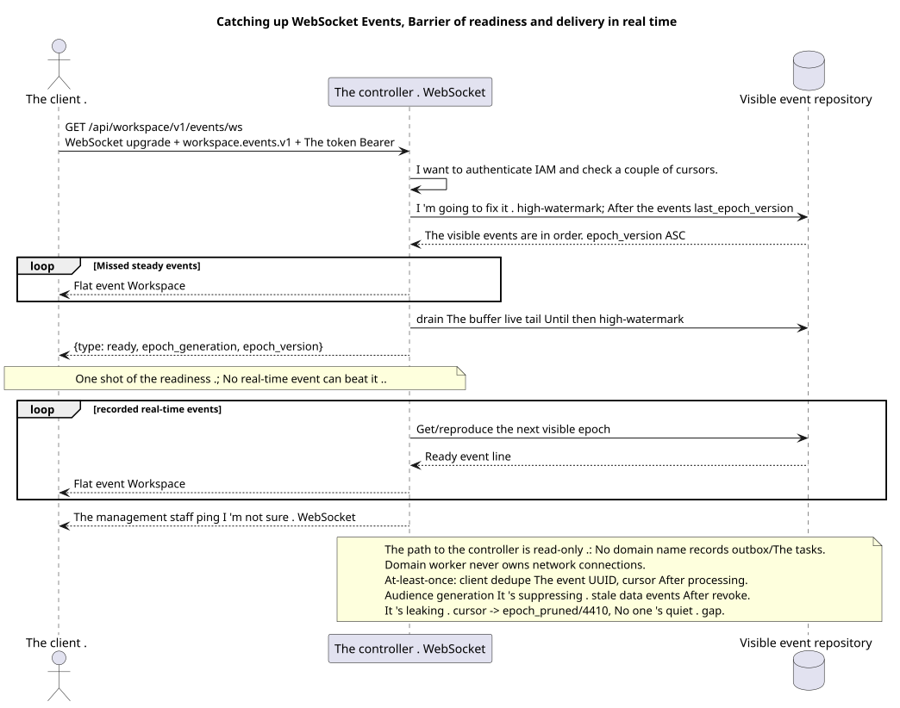

# WebSocket event connection

[← The main index of the documentation](../../../../index.md) ·
[Index of sequence diagrams](../../README.md) ·
[External integration and execution time section](../README.md)

Entry point: `GET /api/workspace/v1/events/ws` with WebSocket upgrade and query
`last_epoch_version=<number>&epoch_generation=<generation>`.

Open a real-time public stream, play the visible steady-state suffix, get exactly one frame of readiness, and then take flat events.WorkspaceThis is a documented entry point of execution time, notHTTP- The surgery. OpenAPI.



[The source that you can edit PlantUML](diagrams/websocket_events.puml)

## Set up the connection

What is the query setting ?:

- `last_epoch_version`: the last fully processed integer epoch; `0`  cold cursor.
- `epoch_generation`: Must be with a non-zero cursor and must match the saved generation.

`Sec-WebSocket-Protocol` values in order:

```text
workspace.events.v1, bearer.<IAM access token>
```

The request body JSON is not sent. The client is not sending `ack` or `pong`-level application; activity checking uses protocol-level ping control frames WebSocket.

## Server messages are

Exactly one control alert message is sent after the catch-up read and before the real-time events:

```json
{
  "type": "ready",
  "epoch_generation": "781203",
  "epoch_version": 124
}
```

Then each event message has exactly the same flat shape as REST `/events/`:

```json
{
  "schema_version": 1,
  "uuid": "5bb95582-b4f3-4de1-bf84-f0244910fc82",
  "epoch_version": 124,
  "project_id": "00000000-0000-4000-8000-000000000001",
  "user_uuid": "3f433fee-b27f-4c67-98bd-31fe4df42cc8",
  "object_type": "external_account",
  "action": "updated",
  "created_at": "2026-07-17T12:12:00Z",
  "updated_at": "2026-07-17T12:12:00Z",
  "payload": {
    "kind": "external_account.updated",
    "uuid": "0d4ae1d0-30ad-4d15-bf26-5789e8406201",
    "snapshot": {
      "uuid": "0d4ae1d0-30ad-4d15-bf26-5789e8406201",
      "settings": {
        "kind": "zulip",
        "server_url": "https://zulip.example.invalid",
        "email": "owner@example.invalid",
        "selection_mode": "explicit",
        "history_depth": "30_days",
        "default_project_id": "00000000-0000-4000-8000-000000000001"
      },
      "credential_present": true,
      "status": "live",
      "live_ready": true,
      "safe_error": null,
      "capabilities": {},
      "desired_generation": 7,
      "applied_generation": 7,
      "last_progress_at": "2026-07-17T12:00:00Z",
      "created_at": "2026-07-17T11:00:00Z",
      "updated_at": "2026-07-17T12:00:00Z",
      "revision": 7
    }
  }
}
```

JSON-No `hello`, `ping`, `pong` or `ack` message at the application level.

## Cursor error occurred

When the cursor is expired, the following typed error JSON is sent, after which the connection is closed with code `4410` and the reason `epoch_pruned`:

```json
{
  "type": "EventsCursorExpiredError",
  "code": 410,
  "error": "epoch_pruned",
  "message": "The event cursor is outside the retained suffix.",
  "reason": "epoch_pruned",
  "epoch_generation": "781203",
  "current_epoch_version": 124,
  "minimum_epoch_version": 37
}
```

## Read and dispatch path

When the connection is set up, the region IAM is authenticated, checked
`(epoch_generation, last_epoch_version)` and is fixed high-watermark durable
event store. Dispatcher Repeat all visible events after the increment
cursor, It simultaneously buffers the emerging live tail, drains it and only
After that, it switches to live without gap./business events
Worker has already atomically saved the projection update and ready event row
in one DB transaction; the dispatcher only reads the durable store and delivers.

## Boundary RestAlchemy and identity

```python
class WorkspaceEvent(models.ModelWithUUID, models.ModelWithTimestamp, orm.SQLStorableMixin):
    __tablename__ = "m_workspace_events"

    epoch_version = properties.property(types.Integer(min_value=1), required=True)
    project_id = properties.property(types.UUID(), required=True)
    user_uuid = properties.property(types.AllowNone(types.UUID()), default=None)
    object_type = properties.property(types.String(), required=True)
    action = properties.property(types.String(), required=True)
    payload = properties.property(types.Dict(), required=True)


class WorkspaceEventController(controllers.BaseResourceControllerPaginated):
    __resource__ = resources.ResourceByRAModel(WorkspaceEvent)
    # Scope by project/user or stored compact audience before indexed keyset read.
```

Public UUID events/entities are scalar UUID properties, not URI relations. Indexed `project_id` events and allowing `null` `user_uuid` refer to canonical strings of the region with `ON DELETE CASCADE`; UUID, copied to the unchanged JSON payload, are event data, not functioning columns of the relationship. Event identity/reproduction uses `(epoch_generation, epoch_version)`, not just UUID entities.

## Parallelism, time and restoration

Read-through and drain live buffer complete to the readiness barrier.
Real-time delivery can't beat readiness.
at-least-once: The client de-duplicates the event UUID and moves the cursor only
After the full processing, the audience row is carrying membership generation; dispatcher
and replay do not deliver data events when inactive membership or incompatible
generation The answer 4410/`epoch_pruned` requires clearing
derived caches, upload authoritative images and start with the returned ones
The number of retention windows remains operational
policy, But a quiet loss of events is forbidden..

## The sources

- [`workspace_api.md`](../../../../workspace_api.md), the following sections `Runtime Entry Points`, `Events And Epoch` and `WebSocket Realtime Summary`.

[← The main index of the documentation](../../../../index.md) ·
[Index of sequence diagrams](../../README.md) ·
[External integration and execution time section](../README.md)
