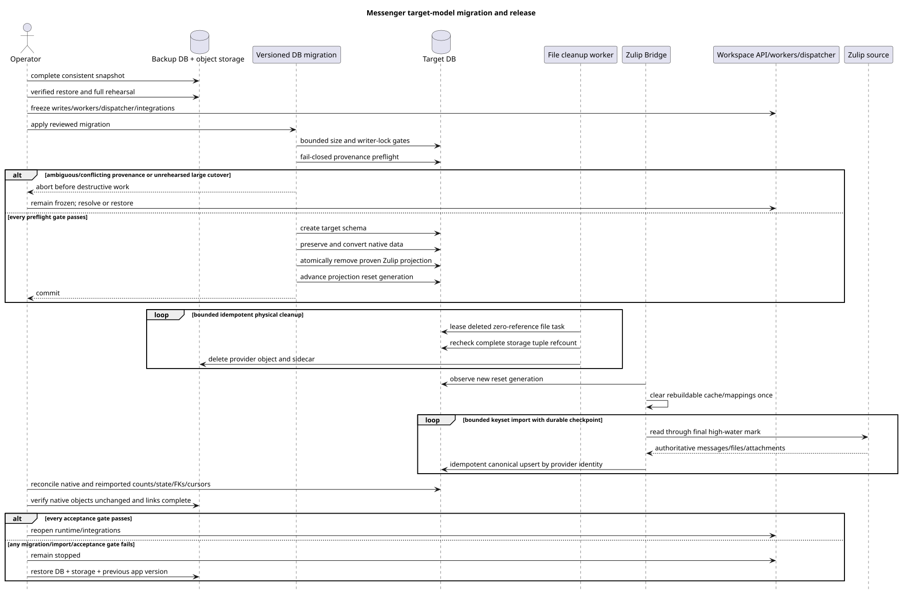

[← Documentation index](../../../index.md) · [Sequence diagram index](../README.md) · [Worker flows](README.md)

# Messenger target-model migration and release runbook

Status: **implemented for Workspace Server v2; mandatory operator procedure**.

This runbook addresses Critic risk #11. It does not, by itself, authorize a
migration, data deletion, or a production schema change. The active public
contract is defined in [`workspace_api.md`](../../../workspace_api.md).

Editable diagram source:
[`migration_release_runbook.puml`](diagrams/migration_release_runbook.puml).

## Responsibility boundary

| Mechanism | Responsibility | Invocation |
| --- | --- | --- |
| versioned DB migrations | create the target schema, migrate authoritative native data, delete proven Zulip message/file projections, and advance reset generation | normal release pipeline after the backup, rehearsal, size, and freeze gates |
| Messenger worker | perform bounded and idempotent physical cleanup only for already-deleted, zero-reference Zulip file rows | automatically after the migration commits |
| Zulip Bridge | observe the new reset generation, clear rebuildable local state, and run a complete fresh import | automatically, with a durable backfill checkpoint and retry |
| operator checks | verify backup/restore, freeze, pre/post counts, reconciliation, and acceptance gates | before migration and after reimport completes |

Every manual helper must provide `check-only`/`dry-run` and `apply` modes, an
explicit project/range/provider/account scope, bounded batches, restartable
checkpoints, idempotent reruns, progress and audit logs, and a final manifest.
A failed check blocks the next step.

## Preparation and freeze

1. Take the agreed complete backup or snapshot of the database and object
   storage.
2. Restore it into an isolated copy. Record the source application revision,
   schema/migration revision, and outbox/task/event/provider cursors.
3. Rehearse the complete procedure on that restored production-like copy,
   measure duration and storage use, and verify rollback.
4. For the incompatible cutover, stop API writes, worker slots, the WebSocket
   dispatcher, and provider integrations. Wait for active transactions and
   tasks to finish, then record final high-water marks.
5. Do not allow a producer to create data between the final watermark/backup,
   the conversion, and reopening writes.

## Separating data by origin

### Native Workspace

Native messages and files uploaded to native chats are authoritative local
data. They are neither deleted nor reimported. Versioned DB migrations
deterministically convert them into target `MESSAGE`, `MESSAGE_PLACEMENT`,
`USER_MESSAGE_BINDING`, and `USER_MESSAGE_STATE` rows while preserving content
and user state. Native file rows, blob objects, references, checksums, and UUIDs
must match before and after the release.

### Zulip: intentional reset of derived Workspace identity

Zulip-imported messages, files/attachments, and their derived projections are
rebuildable. After the verified backup, the versioned migration deletes only
proven rows in the frozen `provider=zulip` scope, advances account/chat desired
generations, and publishes `projection_reset_generation`. The Bridge discards
old rebuildable deduplication state and runs a complete fresh import from the
authoritative Zulip source. Selected account/chat configuration and the
identity/catalog remain in place.

This is an **intentionally destructive identity boundary** only for
Zulip-derived Workspace data:

- old canonical `MESSAGE.uuid` values, public `MESSAGE_PLACEMENT.uuid` values,
  deep links, and other references to imported Zulip messages are not retained;
- old Workspace-local bindings/states (`read`, `starred`, `hidden`), reactions,
  and manual placements tied to the old Zulip UUID need not survive when the
  authoritative Zulip payload cannot reconstruct them;
- Zulip-derived file UUIDs, attachment/link identity, and blob identity are not
  retained; reimport may create new rows, UUIDs, and storage objects;
- no external-id → old Workspace UUID mapping is created or restored;
- this boundary does not apply to native messages, native state, or
  native-owned files.

## Fail-closed provenance classification

Cleanup never decides from one nullable field. Historical migrations did not
guarantee a correct `source_name` on every imported message, while a native
outbound message may acquire provider/account identifiers after echo
reconciliation. The migration therefore runs a deterministic preflight under
the same writer freeze and accepts only these combinations:

- inbound message: consistent `source_name` and `source.kind`, provider message
  identity from `source.message_id` or the legacy `provider_external_id` (the
  values must match when both exist), the complete historical Bridge identity
  `UUIDv5(legacy_namespace, "zulip:<account_uuid>:message:<provider_id>")`,
  plus either a matching Zulip account, a Zulip-owned stream, or corroborating
  legacy entity evidence;
- native outbound message: a durable `m_external_operations_v2` row with
  `action=message.create`, matching `target_uuid`, local `owner_user_uuid`, and
  the same account when the message already carries one;
- legacy native/outbound message created before that operation queue existed:
  the consistent pair `source_name=native` and `source.kind=native`; provider
  identifiers attached by later echo reconciliation do not override this pair;
- external file: a Zulip account, the dedicated external-content storage
  namespace, and no reference from any retained message. A surviving
  `urn:file|image|video:<uuid>` reference always wins and preserves the row and
  physical object.

Any row with partial or contradictory source or Zulip signals aborts the
migration before destructive work. When a fully reconciled historical echo has
both inbound fields and an exact durable `message.create` operation, the
operation takes precedence and the native/outbound row is retained.
Likewise, any Zulip-source UUID—including an arbitrary UUIDv5—that does not
equal the complete legacy identity and lacks that operation is treated as an
ambiguous pre-operation-queue Workspace send and aborts instead of being reset.
`m_zulip_processed_entities` is never sufficient by itself; it is only
corroborating evidence alongside consistent source fields.

Provider-origin reactions are removed through their Zulip account provenance,
including reactions attached to retained native/outbound messages. Native
reactions remain. Compact read/topic state and dependent events are removed only
for proven reset candidates.

The database reset is a single, atomic, set-based transaction under the frozen
writer scope. An unattended cutover is limited to one million legacy messages,
waits at most 30 seconds for its writer locks, and has a 30-minute statement
deadline. A larger legacy database is rejected before destructive work unless
the operator explicitly authorizes the large cutover after a successful
production-sized rehearsal and verified backup. The 50-million-message target
profile describes steady state after fresh import; it is not permission to run
an unrehearsed automatic legacy conversion.

Database rows are removed atomically so failure restores the complete
pre-migration state. Physical file objects are deliberately handled after
commit by the durable bounded worker queue. Before deleting a shared or
deduplicated object, the worker rechecks zero references for the complete tuple
`(storage_type,storage_id,storage_object_id)` and verifies that no retained
native reference exists. Metadata sidecars are removed separately, and retries
are idempotent.

The current schema has no normalized message↔attachment table: references live
inside Markdown as `urn:file|image|video:<uuid>`. The migration scans all
surviving payloads before choosing a file candidate, so it cannot create a
dangling link or rely on an invented FK.

## Migration topology and rolling identity repair

Do not edit the released `0152` file. Verify its published checksum before the
release. Apply only the current head, `0156`; its dependency order provides two
safe paths:

- fresh v1 database: `0155` prepares provenance, then the immutable
  `0152` → `0153` → `0154` chain runs, and `0156` completes cleanup;
- database that already applied `0152`–`0154`: `0155` records a no-op and
  `0156` repairs retained provider identities forward.

For proven aliases of one physical provider message, `0156` preserves every
internal message, placement, content revision, and public UUID. It keeps
provider linkage on one deterministic winner and clears only
`external_account_uuid`/`provider_external_id` on the other aliases. A terminal
local operation wins, then a non-lossy copy, then the newest copy. An already
realm-keyed imported row always wins over an otherwise matching retained
alias. Proof requires the same realm/message ID, project, author, provider URL,
metadata identity, and distinct alias accounts. Any weaker collision is a hard
rollback condition.

After the migration, require one migration head, no duplicate
`(provider_realm_uuid, provider_message_id)`, no eligible provider-linked row
without a realm key, no transient provenance marker or preparation index, and
both rolling legacy repair triggers enabled. Message/placement/public UUID
counts for the retained set must be unchanged.

## Complete fresh Zulip reimport

Fresh import assigns a new canonical `MESSAGE.uuid`; the public placement UUID
is again calculated as
`UUIDv5(namespace=TOPIC.uuid, name=MESSAGE.uuid)`. A new file UUID may also be
assigned. Import does not search for the old Workspace identity.

Idempotency is mandatory **within the new import**. Messages use a physical
unique provider key of at least
`(project_id, external_account_uuid, provider_external_id)`. The runtime also
carries `source.message_id`, which maps to the normalized
`provider_external_id`. The first import creates the new canonical row; retry
or resume with the same provider key reuses/upserts that row rather than making
a duplicate.

Files and attachment links use the corresponding stable Zulip file/message
identity within account/project scope. Repeated batches converge on the same
new file/attachment rows, do not duplicate blobs, and restore links to the
already imported new canonical message.

Import runs automatically in bounded keyset batches with durable checkpoints,
retry/backoff, progress logging, and reconciliation. Provider integration stays
frozen until the final source cursor/high-water mark is recorded, preventing
loss or duplication at the freeze boundary.

## Recovery after a partial v2 import

If a deployed v2 server accepted only part of the Zulip history, deploy the
server build containing migration `0154` while the Bridge is stopped. The
migration advances every Zulip account reset generation once and republishes
all selected assignments. Start the Bridge only after the backend is healthy.

Confirm that every account observes the new generation, old quarantined
deliveries are gone, backfill jobs restart, and no new Provider API rejection
appears. Shared realm-global streams are valid only when every additional owner
has a selected peer assignment for the same project and stream. Keep the
pre-migration backup until the repeated import and all acceptance gates pass.

## Rebuild and acceptance gates

After migration and reimport, the versioned procedures rebuild placements,
bindings/states, reaction snapshots, folder items/snapshots, unread/mention
counts, and other materialized projections. Rebuild is idempotent and does not
replace source-data verification.

Writes stay closed until every gate passes:

- native message/content/state totals and deterministic native placement
  mapping match;
- `UNIQUE(project_id, uuid)`, composite tenant FKs, topic→stream/project
  integrity, and membership generations are valid;
- native file row/blob/reference counts, checksums, and sizes are unchanged;
- after Zulip cleanup there are no pending history/provider/file-transfer
  producers, orphan rows/objects, dangling `urn:file|image|video` references,
  or deleted retained native objects;
- after reimport, source high-water marks, counts, and ranges match; provider
  identity has no duplicates or gaps; sampled/full content reconciliation
  passes;
- Zulip file/blob/attachment totals, checksums/sizes, and links are complete,
  deduplicated, and unbroken;
- reactions, folders, folder-item snapshots, unread counts, and
  outbox/task/event/provider cursors reconcile;
- required manual procedures finish, checkpoints close, and no DLQ/stuck work
  remains unless the release owner explicitly accepts it.

The control-plane scale gate contains at least 15,000 large assignments. It
must show that snapshot creation writes normalized ordered rows without
building an in-process collection, page reads use only bounded rows, backend
RSS stays bounded, and the Bridge installs every resource exactly once before
advancing the anchor cursor.

## Failure and rollback

Any migration, cleanup, reimport, or acceptance failure stops the procedure.
Do not repair production ad hoc in place of restoration. Restore the verified
pre-migration database/object-storage backup and the previous application
version, recheck the recorded cursors, and only then schedule another window.
Keep backups and manifests until explicit acceptance and the configured
retention period expire.

Risk #11 is closed by this procedure: native data migrates without loss, while
Zulip-derived message/file identity has an explicit destructive reset boundary
with backup, fail-closed provenance checks, bounded physical cleanup, complete
fresh reimport, and verifiable rollback.

[← Documentation index](../../../index.md) · [Sequence diagram index](../README.md) · [Worker flows](README.md)
