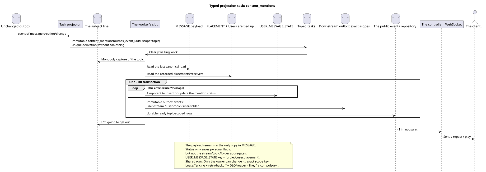

# Typed task: `content_mentions`

[← The main index of the documentation](../../../index.md) · [Index of sequence diagrams](../README.md) · [The worker stream section](README.md)

Status: ** suggested background stream; not endpoint HTTP**.

The source that you can edit:
[`task_content_mentions.puml`](diagrams/task_content_mentions.puml).

## The Purpose and Source of Truth

The task actualizes the materialized state of the content and the references after
When the canonical message is created/changed and after the bindings appear
The source of truth  the last state `MESSAGE.payload`, the obvious
`MESSAGE_PLACEMENT`, Ready access to recipients and canonical identifiers
The public payload remains part of the only
`MESSAGE`; The personal flag of the reference is stored in a unique record
`USER_MESSAGE_STATE (project,user,placement)`.

## The stream

1. The state-changing transaction API records the canonical change and
   unchanged event outbox; `GET` and list operations tasks do not create.
2. The projector produces a separate immutable `content_mentions` task for each
   source outbox event; `outbox_event_uuid` uniquely connects the event and the task.
3. Monopoly topic slot selects work by `MESSAGE.created_at DESC`.
4. Worker reads last payload and recorded bindings
   The recipients.
5. The worker will only create or update personal flags/states.
   references and all relevant durable ready `message.updated` rows in
   One DB transaction; it doesn 't copy the payload or change the public
   UUID or temporary message tags.
6. If the classification of mentions/unread messages has changed,
   separate tasks of the exact domain: `user-stream`, `user-topic` and/or
   `user-folder`. Topic-worker does not change these common lines.
7. After commit, the controller delivers, repeats and plays the ready events;
   event rows containers create their exact-scope tasks atomically with their
   The topic worker doesn't record. shared rows.

## Repeats, races and consistency

- Each task corresponds to one event; the handler reads the last one
  canonical load and applies the event idempotently;
- The `(project_id,user_uuid,placement_uuid)` status key excludes duplicates
  The state of the inside of the enclosure without mixing different placements;
- Capture a topic excludes processing of one topic at a time;
- lease expiry/fencing, retry/backoff, DLQ And the reaper is restored to working order after
  failure; initial design not executing coalescing;
- The repeated operation of insert or update (upsert) converges to the same result from the last source;
- Before the worker fixes it , the client can briefly see the previous state .
  The answer to the change in the canonical content is already
  It 's a fixed `MESSAGE`.

[← The main index of the documentation](../../../index.md) · [Index of sequence diagrams](../README.md) · [The worker stream section](README.md)
