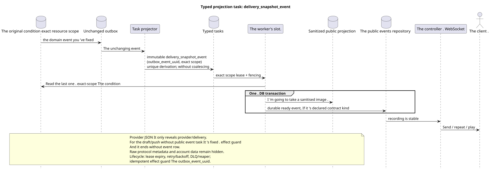

# Typed task: `delivery_snapshot_event`

[← The main index of the documentation](../../../index.md) · [Index of sequence diagrams](../README.md) · [The worker stream section](README.md)

Status: ** suggested background stream; not endpoint HTTP**.

The source that you can edit:
[`task_delivery_snapshot_event.puml`](diagrams/task_delivery_snapshot_event.puml).

## The Purpose and Source of Truth

The task converts the last recorded initial state exact resource
scope to a ready sanitized projection and/or sustainable public event.
It serves provider/delivery, file/user and other simple resource-event
flows. For contract families without a public event (e.g. draft/push
registration) The same handler captures the unique effect guard and completes task
without creating a public event row. Public API stores the current JSON; raw
The protocol metadata, account data and internal delivery fields are not
public.

## The stream

1. Domain transition atomically updates the original line and the unchanged event
   outbox.
2. The projector will output a separate immutable task for the source outbox event with
   unique `outbox_event_uuid` and explicitly declared scope of the resource; coalescing
   There is no.
3. Worker reads the last exact-scope state and in **one DB transaction**
   materializes the sanitized projection together with all relevant
   durable ready public event rows; Both commit and rollback effects together.
   If the current contract doesn 't have a public event for it resource kind,
   The transaction only saves effect guard/task completion and does not invoke
   event kind.
4. After commit, a separate controller sends, repeats and plays
   Ready recording; worker not
   owns the WebSocket/network connection.

## Repeats, races and consistency

- No intermediate event is missed: one immutable outbox event
  One is the same. immutable task;
- Re-materialization reads the last state and is idempotent;
- exact scope lease/fencing, retry/backoff, max attempts/DLQ And the reaper protects
  lifecycle; reconciliation It 's a repair . derivation;
- The outdated end of the provider should not overwrite the newer one
  authoritative status; the specific mechanism of comparison/versions remains a detail
  the current domain of the provider;
- confirmation of change API and final delivery projection may be
  Divided by the consistency interval in the final count;
- Dispatcher repeat does not repeat provider/domain change.

[← The main index of the documentation](../../../index.md) · [Index of sequence diagrams](../README.md) · [The worker stream section](README.md)
