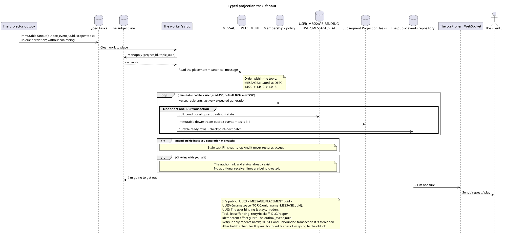

# Typed task: `fanout`

[← The main index of the documentation](../../../index.md) · [Index of sequence diagrams](../README.md) · [The worker stream section](README.md)

Status: ** suggested background stream; not endpoint HTTP**.

The source that you can edit:
[`task_fanout.puml`](diagrams/task_fanout.puml).

## The Purpose and Source of Truth

The task builds the missing pair `USER_MESSAGE_BINDING` +
`USER_MESSAGE_STATE` for each admitted recipient one clear
`MESSAGE_PLACEMENT`. The placement already contains unambiguous canonical
`message_uuid`, `stream_uuid` and the mandatory `topic_uuid`; the worker does not draw
The canonical `MESSAGE` is physically one, and
the public UUID/parameter `{message_uuid}` is
`MESSAGE_PLACEMENT.uuid = UUIDv5(namespace=TOPIC.uuid, name=MESSAGE.uuid)`.

## The stream

1. A synchronous sending transaction creates `MESSAGE`, `MESSAGE_PLACEMENT`,
   `USER_MESSAGE_BINDING` and `USER_MESSAGE_STATE`, and
   The author sees the message immediately..
2. The idmpotent projector produces one immutable `fanout` root task per event
   outbox; unique derivation key contains `outbox_event_uuid`, coalescing
   There is no.
3. The slot gets a monopoly. `(project_id,topic_uuid)`.
4. The waiting placements are selected by canonical
   `MESSAGE.created_at DESC`: `14:20`, `14:19`, `14:15`.
5. Worker reads the latest membership/policy baseline.
   expected `membership_generation`; the receiver is only allowed
   `USER_STREAM_BINDING.active = true` And the exact match . generation.
6. Root creates immutable batches with default `1000`, maximum `5000`.
   are selected by keyset-query `USER_STREAM_BINDING.user_uuid ASC` without `OFFSET`;
   The config value outside `1..5000` blocks startup.
7. Each short batch rechecks membership generation and bulk
   insert/upsert creates `USER_MESSAGE_BINDING`, unique in
   `(project_id,placement_uuid,user_uuid)`, with a snapshot of the generation, and
   `USER_MESSAGE_STATE`, unique in
   `(project_id,user_uuid,placement_uuid)`. Stale task He 's doing no-op and can 't
   The new generation of members gets fresh access to the newest membership binding/state.
8. In the same batch transaction , separate immutable downstream outbox
   events and the corresponding tasks 1:1: placement/topic-scoped work
   stays in scope `topic`, aggregates are created in
   `user-stream`/`user-folder`/`user-topic`; One task corresponds to one
   - My own . source event.
9. Binding/state, downstream outbox/tasks and ready event rows commit/rollback
   together. Checkpoint cursor/count/status and the next immutable batch
   The dispatcher only delivers the batch..

Chat with yourself already has copyright `USER_MESSAGE_BINDING` and
`USER_MESSAGE_STATE` For the only visible participant.
The author's set of recipients is empty, so the fan-out successfully completes without
new lines of the receiver and without a duplicate of the message line in UI.

## Repeats, races and consistency

- The task allows for repetition: unique binding keys and states prevent
  The duplicates;
- retry Repeats only the current one batch; root+start cursor — unique derivation
  key, Batches already fixed are not played back;
- There 's no parallel fan-out of the same topic thanks to the monopoly grab;
- Different topics can be processed in parallel within the set limit;
- Worker reads the last state of the source and compares the expected generation;
- The problem runs `pending -> leased/running -> completed/failed`, uses
  lease expiry/fencing, retry/backoff, DLQ and reaper; `outbox_event_uuid`
  It 's a good idea to have a good effect guard;
- topic-worker does not change shared stream/folder/message rows: they are created
  The task of the actual field;
- Time tags do not change the public date/order of the message;
- The receiver sees the message after atomic fixation binding/state/event with
  delay; about a second and `<=1s p95` batch transaction  SLO intent for
  measurements, not hard guarantee;
- After each batch topic claim can go to the old job; newest-first not
  Cancels bounded fairness;
- metrics: batch latency/rows/WAL, recipients remaining, fanout lag, oldest
  batch, retries/DLQ. Unbounded recipient transaction It 's forbidden ..

[← The main index of the documentation](../../../index.md) · [Index of sequence diagrams](../README.md) · [The worker stream section](README.md)
