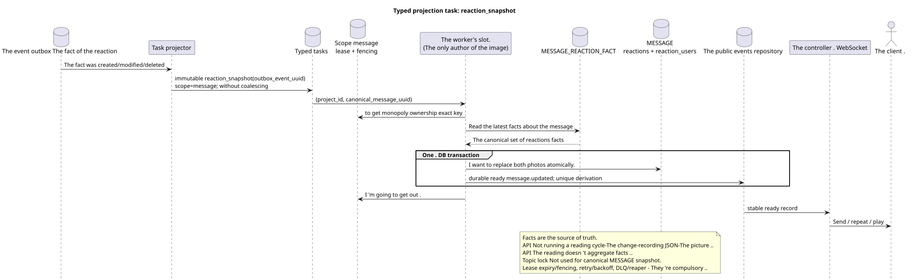

# Typed task: `reaction_snapshot`

[← The main index of the documentation](../../../index.md) · [Index of sequence diagrams](../README.md) · [The worker stream section](README.md)

Status: ** suggested background stream; not endpoint HTTP**.

The source that you can edit:
[`task_reaction_snapshot.puml`](diagrams/task_reaction_snapshot.puml).

## The Purpose and Source of Truth

The raw lines `WorkspaceMessageReactionFact` are the only source
The business key `(project_id,canonical_message_uuid,user_uuid,emoji_name)` prohibits
A duplicate of one participant's response to a canonical message.
The location is only needed to verify access API; the response does not apply to
specific location.

## The stream

1. Creating/modifying/deleting a reaction changes exactly one of the
   The user can access the fact line and add a non-changeable event in the outbox in a short
   The transaction.
2. The projector produces one immutable `reaction_snapshot` task for source event;
   `outbox_event_uuid` is a unique derivation/effect key.
3. Task is forwarded to scope `message` with key
   `(project_id, canonical_message_uuid)`. One lease/fencing token allows
   save pictures to only one owner; topic lock is not used.
4. Worker reads the latest raw facts and in one DB transaction the entire
   replaces `MESSAGE.reactions`/`MESSAGE.reaction_users` **with ** with all
   with the appropriate durable ready `message.updated` rows; both effects commit
   Or rollback together.
5. After commit, the controller delivers, repeats and plays the ready rows.

## Repeats, races and consistency

- Parallel participants safely insert/delete independent lines of facts;
- duplicate of the business key is processed by the current contract of the conflict;
- API Never performs the read-change-write cycle of the common JSON-picture;
- Repeat task rebuilds the same last state shot;
- task lifecycle includes lease expiry, retry/backoff, DLQ and reaper; initial
  design Does not perform coalescing;
- API Reading/listing does not aggregate facts and may briefly return the previous
  The picture .;
- The public projection `provider`/`delivery` is preserved, raw
  `provider_metadata`/`delivery_metadata` not published.

[← The main index of the documentation](../../../index.md) · [Index of sequence diagrams](../README.md) · [The worker stream section](README.md)
