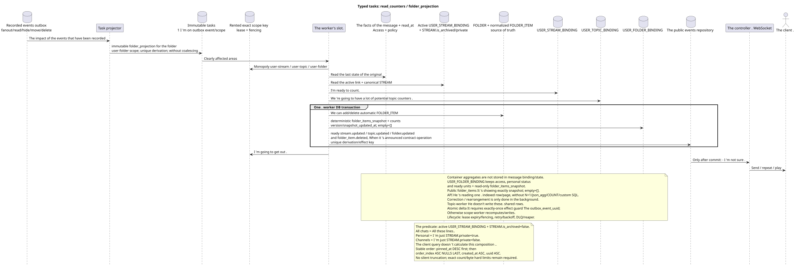

# Typed tasks: `read_counters` and `folder_projection`

[← The main index of the documentation](../../../index.md) · [Index of sequence diagrams](../README.md) · [The worker stream section](README.md)

Status: ** suggested background stream; not endpoint HTTP**.

The source that you can edit:
[`task_read_counters.puml`](diagrams/task_read_counters.puml).

## The Purpose and Source of Truth

The original state of the individual message contains the saved `read_at`
(It 's public .`read = read_at IS NOT NULL`(b) the flags of the Member States and the flags of the Member States.
containers are not duplicated in `USER_MESSAGE_BINDING`/`USER_MESSAGE_STATE`.
The finished counters are stored in unique `USER_STREAM_BINDING
(project,user,stream)`, `USER_TOPIC_BINDING (project,user,topic)` and
`USER_FOLDER_BINDING (project,user,folder)`.

The canonical `FOLDER` is stored once; `FOLDER_ITEM` links it to
canonical supported object, e.g. with `STREAM`, according to the current
`USER_FOLDER_BINDING` determines user access and
It 's a personal folder and it contains ready aggregates of unread messages .
and mentions.
Normalized `FOLDER_ITEM`  source of truth composition, and read-only
JSONB `USER_FOLDER_BINDING.folder_items_snapshot` — Ready for the public
form. The empty array is equal to `[]`; the rows are serialized
Determined and with ready-made counters from `USER_STREAM_BINDING`.
Exact order: pinned items first on `pinned_at DESC`, then
Other; within the group — `order_index ASC NULLS LAST`, `created_at ASC`,
`uuid ASC`. Version/time snapshot internal and not replace public
The image is not silently cropped; you have to select
Numerical hard limits count/bytes and compatible policy for uncut
The system `All chats`.
System bindings of folders have fixed internal rules and types, and their
The automatic `FOLDER_ITEM` is a re-constructed projection.
The original predicate is  active `USER_STREAM_BINDING`, connected to the canonical
`STREAM`, where `STREAM.is_archived = false`. `All chats` includes all
such rows, `Personal`  only rows with `STREAM.private = true`, `Channels`
— only with `STREAM.private = false`.

## Trigger and stream {#триггеры-и-поток}

A separate task occurs after a fan-out, reading a post/topic/stream,
Read before specified message, hide, move location, delete message/location,
changes to membership/policy, creation/updating/deleting `USER_STREAM_BINDING`, archiving
or changes `STREAM.private` and other operations that change the effective
classifying unread messages.

1. The original transaction or the previous worker writes a separate immutable
   outbox event with a new UUID for each affected actual area; projector
   Returns exactly one task from each event
   `UNIQUE(project_id,outbox_event_uuid)`. For the folder exact kind —
   `folder_projection`, exact scope —
   `user-folder:(project_id,user_uuid,folder_uuid)`; coalescing There is no.
2. The owner of exact scope gets the lease from fencing token: `user-stream`,
   `user-topic` or `user-folder`. Topic-worker does not save these shared rows.
   The owner reads the latest facts, access and notification policies of their area.
3. The worker is idempotent to write the ready counters `raw`/`active`/`passive` and
   `last_message_uuid` in the user's binding to the stream, the topic counters  in the binding
   user to the topic, and ready `unread_count` and aggregate folder mentions —
   to bind the user to the folder.
4. For system folders, it reads the current active `USER_STREAM_BINDING` and
   canonical `STREAM`, leaves only `STREAM.is_archived = false`, then
   idimpotent brings automatic `FOLDER_ITEM` to the rules: all remaining
   the rows for `All chats`, `STREAM.private = true` for `Personal` and
   `STREAM.private = false` For the `Channels`.
5. In **one worker DB transaction** the owner of exact scope returns
   automatic `FOLDER_ITEM` To the source of truth, replaces the finished projection and all that.
   state/snapshot/version/timestamp, And all of them . ready
   `topic.updated`, `stream.updated`, `folder.updated` or
   `folder_item.deleted` event rows For resources that have actually changed.
   The failure will roll over the projection and ready event rows.
6. Only after commit does the controller send, repeat and play
   It doesn 't create business event.

API views for the stream/topic/folder only connect one ready
the binding line; for the `folder_items` folder already lies in that line as
Ready to go .JSONBThey're not.
execute `COUNT`, `GROUP BY`, window, lateral or correlated requests and not
A complete recount is only allowed as a clear background.
The task of correcting/rearranging.

## Repeats, races and consistency

- The task reads the latest sources and deterministically replaces the projection;
- Container unique user keys exclude competing lines
  of the aggregates;
- There is one lease on the exact scope key at a time; different areas can
  It 's updated in parallel and it 's visible . eventual-consistently;
- The atomic delta of the counter is only allowed with exactly-once effect guard on
  `outbox_event_uuid`; Otherwise scope worker deterministically re-counts and
  replaces the line;
- task lifecycle, lease expiry/fencing, retry/backoff, max attempts/DLQ and reaper
  The initial design does not meet the requirements of the coalescing;
- The re-delivery is safe; the ready event appears only after
  The state of the;
- The response to the client record may be about a second before the update
  It 's a planned consistency in the end ..

[← The main index of the documentation](../../../index.md) · [Index of sequence diagrams](../README.md) · [The worker stream section](README.md)
