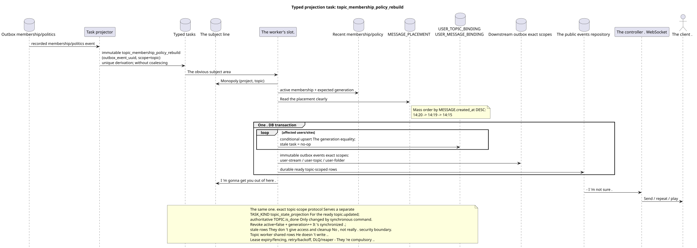

# Typed task: `topic_membership_policy_rebuild`

[← The main index of the documentation](../../../index.md) · [Index of sequence diagrams](../README.md) · [The worker stream section](README.md)

Status: ** suggested background stream; not endpoint HTTP**.

The source that you can edit:
[`task_topic_membership_policy_rebuild.puml`](diagrams/task_topic_membership_policy_rebuild.puml).

## The Purpose and Source of Truth

The task updates the user's visibility in the topic, permissions and affected ready
The canonical `TOPIC` is stored alone
Once; access, notifications and user counters are unique
`USER_TOPIC_BINDING (project,user,topic)`. The default context of the message
comes only from the obvious `MESSAGE_PLACEMENT`, not derived from the binding.

## The stream

1. The membership/policy team records authoritative change and immutable
   The event outbox.
2. The projector will output a separate immutable task for the source outbox event in scope
   `topic`; `outbox_event_uuid` Unique, coalescing is absent.
3. One slot gets monopoly ownership of the topic; different topics can
   It 's processed parallel to the set limit ..
4. Worker reads the latest membership status/policy and placement manifests;
   membership-dependent task Carries the expected `membership_generation`.
5. The conditional-upsert worker creates/updates access rows and corresponding
   durable ready topic-scoped event rows In one DB transaction only when active
   `USER_STREAM_BINDING` and the generation; stale task does no-op.
   Revoke already synchronously disabled read path, and cleanup of old rows is not
   security boundary.
6. Worker is producing individual tasks `user-stream`/`user-topic`/`user-folder`
   for shared rows; topic worker does not edit them himself or perform heavy rows
   The aggregate in the query API.
7. After commit , a separate manager delivers ready topic-scoped events.
   Projections/ready events of the stream, folders and other shared rows are created by them
   separate exact-scope tasks and also atomically paired in their transactions.

## `topic_state_projection` {#topic_state_projection}

The same topic-owned flow documents a separate exact TASK_KIND
`topic_state_projection`: After the synchronous commit , the canonical
`TOPIC.is_done`/version He 's in scope .`(project_id,topic_uuid)`It 's atomically fixed .
ready `topic.updated` and if it is physically needed, rebuildable read-only copy.
This task does not change authoritative `TOPIC.is_done` and has its own source
outbox event/`outbox_event_uuid`.

## Repeat, order and consistency

- The worker gets the obvious task; scanning the table for missing ones
  The link is not used.;
- The mass build of message bindings within the topic follows
  `MESSAGE.created_at DESC` (`14:20`, `14:19`, `14:15`) and guarantees the ultimate
  progress;
- unique user-themed binding key excludes duplicate access/state lines;
- task reads the last policy and checks generation; repeat is potentiated
  The `outbox_event_uuid`;
- lease expiry/fencing, retry/backoff, max attempts/DLQ And the reaper is mandatory.;
- rebuild/fix never starts with `GET` or list operation;
- The user can briefly see previous access/countdowns before fixing
  projection; after the ready event the states REST and WebSocket are agreed.

[← The main index of the documentation](../../../index.md) · [Index of sequence diagrams](../README.md) · [The worker stream section](README.md)
