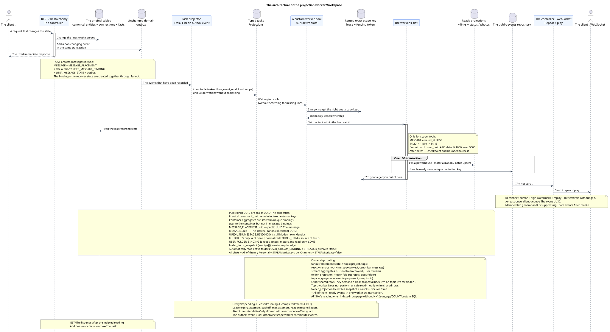

# The architecture of the worker

[← The main index of the documentation](../../../index.md) · [Index of sequence diagrams](../README.md) · [The worker stream section](README.md)

Status: **proposal started with documentation; public API Workspace not changed**.

This document describes the common background path to which the specifications refer
This is not a production implementation, a parameter.
The following are the key features of the new system: SQL.

The source that you can edit:
[`worker_architecture.puml`](diagrams/worker_architecture.puml).

## API boundary and background

Each state-changing transaction API atomically changes the rows  sources
and adds an unchanged domain event to the transaction log
(transactional outbox). `GET` and list operations do not create events or
In the initial design ** there is no coalescing **: each event outbox
corresponds to one single unchanged typed problem with unique
`outbox_event_uuid`/Repeat the derivation for the same problem
The event is idempotent and does not duplicate.
replaces the source of truth: worker reads the last one at each execution
fixed lines.

Sending a message simultaneously is limited by the set `MESSAGE` +
`MESSAGE_PLACEMENT` + `USER_MESSAGE_BINDING` + the author
`USER_MESSAGE_STATE` + transactional outbox. Binding and condition
Each receiver is created together through a fan mail
(fan-out) bounded batches; Container units and public events come later.
with itself already exists the copyright and status; fan-out does not create
of the recipient 's additional lines.

## Parallelism and Order

- The maximum number of simultaneously active worker slots is given by
  Configuration; parameter name and execution mechanism remain open;
- for topic-scoped work monopoly ownership unit —
  `(project_id, topic_uuid)`, Not the flow.;
- one topic at a time belongs to not more than one slot; different topics
  processed in parallel within the `N`;
- the basic order within the topic  `MESSAGE.created_at DESC`: `14:20`, then
  `14:19`, Then `14:15`;
- The time stamps of the assignments and bindings do not change the order or the public time stamps
  The message tags;
- stable cursor at the same time, capture implementation and limited
  The only way to achieve justice is to open up and implement solutions that are narrow .;
- The new entry can 't be deleted indefinitely .
  work.

Fan-out root scans the active `USER_STREAM_BINDING` keyset by `user_uuid ASC`,
not `OFFSET`. Default batch  `1000`, hard maximum  `5000`; configuration outside
`1..5000` It doesn't get startup validation. batch commit
The cursor/count/status is fixed and only then the next one appears immutable
batch. Scheduler after batch gives bounded fairness to old roots/history; one
The big audience doesn 't take up much space . unbounded transaction.

## Possession of projections

`TOPIC` It's not a universal block.
`scope_kind` and accurate `scope_key`; not more than one lease is in effect at the same time
With fencing token for one exact key.
are processed in parallel within the pool limit:

| Type of task | Area of ownership | Guarantee of recording |
| --- | --- | --- |
| `fanout`, placement-scoped `content_mentions`, history/backfill | `topic`: `(project_id, topic_uuid)` | sequential work with placements/bindings of one topic on `MESSAGE.created_at DESC` |
| `reaction_snapshot` and other images of the canonical message | `message`: `(project_id, canonical_message_uuid)` | One author `MESSAGE.reactions`/`reaction_users` |
| Flow units | `user-stream`: `(project_id, user_uuid, stream_uuid)` | One author of the ready line `USER_STREAM_BINDING` |
| `folder_projection` | `user-folder`: `(project_id, user_uuid, folder_uuid)` | one author normalized `FOLDER_ITEM`, `folder_items_snapshot`, ready counters and ready event |
| The subject aggregates | `user-topic`: `(project_id, user_uuid, topic_uuid)` | One author of the ready line `USER_TOPIC_BINDING` |
| Delivery and other common lines | a clearly declared area corresponding to the physical row | No fallback on the side of the road. `topic` |

Topic-worker does not perform the unsafe read-modify-write common lines.
The delta counter is allowed only by atomic increment/decrement with exactly-once
effect guard, unique to `outbox_event_uuid`; otherwise the owner of the relevant
The projected image is then re-read and replaced by a projection.
The results of the global transactions are not synchronous with the public transactions .
Events can become visible at different times within the framework of the adopted eventual
consistency.

`MESSAGE`, `STREAM`, `TOPIC` and `FOLDER`  canonical entities in the singular
Placement clearly specifies the context of the message.
UUID The message  `MESSAGE_PLACEMENT.uuid`; the canonical `MESSAGE.uuid` remains
The UUID internal content, and the UUID custom binding remains hidden
The technical identity of the line.
User-generated container aggregates are stored on unique
`USER_STREAM_BINDING`, `USER_TOPIC_BINDING` and `USER_FOLDER_BINDING`.
`USER_MESSAGE_BINDING`/`USER_MESSAGE_STATE` Only access and status are stored
one message (`read_at`, `mentioned`/`starred`/`pinned` and similar flags), but
Never contain container counters ..

The canonical `FOLDER` is stored once. `USER_FOLDER_BINDING` defines
access to the user, his personal status and ready aggregates of unread
`FOLDER_ITEM` links the folder to the canonical
supported object, for example with `STREAM`, according to the current public
The automatic composition of system folders is built only from active
`USER_STREAM_BINDING`, connected to the canonical `STREAM`, for which
`STREAM.is_archived = false`: `All chats` Includes all such streams,
`Personal` — only `STREAM.private = true`, `Channels`  only
`STREAM.private = false`. Public endpoints, JSON and user
The semantics of folders and elements of folders (`folders`/`folder_items`) are left without
The amendments.

Normalised `FOLDER_ITEM` — source of truth. `USER_FOLDER_BINDING`
also stores read-only JSONB `folder_items_snapshot` with exact
public form (`[]` for empty folder), internal version and time
updates. `folder_projection` serializes items in a stable order and
Atomically captures snapshot + counts + version/timestamp + all ready event
rows. Only after commit can the controller deliver these events. API
reads one ready line/page without N+1, `json_agg`, `COUNT` and custom SQL.

Typed tasks and potentially updating ready projections (projection).
Restoring from the original facts or bindings is allowed only as background
The API representations are executed by simple indexed ones only
One-to-one or many-to-one connections and do not contain
`COUNT`, `GROUP BY`, window, lateral or correlated queries.

The facts of the reaction are the source of truth. `message`
materializes the canonical `MESSAGE.reactions` and `MESSAGE.reaction_users`; API
Does not run the common read-change-write cycle» (read-modify-write) JSON.

## Public events and delivery

Handler It records the materialized state and all the relevant durable ready event
rows In one DB transaction , both commit and rollback effects are combined. Unique
event derivation key on `outbox_event_uuid` prevents duplication at retry.
A separate WebSocket dispatcher does not create a business event: it reads durable
store, sends/repeats/plays, and network send does not affect
It 's very durable ..

Reconnect The last cursor processed is returned.
high-watermark, replay All the newer visible rows, buffer live tail and
drain-At-least-once delivery; client dedupe by event UUID and
cursor advance It's too old for the cursor to be obvious.
`epoch_pruned`/`410`; retention window It stays. operational policy. Data event
audience keeps the membership generation, so inactive/new generation
It suppresses the stale delivery./replayAfter revoke.

## Guarantees for faults

- Change the source and add it to the outbox atomic;
- derivation uses a unique `(project_id, outbox_event_uuid)`, so
  Repeating does not create the second problem, but reconciliation restores the problem to
  The outbox event is lost between the event recording and derivation;
- Task lifecycle: `pending -> leased/running -> completed` or
  `failed -> pending` I 'm with you .`attempts`, `next_retry_at`and back off; after
  `max_attempts` The problem falls into DLQ;
- The lease holds the owner, expiry and fencing token; the reaper returns the expired token
  `running` The task is in the works, and the old owner can't record the recording;
- Re-delivery is safe thanks to unique business keys,
  `outbox_event_uuid` effect guard And the idempotent record of projections.;
- The worker transaction failure reverses both the projection and the ready events; retry
  I'm going to repeat both effects.;
- The repeat controller does not repeat the domain change and uses a stable
  This is the event identifier / cursor .;
- The metrics cover lag, pending/running age, retries, expired leases, stuck
  tasks and DLQ; no coalescing means one task per event,
  Therefore, capacity/backpressure is an essential part of the operation..

## Typed task directory

| Type of task | Scope kind/key | The finished result |
| --- | --- | --- |
| `fanout` | `topic`: `(project_id, topic_uuid)` | `USER_MESSAGE_BINDING` + `USER_MESSAGE_STATE` pairs of receivers |
| `content_mentions` | `topic`: `(project_id, topic_uuid)` for placement state; separate downstream tasks for common lines | Flags of the location |
| `reaction_snapshot` | `message`: `(project_id, canonical_message_uuid)` | The pictures . `reactions` + `reaction_users` |
| `read_counters` | `user-stream`: `(project_id, user_uuid, stream_uuid)` | Ready units `USER_STREAM_BINDING` |
| `folder_projection` | `user-folder`: `(project_id, user_uuid, folder_uuid)` | normalized items + `folder_items_snapshot` + + version/timestamp + ready event atomically |
| `read_counters` | `user-topic`: `(project_id, user_uuid, topic_uuid)` | Ready units `USER_TOPIC_BINDING` |
| `delivery_snapshot_event` | `message:(project_id,canonical_message_uuid)` for delivery or `resource:(project_id,resource_kind,resource_uuid)` | Sanitized projection/ready event or effect-guarded no-public-event completion |
| `topic_membership_policy_rebuild` | `topic`: `(project_id, topic_uuid)`; shared rows — The specific tasks of the actual field | Ready bindings/permits |
| `topic_state_projection` | `topic`: `(project_id, topic_uuid)` | ready `topic.updated` and optional read-only copies canonical `TOPIC.is_done` |

Detailed task flows:

- [`fanout`](task_fanout.md)
- [`content_mentions`](task_content_mentions.md)
- [`reaction_snapshot`](task_reaction_snapshot.md)
- [`read_counters`](task_read_counters.md)
- [`delivery_snapshot_event`](task_delivery_snapshot_event.md)
- [`topic_membership_policy_rebuild`](task_topic_membership_policy_rebuild.md)

[← The main index of the documentation](../../../index.md) · [Index of sequence diagrams](../README.md) · [The worker stream section](README.md)
