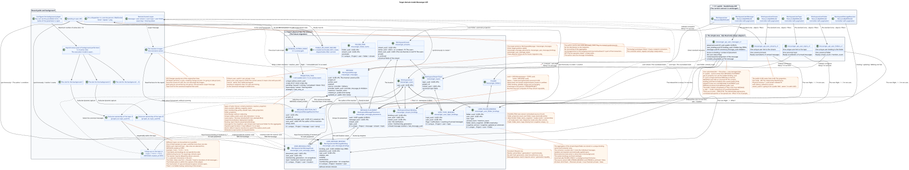

# Proposed Messenger API Domain Model

Status: **design proposal for a future refactoring**.

This document describes the target internal design of the Messenger API. It
does not change the existing routes, JSON fields, filters, pagination,
actions, events, or WebSocket contract. The current public contract is fixed
in [`workspace_api.md`](workspace_api.md) and remains a hard invariant. The
underlying domain decisions are described in
[`messenger_domain_model.md`](messenger_domain_model.md). Concrete RestAlchemy
declarations, field mappings, and the complete contract of the main endpoints
are collected in
[`messenger_restalchemy_api_spec.md`](messenger_restalchemy_api_spec.md).

Terms follow the [common glossary](index.md#глоссарий-проектной-документации):
placement, binding, transactional outbox, projection, fan-out, and worker.

## Boundary between the current state and this proposal

The current implementation already exposes the public domain models
`WorkspaceUserMessage`, `WorkspaceUserStream`, `WorkspaceUserTopic`, and
`WorkspaceUser`. The first three read from SQL views, while Messenger
controllers use `StoreResourceController` and `sql_canonical_store`. Some
current views perform aggregates, lateral or correlated subqueries, and other
work on the read path.

The target model preserves the public resource names and shapes while changing
only their internal source:

- persistent RestAlchemy SQL models store canonical data and pre-materialized
  per-user state;
- read-only SQL views adapt a flat shape without heavy computation;
- `ResourceByRAModel`, standard `objects`/`filters`, scalar UUID properties for
  public UUID references, indexed physical foreign keys, and paginated
  controllers serve the ordinary read path;
- scope mixins and narrow controller overrides remain only where IAM context,
  existing query/header names, the accepted `100/500` pagination marker shape,
  or domain actions require them;
- handwritten SQL and the current non-standard SQL store leave the main
  request path.

Table and column names marked below as proposed are not approved migrations.
This document does not authorize a new public endpoint or field.

## Three layers

[Editable PlantUML source](diagrams/messenger_api_domain_model.puml).

| Public RestAlchemy model | Confirmed current source | Target source |
| --- | --- | --- |
| `WorkspaceUserMessage` | `m_workspace_user_messages_view` | `messenger_api_user_messages_v1`: leading `USER_MESSAGE_BINDING` with indexed joins to one placement, message, and state row. |
| `WorkspaceUserStream` | `m_workspace_user_streams` | `messenger_api_user_streams_v1`: leading `USER_STREAM_BINDING`, ready counters, and one canonical stream. |
| `WorkspaceUserTopic` | `m_workspace_user_topics_view` | `messenger_api_user_topics_v1`: leading `USER_TOPIC_BINDING`, ready per-user counts, and one canonical topic with global `is_done`. |
| `WorkspaceUser` | `m_workspace_users` | Direct target `WorkspaceUser`/`messenger_users`; no separate computed view is required. |

`WorkspaceStreamBinding`, `WorkspaceStream`, `WorkspaceUserTopicFlags`,
`WorkspaceStreamTopic`, and `WorkspaceUser` are confirmed current RestAlchemy
model names. The current physical `WorkspaceMessage` uses
`m_workspace_messages`; that name appears only for comparison with the current
state. The future migration proposal uses consistent model/table pairs:
`WorkspaceMessage`/`messenger_messages`,
`WorkspaceMessagePlacement`/`messenger_message_placements`,
`WorkspaceUserMessageBinding`/`messenger_user_message_bindings`, and
`WorkspaceUserMessageState`/`messenger_user_message_states`. These names belong
to the future migration proposal and do not yet exist in the active schema.

RestAlchemy `relationships.relationship` is not used for UUID fields that the
current JSON returns as UUIDs, because a relationship would serialize as a
URI. For example, public `WorkspaceStream.owner` is an ordinary UUID property,
while physical `owner_uuid` is an indexed foreign key to `WorkspaceUser` with
`ON DELETE RESTRICT`. The same API/database separation applies to public
`author_uuid`, `user_uuid`, `message_uuid`, `stream_uuid`, `topic_uuid`, and
other UUID references in the current contract. The placement UUID is exposed
as `WorkspaceUserMessage.uuid`; hidden `binding_uuid` and internal canonical
`MESSAGE.uuid` remain scalar UUID properties over physical foreign keys or
identities but are absent from the current public JSON. Referential integrity
stays in the database: the concrete indexed foreign-key constraints and
actions are listed in
[`messenger_restalchemy_api_spec.md`](messenger_restalchemy_api_spec.md#uuid-свойства-в-api-и-внешние-ключи-в-бд).

## Message: binding-led row with a public placement UUID

### Physical entities

The proposed `WorkspaceMessage` (`messenger_messages`) has canonical `MESSAGE`
semantics; the existing table appears above only for comparison with the
current state. After a future migration, one target row stores exactly one
copy of:

- content and author;
- projected `source`, `provider`, and `delivery` fields;
- materialized `reactions` and `reaction_users`;
- public `created_at` and `updated_at` timestamps.

`MESSAGE.uuid` is the stable internal identifier of the single content row.
The public identifier in every response and URL is
`MESSAGE_PLACEMENT.uuid`: it is the same for all users of one placement and
different for separate topics containing the same canonical `MESSAGE`.

The target physical model separates three concepts:

- `MESSAGE_PLACEMENT` is the global context of one canonical `MESSAGE` in a
  specific stream/topic, unique by
  `(project_id,message_uuid,stream_uuid,topic_uuid)`; `topic_uuid` is required;
- `USER_MESSAGE_BINDING` grants one user access to a placement and stores its
  relationship/role, visibility, and permissions, unique by
  `(project_id,placement_uuid,user_uuid)`;
- `USER_MESSAGE_STATE` is the unique per-user, per-placement row with persisted
  `read_at` (public `read = read_at IS NOT NULL`), `mentioned`, `starred`,
  `pinned`, and similar flags, unique by
  `(project_id,user_uuid,placement_uuid)`.

The user binding has its own hidden UUID for the lifecycle
UUID placement, on the other hand, is published as
message ID. `revision` or binding version is missing.
Copying creates a new explicit `MESSAGE_PLACEMENT` and the desired user
bindings, but retains the original internal `MESSAGE.uuid`.

### The decision was made UUIDv5

`MESSAGE_PLACEMENT.uuid` is determined as
`UUIDv5(namespace=TOPIC.uuid, name=MESSAGE.uuid)`. Namespace — It 's canonical .
globally unique UUID topics; name  only canonical UUID messages in
lowercase hyphenated ASCII-The presentation without braces, prefixes and additional
Project and stream are not part of name.

It's only safe with a physical invariant: every `TOPIC` belongs
is equal to exactly one of `PROJECT` and `STREAM`, and its ownership/identity is unchanged.
topics means creating a new `TOPIC` and migrating the placements, not update
UUIDv5 does not replace the authoritative business key
`(project_id,message_uuid,stream_uuid,topic_uuid)`, FK and check
The topic belongs to the specified project/stream.

### Flat model `WorkspaceUserMessage`

Read-only view `messenger_api_user_messages_v1` in target
The model starts with one line `USER_MESSAGE_BINDING` and runs
Indexed connections with one
`MESSAGE_PLACEMENT`, One `WorkspaceMessage` and one
`USER_MESSAGE_STATE`. FK and unique keys prevent line replication: one
The user binding gives exactly one public line.

| The public fields | The source |
| --- | --- |
| `uuid` | `MESSAGE_PLACEMENT.uuid`; the determined public identifier placement. |
| Hidden `binding_uuid` | `USER_MESSAGE_BINDING.uuid`; unique technical identity of the line ORM, not present in the current public JSON. |
| The internal `message_uuid` | `MESSAGE.uuid`; canonical FK content, not available in the current public JSON. |
| `project_id`, `user_uuid` | User-connected area/state. |
| `stream_uuid`, `topic_uuid` | Context from `MESSAGE_PLACEMENT`. |
| `read`, `mentioned`, `starred`, `pinned` | Ready state of the user for placement from `USER_MESSAGE_STATE`; `read`  scalar projection `read_at IS NOT NULL`. |
| `is_own` | Simple scalar comparison of `user_uuid` binding and `MESSAGE.author_uuid`; it does not require bypassing other lines. |
| `author_uuid`, `payload` | Canonical `MESSAGE`. |
| `source_name`, `source`, `provider`, `delivery` | Canonical `MESSAGE`; internal storage `provider`/`delivery` does not become public. |
| `reactions`, `reaction_users` | Pre-materialized state of canonical `MESSAGE`, without aggregates in the reading representation. |
| `created_at`, `updated_at` | Only the canonical `MESSAGE`. |

Public timestamps are never taken from the time of creation or modification
So the author and the recipient see the same date of the message, even if
The read/add operation in the selected/
The fixation/change of visibility may change the
a technical time stamp of condition/binding, but not public
`WorkspaceUserMessage.updated_at`.

Public sorting and page contract by key remain
`(created_at, uuid)`: `created_at` comes from `MESSAGE`, and `uuid`  comes from
`MESSAGE_PLACEMENT`. No , not at all .
Duplicate time stamp or sort key in binding not available
are approved.

If the user has multiple placements of one canonical `MESSAGE`, the list
contains several lines with different public placement UUID and different
`stream_uuid`/`topic_uuid`; Personal flags also placement-scoped. `binding_uuid`
remains unique `get_id_property()` only for recovery/display
The objectsRestAlchemy. The adapter of the public resource and the routes are used by
`MESSAGE_PLACEMENT.uuid` And they never publish internal binding key.
Getting and placement-scoped actions unambiguously restore one visible
I 'm gonna go with`(project_id,current_user,placement_uuid)`. Page marker  public
placement UUID; Controller restores the stable boundary
`(MESSAGE.created_at,MESSAGE_PLACEMENT.uuid)` No hidden one `binding_uuid`.

### Reactions

The source of truth for reactions is the individual, changing lines of facts.
line with business key
`(project_id, canonical_message_uuid, user_uuid, emoji_name)`
means one specific user reaction to a canonical `MESSAGE`;
The visual link is used only for
Check access/permissions for public placementUUID- Reaction canonically .
Global and intentionally visible in all message placements, even if their
This privacy trade-off is accepted as Critic risk
#8 and is not OPEN.

The public fields `reactions` and `reaction_users` are saved without renaming as
The image is only readable in `MESSAGE`./
Removing a response in a query transaction changes exactly one line of fact and not
performs a cycle  read  change  write  general JSON. fenced
The owner of the scope `message` with the key `(project_id, canonical_message_uuid)` reads
The facts of the matter and as the only writer atomically
The facts are the source of the truth, the pictures can be reconstructed, and the facts can be reconstructed.
A short delay in their renewal is a compromise in the final
I 'm counting . (eventual consistency).

## Read user models, streams and topics

### `WorkspaceUser`

`WorkspaceUser` becomes a direct target physical model over
`messenger_users`; `m_workspace_users` It 's only for current-runtime
comparison - I 'm not ..
Standard `ResourceByRAModel` hides the internal providers' IDs and
The projected message presentation
only references the user through an indexed external key
«Many-to-one and does not aggregate user data.

### `WorkspaceUserStream`

`WorkspaceUserStream` keeps the current public fields, but the target representation
builds from the physical `WorkspaceStreamBinding` current user:

- Membership/role/notification and status in the user area are taken from the binding;
- canonical name/description/source/privacy/default topic and time stamps
  They 're taken from one . `WorkspaceStream`;
- Unread message counters and other pre-calculated status
  They 're materialized right in the unique binding line .
  `(project_id,user_uuid,stream_uuid)`;
- `last_message_uuid` It is also stored as a ready-made physical item, not
  is searched with a side subquery every time it is read;
- The name of the private chat can only be used with a simple
  many-to-one indexed connection with `WorkspaceUser`, without fan
  The spread.

The physical `WorkspaceStream` stores `owner_uuid` and the original
`direct_user_uuid` It's like scalar UUID FK. `owner` — alias
`owner_uuid AS owner`, It 's public . `direct_user_uuid` viewer-relative: owner
sees `stream.direct_user_uuid`, the second participant — `stream.owner_uuid`, self-chat
— My own .UUID. View only uses scalar`CASE`over one stream row and
The leading `USER_STREAM_BINDING`; list/get/event snapshot have the same
Semantics, relationship URI or one-to-many join not required.

The physical `WorkspaceStreamBinding` is not deleted upon revocation.
`active` and monotonous `membership_generation` are experiencing revoke/re-add and not
They 're being added to publicJSON. Message/reaction view/actionAlways checking . active
membership and generation snapshot match; visibility binding alone not
is authorization.

Creating with one `direct_user_uuid` always keeps the stream with `private=true`.
If UUID is equal to the current owner/user, it's a chat with itself: physically
There is only one owner link, and only that user sees the stream.
Sending to chat with you creates one canonical `MESSAGE`, one explicit
placement, author's link and its unique `USER_MESSAGE_STATE`; fan
distribution to recipients does not create other user connections or
states, so the message appears exactly once only in the current
The user.

The default is not to enter a separate user status table in the stream:
The access life cycles and projection use the same unique
The user/stream cardinality is selected separately.
The need is proven.

### `WorkspaceUserTopic`

`WorkspaceUserTopic` uses a targeted representation
`messenger_api_user_topics_v1`. The leading physical line becomes unique
`USER_TOPIC_BINDING` `(project_id,user_uuid,topic_uuid)`:

- The notification mode and the counters in the user area are read from the ready
  `USER_TOPIC_BINDING`;
- global `is_done`, name/stream/source/configuration of the summaries and canonical
  Time stamps come from one `WorkspaceStreamTopic`/`TOPIC`;
- `last_message_uuid`, The signs of obsolescence of the summary and the countdowns of unread messages are materializing
  I 'm going to get it .;
- The message submission is not used to count or search for the last message.

The topic-level aggregates are stored in this binding line.
The default state is not entered; the public presentation performs one
Indexed link with a canonical topic.

### Folders

Canonical `FOLDER` and unique in `(project_id,user_uuid,folder_uuid)`
`USER_FOLDER_BINDING` It 's a separate folder and a separate user
`unread_count` and `mention_count` are stored directly in
binding together with read-only JSONB `folder_items_snapshot`, its internal
The public `folder_items` displays the image
directly (`[]` for empty folder), and the reading view of the folder connects one
The public fields of the folder elements
`unread_count`, `active_unread_count` and `passive_unread_count` are taken from
corresponding `USER_STREAM_BINDING` for the indexed key
The user/stream view is not a folder view or a folder view
perform `COUNT`, `GROUP BY`, correlated query or bypass bindings
I 'm not sure ..

`FOLDER_ITEM` links the folder to a canonical supported object, such as
For system folders, the file format is the same as the current public contract.
their `USER_FOLDER_BINDING` contains a fixed `rule`/`type`, which you cannot
The user can delete or change the user's name arbitrarily.
The system folder is pre-materialized in the automatic `FOLDER_ITEM`:

- `All chats` — all user-accessible non-archival streams;
- `Personal` — available non-archival streams with canonical `private = true`;
- `Channels` — available non-archival streams from `private = false`.

This is the exact operating criterion `Personal`: it is defined by `private = true`, and
I 'm not available .`direct_user_uuid`The source of truth is the active
`USER_STREAM_BINDING` and canonical `STREAM` with mandatory
`is_archived = false`; then `private` divides `Personal` and `Channels`, and
`All chats` Any change in the current state of the system,
normalized items/pin or automatic composition writes transactional outbox
and produces immutable task `folder_projection` without coalescing, with scope
`user-folder:(project_id,user_uuid,folder_uuid)`. The background player brings
`FOLDER_ITEM` To the current source of truth and atomically replaces the ready
The client's path is the same as the client's path.
Read returns one ready line/page without N+1, `json_agg`, `COUNT`
and custom SQL; before the task is complete, the previous image is shown.

## RestAlchemy Display and controllers

The targeted implementation follows the usual style Exordos Core:

1. The physical entities use `SQLStorableMixin`, the standard
   `objects`/`filters` And the future scheme retains the same scalar UUID properties.
   indexed restrictions of external keys with clearly selected reference keys
   actions; public UUID never becomes a URI relation
   RestAlchemy.
2. Public read patterns are displayed through `ResourceByRAModel` with current
   with hidden fields and read-only permissions.
3. The collection is serviced by `BaseResourceControllerPaginated` with minimal
   redefining and adding restrictions to the project/user area.
   Target policy: The missing `page_limit` and `0` are `100`, `1..500`
   is taken exactly, negative/integer/greater than `500` gives HTTP `400` without
   clamp; unbounded mode The current implementation gap is confirmed
   separated from the project proposal: missing `page_limit` and
   `page_limit=0` Now they're giving unlimited reading, negative or
   The non-integer value is  HTTP `400`, and the positive values are not
   Target `100/500`  conscious
   observable compatibility change, Not a description of the current runtime.
4. Narrowly redefined is permissible for the preservation of the existing composite
   Pagination messages by key and current IAM-/domain actions, but it
   works through models/filters RestAlchemy, not through raw SQL or
   a separate abstraction of the storage.
5. The creation/updating actions are written by physical models in the current transaction
   The read-only view is never used as a target
   records.

## The Way to Read

### The messages

1. IAM-The context specifies `project_id` and `user_uuid`.
2. The usual filter RestAlchemy selects the indexed
   `USER_MESSAGE_BINDING` In this area.
3. The simple representation adds one `MESSAGE_PLACEMENT`, one
   canonical `MESSAGE` and one unique `USER_MESSAGE_STATE`.
4. `ResourceByRAModel` Returns the current flat
   `WorkspaceUserMessage`: `MESSAGE_PLACEMENT.uuid` is published as `uuid`, and
   canonical `MESSAGE.uuid`, technical `binding_uuid` and access fields
   They 're hiding ..

There's no audience count, no resolution, no mentions, no reactions, no counters or
All of these values are already written in the binding/state/message..

### Streams, topics, folders and users

Streams, topics and folders start with a single unique physical line
bind the user to the container and attach one canonical line
The finished aggregates are already written in the lead binding.
The user reads `WorkspaceUser` directly.
aggregates user-defined message bindings and does not bypass the set
I 'm not sure ..

## Record path

### Sending in sync

Ordinary `POST /messages/` performs minimal synchronous work in one
The transaction of the request:

1. Checks the author's current access to the selected stream/topic.
2. Creates one canonical `MESSAGE`.
3. Creates one explicit `MESSAGE_PLACEMENT` in the selected stream/topic.
4. He 's creating one at a time .`USER_MESSAGE_BINDING`And her unique
   `USER_MESSAGE_STATE` With common flags ready for communication.
5. Writes unchangeable domain events in the same transaction transactional
   outbox — One for each of the two initial typed task.
6. Returns the author of the flat API-line of this binding.

API does not perform the fan distribution to the recipients, does not calculate the rights and
The author sees the data in the image, and the image is visible to all recipients, and does not count the aggregates.
The message was sent immediately ..

### Other records

- Copying creates a new explicit `MESSAGE_PLACEMENT`, a custom
  The author 's linkage and the event of the journal of outgoing events with reference to
  The existing one .`MESSAGE`- New public endpoint for this document to copy
  Not to be introduced.
- Read/add to selected/attached changes unique
  `USER_MESSAGE_STATE`; visibility/access belongs to `USER_MESSAGE_BINDING`
  specific location.
- Edit content first by checking permissions through the applicable
  The user binding, then changes the only canonical
  `MESSAGE`; All posts read the updated content.
- The current `DELETE /messages/{uuid}` maintains the public semantics of the full
  Delete: `MESSAGE_PLACEMENT.uuid` addresses the placement, through the applicable
  The user's visible link is accessed and authorized, then
  `MESSAGE` are removed, placement, user bindings and status.
  Hide or delete a separate binding to another internal domain
  The operation is not a substitute for a public
  `DELETE`.

Each state change operation writes an unchanged domain event/event
Each event generates a new one.
separate immutable typed task with unique `outbox_event_uuid`; repeated
derivation Initial design does not combine tasks.`GET`/ operations
The list doesn 't create events or tasks.

Task passes `pending -> leased/running -> completed|failed`; lease has
expiry, owner The error increases attempts and plans
`next_retry_at` with backoff; after max attempts the record goes to DLQ. Reaper
Returns expired running work, reconciliation creates a missing task by
immutable outbox event, handlers And projection writes idempotent on
`outbox_event_uuid`. Observability includes lag, retries, stuck/expired leases and
DLQ. The lack of coalescing increases the throughput/storage load, so
backpressure and capacity budget are mandatory; future optimization is not included in
initial design.

## Background path {#путь-фоновой-обработки}

After synchronization, the output log/projector creates
Typed task `fanout` for specific placement; background performer
It doesn't detect work by scanning for missing links.
Asynchronously performing:

1. One free slot of background performer gets exclusive ownership
   specific `(project_id, topic_uuid)` with pending messages.
2. Within the captured topic, selects explicit placement tasks, ordering them
   canonical `MESSAGE` from the latest to the earliest by
   `MESSAGE.created_at DESC`.
3. Calculates receivers, resolutions and visibility.
4. For each placement, `USER_MESSAGE_BINDING` creates the allowable
   receivers, unique by `(project_id,placement_uuid,user_uuid)`, and together
   It creates or impotently provides a unique
   `USER_MESSAGE_STATE` by `(project_id,user_uuid,placement_uuid)`.
   state They're going to keep the same `membership_generation`.
   The same message is placed in a separate state;
   The existing state is reused only inside the same placement.
   The target stream/topic is never pulled from
   I 'm not gonna let you do that ..
   The expected `membership_generation` comes from source event/task; conditional
   upsert is only performed when active membership and exact match. Stale
   task Re-add conditional-upsert translates the same unique
   binding/state rows It 's a new generation and it completely drops state to
   defaults; Old personal flags are not reused.
5. Creates separate immutable tasks of actual domains for common
   Each handler atomically records the projection update and all
   the appropriate durable ready public event rows in one DB transaction.

Confirmed types of typed tasks: `fanout`,
`content_mentions`, `reaction_snapshot`, `read_counters`,
`delivery_snapshot_event`, `topic_state_projection` and
`topic_membership_policy_rebuild`. Initial design Does not combine tasks: one
source outbox event corresponds to one immutable typed task with unique
`outbox_event_uuid`; handler When it 's running , it reads the last one that was recorded .
The source 's condition ..

The possession of tasks is defined by the actual line they change:

| Task kind | Scope kind/key | Order and sole author |
| --- | --- | --- |
| `fanout`, placement-scoped `content_mentions`, history/backfill | `topic`: `(project_id, topic_uuid)` | Sequentially inside topic, `MESSAGE.created_at DESC` |
| `reaction_snapshot` | `message`: `(project_id, canonical_message_uuid)` | One author canonical reaction snapshots |
| stream counters | `user-stream`: `(project_id, user_uuid, stream_uuid)` | One author of the line stream binding |
| folder counters/automatic items | `user-folder`: `(project_id, user_uuid, folder_uuid)` | One author of the line folder binding/items |
| topic counters | `user-topic`: `(project_id, user_uuid, topic_uuid)` | One author of the line topic binding |
| `topic_state_projection` | `topic`: `(project_id, topic_uuid)` | ready events/read-only copies After canonical `TOPIC.is_done` commit |
| Other shared projection | It 's a well-publicized one . scope exact physical row | fallback `topic` is forbidden |

At the same time, one lease/fencing token is active for one exact scope key;
The topic-worker works only with
placements/bindings It 's not doing its job . unsafe read-modify-write shared
rows. Atomic counter delta Allowed only with exactly-once effect guard on
`outbox_event_uuid`; Otherwise scope worker reads the sources and replaces
The results of different scopes can become visible to the client at different times.
within the limits of the eventual consistency.

After the fan spreads, reads, hides, moves, deletes and others
The typed counter tasks are updated with the changes that affect them.
Ready fields in unique
`USER_STREAM_BINDING`, `USER_TOPIC_BINDING` And `USER_FOLDER_BINDING`. These
Aggregates are never stored in a binding/state of a separate message.
Counting from facts/linking messages is only allowed as a background
Restore/rearrange; neither `GET`/list operation nor state changing
The client request is not executing it synchronously.

Fan-out root One outbox event is processed recipients immutable keyset
batches: `USER_STREAM_BINDING.user_uuid ASC`, without `OFFSET`. Default batch size
`1000`, hard maximum `5000`; Configuration outside `1..5000` not running. Batch
atomically write binding/state, downstream outbox/tasks and ready events, then
Fixes the cursor/countRetry only repeats this one.
batch. After each batch topic claim can be given to another old job;
newest-first Intent `<=1s p95` requires that the starvation is not allowed.
benchmark and is not hard API guarantee.

Creating, modifying or deleting `USER_STREAM_BINDING` also generates
a separate immutable typed task in automatic folders.
reads current active bindings of streams and only canonical `STREAM` with
`is_archived = false`: `All chats` Includes all available streams,
`Personal` — lines with `private = true`, `Channels`  lines with
`private = false`. Then it idympotently leads the ready `FOLDER_ITEM` to these
and updates their aggregates
`USER_FOLDER_BINDING`. This projection is completely rebuildable; the client `GET` is not
Creates a task and does not calculate the membership of the folder.

To change the reaction, the scope `message` task gets the affected canonical
The message, reads its original reaction facts and monopolistically updates
`MESSAGE.reactions` along with `MESSAGE.reaction_users`. API
securely insert/delete independent fact lines, unique business key
It prevents duplication of the same user reaction, and sharing images
If the message has a location, it's not going to be recorded.
In multiple topics, exact key `(project_id, canonical_message_uuid)` is the same
directs the task to exactly one owner; topic lock for this shared row does not
It 's used ..

The background executable in one DB transaction updates the materialized state and
creates all the relevant ready public records
`WorkspaceEvent`/WebSocket; both commit/rollback effects together. Unique
derivation key from `outbox_event_uuid` makes the iteration handler idempotent and not
It creates a duplicate in the event store.WebSocketdispatcher is not creating
business events: It reads durable rows, delivers/repeats/plays them,
And network send doesn 't affect the recording duration ..

When reconnect, the client passes the last fully processed cursor.
Fixes the high-watermark, plays back all the new visible durable events,
Buffers the live tail that 's been generated and switches the connection without drain . gap.
Delivery at-least-once: client de-duplicates on event UUID and promotes cursor
The leaked cursor will give you an explicit `epoch_pruned`/`410`
The number retention window remains operational policy.
The user is responsible for the membership generation; the dispatcher and the replay are responsible for the suppression data
events, If membership is inactive or generation has already changed.
`stream.deleted`/revocation-The event remains separate. control effect.

The processing is performed by a pool of several parallel slots of the background
The configuration specifies the maximum number of people working at the same time.
slots `N`; specific name of configuration parameter and execution model  flow
OS, asyncio tasks, processes or other implementation  not selected yet.
Each moment, one slot deals with not more than one topic, but one
`(project_id, topic_uuid)` The different topics of the game are:
The waiting messages can be processed simultaneously by different slots, but
The total is not more than the set limit `N`.

Having a topic doesn't mean constantly sections.
get the topic, safely release it and allow another slot to repeat
The architectural invariant is the absence of simultaneous owners of a single topic.
and safe release/re-acquisition; lease line, recommendation
block, `SKIP LOCKED`, coordinator or other specific mechanism by this
The project proposal is not selected.

This order is mandatory for fan distribution.
The purpose of this section is to provide a list of the types of construction projects that are being undertaken by the recipients, the overhaul/reconstruction and any other mass construction.
The primary order is determined only by the canonical
`MESSAGE.created_at`, Not the time of the background artist's task creation,
For example, messages with temporary messages may be sent to the recipient.
The labels `14:20`, `14:19`, `14:15` are processed in the order
`14:20` → `14:19` → `14:15`, So that the most recent messages will appear to the client
The first.

The priority of new messages does not cancel the promotion in the end: old ones
The news can 't go on forever with the constant flow of new ones ..
The specific mechanism
limited packages, fairness, boundaries of the picture or queue should work
The project is still in the very early stages of being implemented, but it's still a matter of design.
The proposal is not being designed ..

The unit of exclusion is `TOPIC`, not `STREAM`. placement,
including direct chat and self-chat, must refer to the canonical or
The technical `TOPIC`; `null`, sentinel and backup sectioning stream
It 's forbidden ..

The receiver's attachments are coming in with a reasonable delay of about a second.
The receiver does not see the message; it 's the planned consistency in the
It's the end result, not the mistake.APIAfter the binding .APIand the event
The real-time message is shown with the canonical
`MESSAGE.created_at`/`updated_at`, Not with the wind spread time..

Outgoing event log, background performer and dispatcher shown in the diagram
The task lifecycle already has to have lease expiry, owner/fencing token,
attempts, retry/backoff, max attempts/DLQ and reaper/reconciliation; specific
runtime/transport The controller is not selected..

## Invariants of simple representations, cardinality and indices

1. One leading physical line gives exactly one line of reading representation.
2. Only indexed `LEFT JOIN`/`INNER JOIN` links are allowed
   «One-to-one or many-to-one..
3. Readings are prohibited by aggregates, `GROUP BY`, window functions,
   Side connections, correlated sub-intercepts and fan spread
   «One-to-many».
4. Every external key involved in the connection is indexed.
   project/user and actual public filtering/sorting paths
   have appropriate composite indices; accurate DDL is checked by plans
   The first thing you need to do is to ask questions before you move.
5. `MESSAGE_PLACEMENT` It 's unique .
   `(project_id,message_uuid,stream_uuid,topic_uuid)` And is the only
   `USER_MESSAGE_BINDING` is unique in that it is a source of truth for the target context.
   `(project_id,placement_uuid,user_uuid)`; Placement/binding without parental
   `TOPIC` is mandatory, globally unique and unchangeable
   belongs to exactly one `PROJECT`/`STREAM`; the composite FKs guarantee this
   regardless of UUIDv5.
6. `USER_MESSAGE_STATE` It 's unique .
   `(project_id,user_uuid,placement_uuid)`, That 's why . `read`, `mentioned`,
   `starred`, `pinned` are clearly addressed to the public placement.
7. The canonical data of the stream/topic/folder is stored once.
   The user 's unique bindings are directly in the user 's
   The container with the keys .
   `(project,user,stream)`, `(project,user,topic)` and `(project,user,folder)`;
   A separate state table is not entered without a proven need
   Life cycle.
8. The public message order uses the canonical `MESSAGE.created_at`;
   The time stamps on the binding do not change the chronology ..
9. Maximum number of simultaneously working slots of background performers
   is set by configuration; parameter name and execution primitive are not part of
   The architectural contract.
10. For topic-scoped work , exclusive ownership unit —
    `(project_id, topic_uuid)`. It 's not gonna work on more than one topic at a time .
    One slot; different topics can be worked on in parallel within
    The subject lock is not a lock
    The common message/user-stream/user-folder rows.
11. Mastering the topic allows for dynamic capture, but requires a secure
    Release and re-capture without simultaneous owners.
12. Inside each captured topic , the background player processes explicit tasks
    The system is designed to select the canonical messages
    `MESSAGE.created_at DESC`. The time labels of the task/binding are not involved in
    In the first instance.
13. Priority first new  must keep the promotion of old messages in
    And it keeps them from starving to death..
14. The request path does not create bindings/states of recipients and does not recalculate
    The background artist creates a bond.
    the recipient and the corresponding unique `USER_MESSAGE_STATE` together.
15. `revision`/There is no binding version ..
16. The public UUID message is always equal to `MESSAGE_PLACEMENT.uuid` and is computed
    like `UUIDv5(namespace=TOPIC.uuid, name=MESSAGE.uuid)`. `MESSAGE.uuid` and
    `binding_uuid` not included in public JSON; different placements have different
    public UUID.
17. The reaction is unique in
    `(project_id,canonical_message_uuid,user_uuid,emoji_name)`. API Changes one line of fact,
    and one exclusive owner  background performer  is the only one
    I 'm a photographer . `reactions`/`reaction_users`.
18. Each change of state transaction writes an unchangeable domain name
    The event/event of the outgoing event log; `GET`/operations list does not create
    Each event corresponds to one immutable typed task with unique
    `outbox_event_uuid`; coalescing Absent, handlers are impotent.
19. The background artist creates ready-made public recordings of events WebSocket
    only in one DB transaction with materialized state.
    The sending/repeating/reproducing belongs to a separate dispatcher/service.
20. Public UUID links are declared scalar UUID properties, and physical
    The storage columns remain indexed with external keys with explicit
    In particular, the Commission has proposed that the Commission should, `WorkspaceStream.owner` — UUID,
    The physical `owner_uuid` refers to the user. placement UUID,
    The inner `MESSAGE.uuid` and the hidden `binding_uuid` are scalar
    UUID/FK/Identifiers; only the first is serialized as UUID resource.
21. `direct_user_uuid` When it 's created , it means `private=true`.
    Chat with yourself where `direct_user_uuid` is equal to UUID of the current user,
    has one owner 's tie; its placement does not receive additional
    The receiver link and displays the canonical message only once
    to this user.
22. The status of the individual message is stored in `read_at` (or equivalent marker
    The public flags are not container units.
    The stream/topic/folder view reads the ready fields without the bindings. `COUNT`,
    `GROUP BY`, correlated subqueries or bypassing message bindings.
23. The updates of the projections of the units are also potentially agreed upon in the end.;
    The rebuild from the message bindings is only a background task
    The restoration.
24. The system `USER_FOLDER_BINDING` has a fixed `rule`/`type`, and
    Automatic `FOLDER_ITEM` is a rebuilt materialized
    The projection of the active `USER_STREAM_BINDING` and canonical `STREAM`
    `is_archived = false`: `All chats` Includes everything, `Personal`  only
    `private = true`, `Channels` — It's just `private = false`.
    The user path does not delete the system folder or change its rule.
25. `USER_STREAM_BINDING` — persistent lifecycle row. Revoke It 's changing synchronously .
    `active=false` and increases generation; every read/action checks this
    Status, stale task cannot resurrect access, cleanup optional.
26. Each task has an exact scope key.
    `message`, the aggregates  `user-stream`/`user-topic`/`user-folder`; not obvious
    fallback `topic` is not allowed. lease/fencing
    token Atomic delta is only allowed with
    exactly-once effect guard on `outbox_event_uuid`; otherwise scope worker
    recomputes/writes.
27. `TOPIC.is_done` — Toggle is serialized on
    `TOPIC`, increases version/`updated_at` and writes outbox; custom
    binding No , not really . authoritative writer.
28. Canonical-message-global reactions to all placements; cross-audience
    visibility It was taken deliberately after placement access check.
29. `2xx`/`201` means primary commit, not background effects completion.
    I 'm sorry .RYWIt 's synchronized .; recipient/history/counters/snapshots/events
    Asynchronous, about a second. — SLO intent.
30. Projection update And ready events are atomic in one . worker transaction.
    Reconnect Mandatory through cursor replay without gap; delivery at-least-once.
31. Tenant-owned rows have `project_id`, `UNIQUE(project_id,uuid)` and composite
    FK; worker scope/query The authorization is being re-checked.
    The exact non-direct role matrix remains OPEN,
    Because the current contract doesn't define it..
32. Fan-out It doesn 't use unbounded recipient transaction: immutable batches
    have default `1000`, maximum `5000`, cursor `user_uuid ASC`, checkpoint and
    bounded fairness.

## Closed blocking risks Critic-review

- **Risk #1 resolved:** public message ID — It 's determined . placement UUID;
  canonical content ID It 's still internal ..
- **Risk #2 resolved:** persistent stream membership with `active` and
  `membership_generation` Creates a synchronized deny boundary.
- **Risk #3 resolved:** initial design It doesn 't use coalescing; it 's single . immutable
  task corresponds to one outbox event, and lease/retry/reaper/DLQ closes
  crash-stuck lifecycle.
- **Risk #4 resolved:** topic ownership subject-scoped work; each
  shared projection has its exact scope and unique fenced writer.
- **Risk #5 resolved:** pagination `100/500`, `0 -> 100` and observable async
  timing It 's been accepted as a conscious change in behavior ..
- **Risk #6 resolved:** `TOPIC.is_done` canonical and changing
  Serialised toggle with version/outbox; binding not writable source.
- **Risk #8 accepted:** reactions You can 't use canonical-message-global in all
  placements, Including different audiences.
- **Risk #9 resolved:** projection and ready event rows are atomic; mandatory
  cursor replay with at-least-once delivery closes event-loss window.
- **Risk #7 partially resolved:** tenant integrity and transactional recheck
  fixed; non-direct role/action cells remain pointed OPEN.
- **Risk #10 resolved:** bounded keyset fan-out batches `1000/5000` The rules are
  unbounded transaction And they give checkpoint/retry/fairness.
- **Risk #11 resolved:** native data Converts to versioned migrations after
  verified backup/restore rehearsal; The handheld bounded scripts run rebuild and
  separate destructive reset Zulip-derived messages/files with fresh reimport.
  The full procedure and rollback gate are defined in
    [`migration_release_runbook.md`](diagrams/sequence/worker_flows/migration_release_runbook.md).
- **Risk #12 resolved:** normalized `FOLDER_ITEM` remain the source
  truth, and `USER_FOLDER_BINDING.folder_items_snapshot` gives an exact public
  array with one indexed reading without N+1 and runtime aggregation.

## Open solutions

The only canonical list is in
[`messenger_architecture_inventory.md`](messenger_architecture_inventory.md#единственный-список-open-решений).
This document does not support a separate copy of the list.
