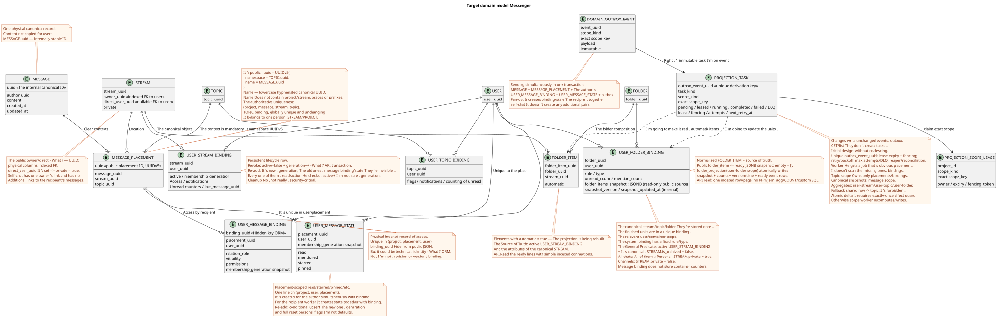

# Draft Domain Model for Messenger

Status: **proposal (design proposal) for joint discussion**.

This document describes the target domain model for a future refactoring. It does not change the current public client interface. The current public contract is fixed separately in [`workspace_api.md`](workspace_api.md) and must remain unchanged.

Terms are used with the meanings from the [common glossary](index.md#глоссарий-проектной-документации): placement, binding, transactional outbox, projection, fan-out, and worker (background executor).

## Core Idea

`MESSAGE` is the central standalone canonical entity. Message content is stored in exactly one instance regardless of the number of users who see it.

Placement, access, and user state are separated.
`MESSAGE_PLACEMENT` links the canonical message to a specific stream/topic context. `USER_MESSAGE_BINDING` grants the user access to the placement and stores `visibility`/`permissions`. `USER_MESSAGE_STATE` stores the personal state of the user for a specific placement. Copies of content for users are not created. Copying creates a new explicit placement and bindings, and the public UUID of the resource becomes the deterministic UUID of the placement.

The mapping of this model to public RestAlchemy models and API paths is described in a separate proposal
[`messenger_api_domain_model.md`](messenger_api_domain_model.md).
Detailed RestAlchemy declarations and immutable HTTP/JSON contracts are collected in
[`messenger_restalchemy_api_spec.md`](messenger_restalchemy_api_spec.md).

## Entities

### `MESSAGE`

- The single canonical record of the message and its content.
- Its `uuid` is a stable internal identifier for the single canonical content record and is not published as the resource UUID of the message.
- Stores authorship and public `created_at`/`updated_at` of the message.
- Is not duplicated when new users who can see the message appear.
- Does not store personal read flags or user state.
- The remaining field composition will be defined separately and is not included in this draft model.

### `MESSAGE_PLACEMENT`

Global physical placement row `MESSAGE` in one stream/topic:

- `uuid`, which simultaneously serves as the physical identity of the placement and the public UUID of the message resource;
- `message_uuid`, `stream_uuid`, `topic_uuid`;
- business key `(project_id,message_uuid,stream_uuid,topic_uuid)`.

Multiple placements of a single `MESSAGE` are handled independently. The worker does not derive the required stream/topic from the set of user bindings. `topic_uuid` is mandatory: direct chat and self-chat also have a canonical or technical
`TOPIC`, without `null` and sentinel values.

### `USER_MESSAGE_BINDING`

Physical indexed access row for a specific user to one placement:

- hidden internal `binding_uuid`;
- `placement_uuid`, `user_uuid`;
- relation/role, `visibility`, `permissions`;
- unique key `(project_id,placement_uuid,user_uuid)`.

Deleting or hiding a binding closes the user's access to this placement without deleting `MESSAGE` and without changing other users' access. `revision` or
binding version is absent.

### `USER_MESSAGE_STATE`

The single personal state row for a placement, unique by
`(project_id,user_uuid,placement_uuid)`. Here are stored the saved `read_at`
(or equivalent marker), `membership_generation`, `mentioned`, `starred`, `pinned` and similar
flags. The public `read` is a scalar projection of
`read_at IS NOT NULL`. Container aggregates are not stored here. State is not duplicated across bindings of one placement. When copying to another stream/topic, separate state is created; a global flag at the canonical message level is not introduced without a separate confirmed decision.
On re-add, conditional upsert moves the same business-key row to a new generation and atomically resets all personal flags to defaults; old state is not reused.

## Decision on Public Message Identity

Decision status: **accepted**. It replaces the previous proposal to publish
`MESSAGE.uuid`.

- The public `WorkspaceUserMessage.uuid` and parameter `{message_uuid}` in all
  existing URLs equal `MESSAGE_PLACEMENT.uuid`.
- Placement UUID is computed as
  `UUIDv5(namespace=TOPIC.uuid, name=MESSAGE.uuid)`.
- Namespace — canonical `TOPIC.uuid`. Name — only canonical
  `MESSAGE.uuid` in standard lowercase hyphenated ASCII format, without braces, prefixes, or additional fields.
- For example, with namespace
  `4ec0b996-b778-45f8-8ef4-ef863be0c047` and name
  `aaaaaaaa-aaaa-4aaa-8aaa-aaaaaaaaaaaa` the result equals
  `8b9eb310-407c-55fb-881b-092f92ddce88`.
- The same topic/message pair on repeat or retry always yields the same UUID.
  Copying to another topic, including a different stream, yields a new placement UUID and does not copy `MESSAGE`.
- `TOPIC.uuid` is globally unique; each `TOPIC` immutably belongs to exactly one
  `STREAM` and `PROJECT`. Moving a topic to another stream/project is not an identity update: a new `TOPIC` and explicit migration of placements are required.
- UUIDv5 does not replace database integrity. The authoritative constraint remains
  `(project_id,message_uuid,stream_uuid,topic_uuid)`, supplemented by composite FKs,
  which guarantee that the topic belongs to the specified stream/project.
- `USER_MESSAGE_BINDING` is unique at least by
  `(project_id,user_uuid,placement_uuid)`. Its own UUID remains a hidden technical key of the ORM row.

The shape of public JSON and URLs does not change, but the UUID semantics do. Therefore, a future migration must create a deterministic mapping from old public identifiers to placement UUIDs, update references/markers, and ensure a compatibility period or coordinated cutover/rollback. Specific rollout remains a separate design phase.

### `USER`, `STREAM`, `TOPIC`, `FOLDER` and their bindings

`STREAM`, `TOPIC` and `FOLDER` — canonical entities in a single instance. Their visibility and personal state are defined by the respective unique rows:

- `USER_STREAM_BINDING (project,user,stream)`;
- `USER_TOPIC_BINDING (project,user,topic)`;
- `USER_FOLDER_BINDING (project,user,folder)`.

`USER_STREAM_BINDING` is a persistent membership lifecycle row: revoke does not delete it but atomically sets `active=false` and increments the monotonic
`membership_generation`. Re-add increments the generation again. Old message bindings/state do not become visible automatically.

Ready `unread_count`, `mention_count` and other aggregates of the corresponding level are stored directly in these bindings because the aggregate scope matches the row cardinality. A separate state table is not introduced without proven necessity to separate access lifecycle and projection.

`FOLDER_ITEM` links a canonical `FOLDER` with one supported canonical object, for example `STREAM`, strictly in the form of the current public contract folders/folder_items. It does not copy the object and does not introduce new public actions. Folder and item views use only simple indexed joins; `COUNT` and message traversal in the request path are prohibited.

Normalized `FOLDER_ITEM` — source of truth for composition. For the current nested public `folder_items` without N+1 and aggregation when reading `USER_FOLDER_BINDING` stores ready read-only JSONB
`folder_items_snapshot`, its internal version, and update time. An empty public array is always `[]`; ready item counters come from the unique `USER_STREAM_BINDING`.

System folders are represented by system `USER_FOLDER_BINDING` with a fixed
`rule`/`type`: the rule cannot be deleted or arbitrarily modified through the regular
user path. Their composition is not computed during client-side reads. Ready
automatic `FOLDER_ITEM` are supported by workers as rebuildable
materialized projections, whose source of truth consists of active
`USER_STREAM_BINDING` and attributes of the canonical `STREAM`. The common composition
predicate is an active `USER_STREAM_BINDING` + a canonical
`STREAM.is_archived = false`; after that, specific rules apply:

- `All chats` includes every non-archived stream available to the user;
- `Personal` includes available non-archived streams with a canonical
  `private = true` — this is exactly the criterion used by the active contract;
- `Channels` includes available non-archived streams with `private = false`.

Every change to items/pin or automatic composition writes an immutable
transactional outbox event. From it, a single immutable typed task
`folder_projection` is derived without coalescing and with scope
`user-folder:(project_id,user_uuid,folder_uuid)`. The owner of the fenced lease brings
normalized items up to date with the current source of truth, then in one
transaction replaces the snapshot, ready counters, projection version/time,
and creates a ready public event. Public folders/folder_items endpoints and JSON
remain unchanged; until background persistence they may see the previous snapshot.

Public UUID references in the RestAlchemy API remain scalar UUID properties, while
physical columns `*_uuid` are indexed foreign keys with an explicitly
chosen referential integrity action. Specifically,
`WorkspaceStream.owner` is serialized as a UUID, and the physical `owner_uuid`
references a workspace user; no relationship URI appears in public JSON.

Creating a stream with a single `direct_user_uuid` always creates a private stream.
If `direct_user_uuid` equals the UUID of the owner/current user, it is a
self-chat with a single owner binding. A self-chat message still has one canonical
`MESSAGE` and one placement; authorship
`USER_MESSAGE_BINDING` and `USER_MESSAGE_STATE` already provide access and ready flags
to the sole participant, so recipient fan-out does not create other
binding/state pairs, and the message is displayed exactly once only to that user.

## Relationships

Editable PlantUML source:
[`messenger_domain_model.puml`](diagrams/messenger_domain_model.puml).

The relationship with `TOPIC` is mandatory for any placement, including direct chat and
self-chat. Authorship belongs to the canonical `MESSAGE`.

## Read Path and Background Refresh

The public API reads ready physical and indexed
`USER_MESSAGE_BINDING` records for the user, joins one
`MESSAGE_PLACEMENT`, an active `USER_STREAM_BINDING` of the same generation,
a single `MESSAGE` and a unique
`USER_MESSAGE_STATE`. The hidden `binding_uuid` may be the technical
identity of an ORM row, but public JSON/URL always uses
`MESSAGE_PLACEMENT.uuid`. The request path must not contain complex computed
views or heavy recalculations.

Synchronous sending in a single transaction creates the canonical `MESSAGE`,
one `MESSAGE_PLACEMENT`, authorship `USER_MESSAGE_BINDING` and
`USER_MESSAGE_STATE`, as well as immutable transactional outbox records — one
for each derived initial typed task. Therefore,
the author immediately reads ready source flags without lazy state creation.

Every state-changing transaction writes an immutable domain event to the
transactional outbox. Each event spawns a separate immutable typed task with
a unique `outbox_event_uuid`; `GET`/list do not create tasks. Workers receive explicit
work rather than scanning for missing bindings, and for each recipient
separately per placement they jointly create `USER_MESSAGE_BINDING` and a unique
`USER_MESSAGE_STATE`. The task carries the expected membership generation and performs
a conditional upsert only upon active membership and exact generation match;
stale tasks perform a no-op. There is no lazy state creation in the read path. A delay of about one second for eventual consistency is acceptable as a target SLO intent, not
as a strict guarantee before selecting the operational SLO. `2xx`/`201` means the commit
of the primary mutation; the author gets immediate read-your-write, while other
users may see projections later. Workers persist projection changes
and all corresponding durable ready WebSocket event rows atomically in one DB
transaction: either both are committed, or both are rolled back. A separate dispatcher
only reads the event store, sends/retries/replays events and owns
network connections.

The topic worker owns only topic-scoped placements/bindings and within the topic
adheres to `MESSAGE.created_at DESC`. Common projections receive separate exact
scopes: `message` for canonical snapshots, `user-stream`, `user-topic` and
`user-folder` for the corresponding aggregates. Only one
lease/fencing token is active per exact scope key; different scopes run in parallel. The topic worker
does not perform unsafe read-modify-write on shared rows. Atomic counter deltas are allowed
only with an exactly-once effect guard based on `outbox_event_uuid`; otherwise the scope worker
recalculates and replaces the projection.

Fan-out of a single placement is split into immutable keyset batches. The default
size is `1000` recipients, with an allowed runtime maximum of `5000`; configuration
`<=0` or `>5000` fails startup validation. Recipients proceed by
`USER_STREAM_BINDING.user_uuid ASC` without `OFFSET`; each batch re-verifies
active membership/generation, atomically writes binding/state,
downstream work and ready events, and only after commit creates the checkpoint/next
batch. A single batch has a short transaction; the root stores cursor/count/status.

## Invariants

1. The public client API and its observable behavior remain unchanged.
2. The content of each message is stored in exactly one `MESSAGE` record.
3. Each stream/topic context is represented by an explicit `MESSAGE_PLACEMENT`.
4. A user gains access to a placement only through the corresponding
   `USER_MESSAGE_BINDING`.
5. The receiver binding is unique per
   `(project_id,placement_uuid,user_uuid)`.
6. Personal message flags belong to the single `USER_MESSAGE_STATE` for a user and
   placement, not to the canonical message.
7. Hiding or deleting a binding does not delete the `MESSAGE` and does not change access
   for other users.
8. The query path uses precomputed binding/placement/state rows;
   complex recalculations are performed outside the query.
9. A `revision` or binding version is not added until separate design of
   background processing.
10. The public message UUID always equals `MESSAGE_PLACEMENT.uuid`, computed
    as `UUIDv5(namespace=TOPIC.uuid, name=MESSAGE.uuid)`. It is identical for all
    users within a single placement and distinct across different topics. The canonical
    `MESSAGE.uuid` is internal; the user binding UUID is hidden.
11. State-mutating operations write immutable outbox events; reads do not
    create tasks, and workers do not search for work by scanning missing rows.
12. The WebSocket dispatcher is separated from projection workers. A worker writes a projection and
    ready event rows in a single transaction; the dispatcher does not create business events and
    its network send does not affect their durability.
13. Public UUID references are scalar RestAlchemy UUID properties, but
    physical UUID columns remain indexed foreign keys with explicitly
    chosen actions; URI relations do not change the JSON contract.
14. `direct_user_uuid` upon stream creation means `private=true`; a self-chat
    contains one author binding/state pair and does not create pairs for other users.
15. Stream/topic/folder aggregates are stored only in the unique binding of
    the corresponding container level, never in the binding/state of an individual message. Views read precomputed values without `COUNT`,
    `GROUP BY`, or message traversal.
16. Workers update aggregates idempotently via typed tasks after
    fan-out, read/hide/move/delete, and similar changes. Repair/rebuild from
    message bindings is allowed only in the background; eventual consistency is accepted.
17. The canonical `FOLDER` is stored once; `USER_FOLDER_BINDING` defines
    user access/state and precomputed aggregates, while `FOLDER_ITEM`
    only links a folder to its supported canonical object.
18. System folder bindings have a fixed rule, and their automatic
    elements are a rebuildable projection from active stream bindings;
    the API reads precomputed elements and counters without calculating composition.
19. Synchronous sending creates author `USER_MESSAGE_BINDING` and
    `USER_MESSAGE_STATE` together; fan-out for each receiver also creates
    a ready binding/state pair; lazy state creation in the read path is prohibited.
20. The initial design does not use coalescing: one immutable outbox event
    corresponds to one immutable typed task with a unique derivation key.
    Lease expiry, fencing token, retry/backoff, max attempts/DLQ, and reaper
    ensure crash recovery; handlers are idempotent per source event.
21. Revoking stream membership synchronously sets `active=false` and increments
    the persistent `membership_generation`. Each message/reaction read/action
    checks active membership and generation; background cleanup is not a
    security boundary.
22. Topic UUID is required for placement but does not serve as a universal
    lock. Each shared projection task owns its actual exact
    scope key; fallback to a common topic string is prohibited.
23. `TOPIC.is_done` — global canonical state of one topic. Toggling
    serializes on the `TOPIC` row, increments its version/`updated_at`, and writes
    to the outbox in the same transaction. `USER_TOPIC_BINDING` is not the authoritative
    writer for this attribute.
24. Reactions are intentionally shared across the canonical `MESSAGE` in all placements.
    Placement UUID is used only for access checks; raw facts and
    `reactions`/`reaction_users` have message scope. Cross-placement visibility
    between different audiences is accepted semantics.
25. For each public resource list, a missing/`0` `page_limit` yields
    `100`, `1..500` is accepted exactly, and other values yield HTTP `400`;
    unbounded mode does not exist.
26. Reconnection uses durable cursor/replay: after the last processed
    cursor, all newer visible events are replayed without breaking live.
    Delivery is at-least-once; the client deduplicates by event UUID and advances
    the cursor only after processing.
27. All tenant-owned rows and scope keys contain `project_id`; physical
    `UNIQUE(project_id,uuid)` and composite FKs prohibit cross-project edges.
    Mutations re-check authorization within a blocking transaction.
28. Fan-out batch default `1000`, hard maximum `5000`; keyset cursor —
    `user_uuid ASC`, retry is limited to one batch, unbounded transactions
    are prohibited, and the scheduler ensures bounded fairness for old work.
29. Migration/release occurs only after a verified backup/restore rehearsal
    and acceptance gate. Native messages/states/files are preserved and migrated;
    Zulip-derived messages/files undergo an intentional destructive reset with manual
    scoped cleanup and fresh complete reimport. Old Zulip Workspace UUIDs,
    references, and local state do not need to be preserved.

## Open Questions

The single canonical list is located at
[`messenger_architecture_inventory.md`](messenger_architecture_inventory.md#единственный-список-open-решений).
This document preserves only accepted domain invariants.
